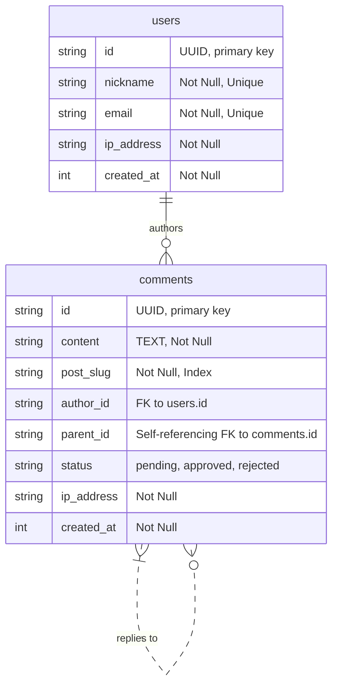

# 最终实施计划 V2：博客评论功能

## 1. 总体架构

*   **后端**: 使用 **Drizzle ORM** 与 **SQLite** 数据库，在 **Astro API 路由**中实现业务逻辑。
*   **前端**: 使用 **React** 创建可交互的 `CommentSection` 组件，并嵌入到 Astro 页面中。

## 2. 数据库设计 (Schema)

文件: `src/lib/schema.ts`

*   **`users` 表**:
    *   `id` (TEXT, PK): 用户ID。
    *   `nickname` (TEXT, **UNIQUE**): 用户昵称，确保唯一性。
    *   `email` (TEXT, UNIQUE): 用户邮箱。
    *   `ip_address` (TEXT): **创建用户时的 IP 地址。**
    *   `created_at` (INTEGER): 创建时间。
*   **`comments` 表**:
    *   `id` (TEXT, PK): 评论ID。
    *   `content` (TEXT): 评论内容。
    *   `post_slug` (TEXT, **INDEX**): 关联文章，加索引以提高查询性能。
    *   `author_id` (TEXT, FK): 关联 `users.id`。
    *   `parent_id` (TEXT, FK): 回复的父评论ID。
    *   `status` (TEXT): 评论状态 (`pending`, `approved`, `rejected`)，默认为 `'pending'`。
    *   `ip_address` (TEXT): **创建评论时的 IP 地址。**
    *   `created_at` (INTEGER): 创建时间。

## 3. 后端实现 (Astro API)

*   **`POST /api/comments`** (创建评论)
    *   **认证**: 检查请求头中的 JWT。如果存在且有效，则信任其中的用户信息。
    *   **请求体**:
        *   如果未认证: `{ content: string, postSlug: string, parentId?: string, author: { nickname: string, email: string } }`
        *   如果已认证: `{ content: string, postSlug: string, parentId?: string }`
    *   **逻辑**:
        1.  从 `Astro.clientAddress` 获取请求的 IP 地址。
        2.  **用户处理**: 如果创建新用户，将获取到的 IP 地址一并存入 `users` 表。
        3.  **评论创建**: 创建新评论时，将获取到的 IP 地址存入 `comments` 表。
        4.  **响应**:
            *   如果用户是首次操作（或 JWT 无效/过期），生成并返回一个新的 JWT。
            *   返回新创建的评论对象（包含 `status: 'pending'`）。

*   **`GET /api/comments`** (获取评论)
    *   **查询参数**: `slug=<post_slug>`, `page=<number>`, `limit=<number>`
    *   **认证**: 检查请求头中的 JWT，以获取当前用户 `userId`。
    *   **逻辑**:
        1.  根据 `slug` 和分页参数查询评论。
        2.  **过滤规则**:
            *   查询所有 `status = 'approved'` 的评论。
            *   **或** `author_id` 为当前 `userId` 的评论（这样作者能看到自己待审核的评论）。
        3.  **关联查询**: Join `users` 表获取作者的 `nickname`。
        4.  **数据组织**: 将扁平的评论列表构造成层级的树状结构。
        5.  **响应**: 返回评论树和分页信息（如总页数 `totalPages`）。

*   **`GET /api/auth/public-key`** (提供公钥)
    *   **逻辑**: 读取环境变量 `JWT_PRIVATE_KEY`，生成并返回公钥。

## 4. 前端实现 (React)

*   **组件**: `CommentSection.tsx`
*   **功能**:
    1.  **数据获取**:
        *   组件加载时，调用 `GET /api/comments` 获取第一页数据。
        *   实现“加载更多”按钮，点击时请求下一页数据并追加到列表中。
    2.  **UI 渲染**:
        *   递归渲染评论树，实现楼中楼。
        *   对 `status === 'pending'` 的评论，显示一个“审核中”的标签。
    3.  **表单提交**:
        *   提交后，禁用表单，等待服务器响应。
        *   成功后，不清空输入框，而是显示成功消息，并根据 API 返回的待审核评论更新列表。
    4.  **交互**:
        *   为每条评论生成唯一的 DOM `id` (例如 `comment-uuid-xxxx`)。
        *   当点击 `@User` 时，获取被回复评论的 `id`，然后使用 `document.getElementById('comment-uuid-xxxx').scrollIntoView({ behavior: 'smooth' })` 平滑滚动到该评论，并添加一个高亮效果。
    5.  **JWT 管理**:
        *   组件初始化时，从 `localStorage` 读取 JWT。
        *   每次 API 请求时，将 JWT 放入 `Authorization` 请求头。
        *   在 `POST /api/comments` 的响应中，检查是否返回了新的 JWT，并更新 `localStorage`。

## 5. 实施步骤

1.  **环境与依赖**:
    *   在 `.env` 和 `.env.example` 文件中添加 `JWT_PRIVATE_KEY`。
    *   执行 `bun add jose`。
2.  **数据库**:
    *   在 `src/lib/schema.ts` 中更新 `users` 和 `comments` 表的定义。
    *   运行 `bun run migrate` 生成并执行迁移。
3.  **后端**:
    *   创建 `src/pages/api/comments/index.ts` (用于 GET 和 POST)。
    *   创建 `src/pages/api/auth/public-key.ts`。
    *   创建 JWT 相关的工具函数。
4.  **前端**:
    *   创建 `src/components/comments/CommentSection.tsx` (以及可能的子组件 `CommentList.tsx`, `CommentItem.tsx`, `CommentForm.tsx`)。
    *   在 `src/components/blog/SinglePost.astro` 中引入 `CommentSection`。
5.  **测试**:
    *   进行全面的端到端测试，覆盖所有功能点。
