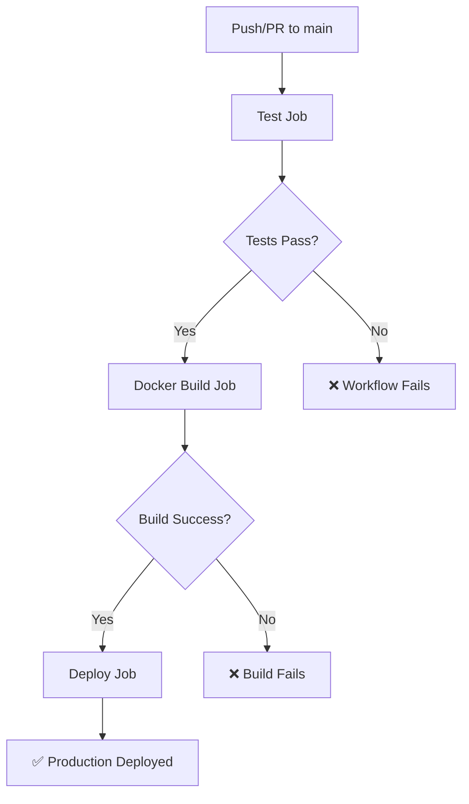

# CI/CD 流程文档

本文档描述了项目的持续集成和持续部署流程，包括本地开发钩子和 GitHub Actions 配置。

## 🔧 本地开发流程 (Lefthook)

### Pre-commit 钩子

每次提交代码时，lefthook 会自动运行以下检查：

```yaml
pre-commit:
  commands:
    check:
      glob: "*.{js,ts,cjs,mjs,d.cts,d.mts,jsx,tsx,json,jsonc}"
      run: bunx @biomejs/biome check --write --no-errors-on-unmatched --files-ignore-unknown=true {staged_files} && git update-index --again
    test:
      run: bun test
      fail_text: "Tests failed. Please fix the failing tests before committing."
    checkBuild:
      run: bun run check:astro
```

#### 执行顺序：
1. **代码格式检查** - 使用 Biome 检查和修复代码格式
2. **单元测试** - 运行所有测试确保功能正常
3. **构建检查** - 验证 Astro 项目能正常构建

### 安装和配置

```bash
# 安装 lefthook 钩子
bunx lefthook install

# 手动运行 pre-commit 检查
bunx lefthook run pre-commit
```

### 跳过钩子（紧急情况）

```bash
# 跳过所有钩子
git commit --no-verify -m "emergency fix"

# 或者设置环境变量
LEFTHOOK=0 git commit -m "skip hooks"
```

## 🚀 CI/CD 流程 (GitHub Actions)

### 工作流程概览



### Job 详细说明

#### 1. Test Job (`test`)
- **目的**: 运行单元测试和代码质量检查
- **运行环境**: Ubuntu 22.04 + Bun 1.2.13
- **步骤**:
  1. 检出代码
  2. 设置 Bun 环境
  3. 缓存依赖
  4. 安装依赖
  5. **运行单元测试** (`bun test`)
  6. **运行代码检查** (`bun run check`)

#### 2. Docker Job (`docker`)
- **目的**: 构建和推送 Docker 镜像
- **依赖**: `test` job 必须成功
- **步骤**:
  1. 检出代码
  2. 设置 QEMU 和 Docker Buildx
  3. 登录到私有镜像仓库
  4. 构建并推送镜像

#### 3. Deploy Job (`deploy`)
- **目的**: 部署到生产环境
- **依赖**: `docker` job 必须成功
- **步骤**:
  1. 通知 Watchtower 更新容器

### 触发条件

- **Pull Request** 到 `main` 分支
- **Push** 到 `main` 分支
- **Release** 发布

### 环境变量和密钥

#### 必需的 GitHub Secrets:
- `USER_TOKEN` - 私有镜像仓库访问令牌
- `WATCHTOWER_TOKEN` - Watchtower API 令牌
- `WATCHTOWER_HOST` - Watchtower 主机地址
- `WATCHTOWER_PORT` - Watchtower 端口

## 🛡️ 质量保证

### 测试覆盖
- **80 个单元测试** 覆盖所有鉴权逻辑
- **144 个断言** 确保功能正确性
- **100% 通过率** 要求

### 代码质量
- **Biome** 代码格式化和 linting
- **TypeScript** 类型检查
- **Astro** 构建验证

### 安全检查
- 鉴权逻辑完整测试
- JWT 安全性验证
- 权限边界测试

## 🚨 故障排除

### 本地测试失败
```bash
# 查看详细测试输出
bun test --verbose

# 运行特定测试文件
bun test tests/lib/auth-utils.test.ts

# 监视模式调试
bun test:watch
```

### CI 测试失败
1. 检查 GitHub Actions 日志
2. 本地复现问题：
   ```bash
   bun install
   bun test
   bun run check
   ```
3. 修复后重新提交

### Docker 构建失败
1. 检查 Dockerfile 语法
2. 验证依赖安装：
   ```bash
   bun install
   bun run build
   ```

### 部署失败
1. 检查 Watchtower 连接
2. 验证镜像是否正确推送
3. 检查生产环境日志

## 📊 性能指标

### 典型执行时间
- **本地 pre-commit**: ~5-10 秒
- **CI 测试 job**: ~2-3 分钟
- **Docker 构建**: ~3-5 分钟
- **部署**: ~30 秒

### 优化建议
- 使用依赖缓存减少安装时间
- 并行运行独立的检查
- 增量构建减少 Docker 层

## 🔄 维护和更新

### 定期维护
- 更新 Bun 版本
- 更新依赖包
- 审查和优化测试

### 添加新检查
1. 更新 `lefthook.yml`
2. 更新 GitHub Actions 工作流
3. 测试新配置
4. 更新文档

## 📝 最佳实践

### 开发者指南
1. **提交前**: 确保本地测试通过
2. **小步提交**: 避免大量变更
3. **描述性消息**: 使用清晰的提交消息
4. **测试驱动**: 为新功能编写测试

### 代码审查
1. 检查测试覆盖
2. 验证 CI 通过
3. 审查安全影响
4. 确认文档更新

这个 CI/CD 流程确保了代码质量、安全性和可靠的部署过程。
