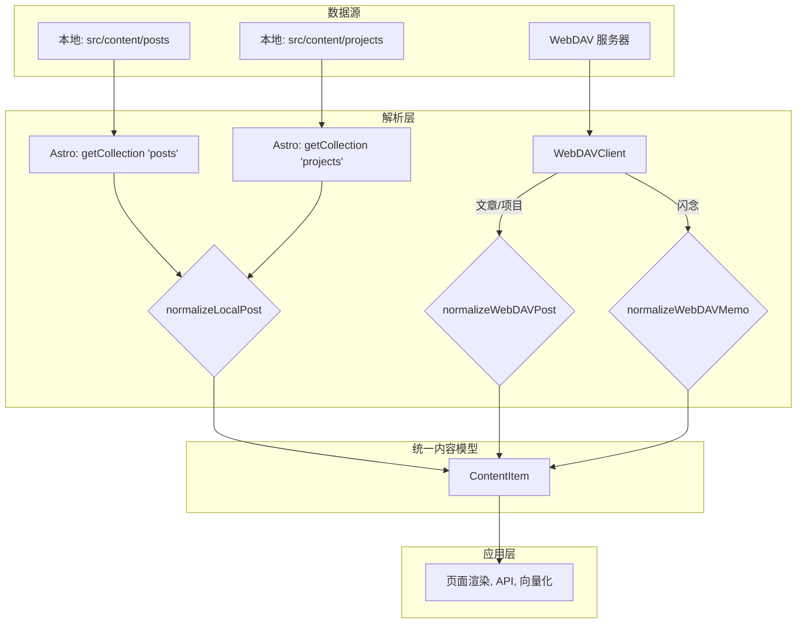

# 内容格式规范

## 1. 引言

本文档旨在提供一个关于项目中所有内容类型的全面指南。它定义了内容的组织方式、数据结构、Frontmatter 字段标准，以及不同内容来源（本地文件系统与 WebDAV）的解析规则。

遵循此规范有助于保持项目的一致性、可维护性和可扩展性。

---

## 2. 核心概念：统一内容模型 (`ContentItem`)

为了屏蔽不同数据源和内容类型的差异，系统将所有内容都规范化为一个统一的数据结构：`ContentItem`。无论是一篇本地的文章，还是来自 WebDAV 的一篇闪念，最终都会被转换成这个标准格式，供上层应用（如页面渲染、API、向量化）使用。

`ContentItem` 接口的关键字段包括：

-   `id`: 唯一标识符（通常是文件路径）。
-   `slug`: URL 友好的标识符。
-   `type`: 内容类型，值为 `'post'`, `'project'`, 或 `'memo'`。
-   `title`: 内容标题。
-   `publishDate`: 发布日期。
-   `body`: 原始 Markdown 内容。
-   `content`: 渲染后的 HTML 或 Astro 组件。
-   `...` 其他元数据字段。

---

## 3. 内容来源与解析流程

系统支持两种主要的内容来源，每种来源都有独立的解析路径，但最终都汇入统一的内容模型。

-   **本地文件系统**: 使用 Astro 的 Content Collections API，在项目构建时进行类型检查和解析。
-   **WebDAV**: 使用自定义的 WebDAV 客户端，在需要时（例如，服务器启动或缓存刷新时）动态获取和解析远程内容。

### 解析流程图

---

## 环境变量

为了使 WebDAV 功能正常工作，需要在项目的 `.env` 文件中配置以下环境变量：

| 变量名 | 是否必需 | 描述 | 默认值 |
| :--- | :--- | :--- | :--- |
| `WEBDAV_URL` | **是** | WebDAV 服务器的完整 URL。 | |
| `WEBDAV_USERNAME` | **是** | 用于登录 WebDAV 服务器的用户名。 | |
| `WEBDAV_PASSWORD` | **是** | 用于登录 WebDAV 服务器的密码。 | |
| `WEBDAV_PROJECTS_PATH` | 否 | 指定存放“项目”类型内容的目录路径。 | `/projects` |
| `WEBDAV_MEMOS_PATH` | 否 | 指定存放“闪念”类型内容的目录路径。 | `/Memos` |
| `WEBDAV_EXCLUDE_PATHS` | 否 | 指定需要从同步中排除的路径，多个路径之间用逗号 `,` 分隔。 | `''` |

---

## 4. 内容类型详解

### 4.1 文章 (Posts)

通用的内容形式，如博客文章、笔记等。

-   **来源**:
    -   **本地**: `src/content/posts/` 目录下的所有 `.md` 或 `.mdx` 文件。
    -   **WebDAV**: 除 `projectsPath` 和 `memosPath` 之外的所有 `.md` 或 `.mdx` 文件。
-   **Frontmatter**: 遵循下文定义的“通用 Frontmatter 字段参考”。

### 4.2 项目 (Projects)

用于展示作品集或项目的特殊内容类型。

-   **来源**:
    -   **本地**: `src/content/projects/` 目录下的所有 `.md` 或 `.mdx` 文件。
    -   **WebDAV**: 由环境变量 `WEBDAV_PROJECTS_PATH` 定义的目录下的所有 `.md` 或 `.mdx` 文件。
-   **Frontmatter**: 与“文章”类型共享相同的“通用 Frontmatter 字段参考”。目前没有独有字段。

### 4.3 闪念 (Memos)

一种轻量级的、时间线式的内容，用于快速记录。

-   **来源**:
    -   **WebDAV Only**: 由环境变量 `WEBDAV_MEMOS_PATH` 定义的目录下的所有 `.md` 文件。**系统当前不支持本地闪念文件**。
-   **Frontmatter**: 使用一套更简洁的、特有的 Frontmatter 字段。标题通常从正文的第一个 H1 (`#`) 标题动态提取。
    -   `createdAt`: (必需) 创建时间的 ISO 8601 字符串。
    -   `updatedAt`: (必需) 更新时间的 ISO 8601 字符串。
    -   `public`: (可选) 布尔值，控制是否公开，默认为 `true`。
    -   `tags`: (可选) 标签数组。
    -   `attachments`: (可选) 附件对象数组。

---

## 5. 通用 Frontmatter 字段参考

此规范适用于“文章”和“项目”类型的内容。所有字段均基于 `src/content/config.ts` 中的 Zod schema 定义。

| 字段名 | 数据类型 | 是否必需 | 是否默认显示 | 是否自动更新 | 描述和格式 | 别名 |
| :--- | :--- | :--- | :--- | :--- | :--- | :--- |
| `title` | `String` | **是** | 否 | 是 | 内容的标题。 | |
| `slug` | `String` | 否 | 是 | 否 | 用于 URL 的唯一标识符。如果留空，通常会根据标题或文件名生成。 | |
| `publishDate` | `Date` | 否 | 是 | 否 | 内容的发布日期。支持 `YYYY-MM-DD`、`YYYY-MM-DD HH:mm:ss` 和 ISO 8601 格式。无时区信息时，默认按东八区解析。 | |
| `updateDate` | `Date` | 否 | 是 | 是 | 内容的最后更新日期。格式同 `publishDate`。 | `date` |
| `draft` | `Boolean` | 否 | 是 | 否 | 是否为草稿。`true` 表示是草稿，不会在生产环境中显示。默认为 `true`。 | |
| `public` | `Boolean` | 否 | 是 | 否 | 内容是否公开。`true` 表示公开。默认为 `true`。 | |
| `excerpt` | `String` | 否 | 是 | 否 | 内容的简短摘要。 | `summary` |
| `image` | `String` | 否 | 是 | 否 | 文章的主题图片。可以是本地图片的相对路径或完整的 URL。 | |
| `images` | `Array<String>` | 否 | 否 | 否 | 一个包含多个图片路径或 URL 的数组。 | |
| `category` | `String` | 否 | 是 | 是 | 内容所属的分类。如果未指定，则默认为文件相对于内容集合根目录的路径。 | |
| `tags` | `Array<String>` | 否 | 是 | 是 | 内容的标签数组。 | |
| `author` | `String` | 否 | 否 | 否 | 内容的作者。 | |
| `metadata` | `Object` | 否 | 否 | 否 | 一个包含 SEO 元数据的嵌套对象。 | |

### SEO 元数据 (`metadata`)

| 字段名 | 数据类型 | 描述和格式 |
| :--- | :--- | :--- |
| `title` | `String` | SEO 标题，会显示在浏览器标签页和搜索结果中。 |
| `description` | `String` | 页面的 SEO 描述。**回退**: 如果此字段为空，将使用顶层的 `excerpt` 字段的值。 |
| `...` | `...` | 其他 SEO 相关字段，如 `canonical`, `robots`, `openGraph`, `twitter`。 |
