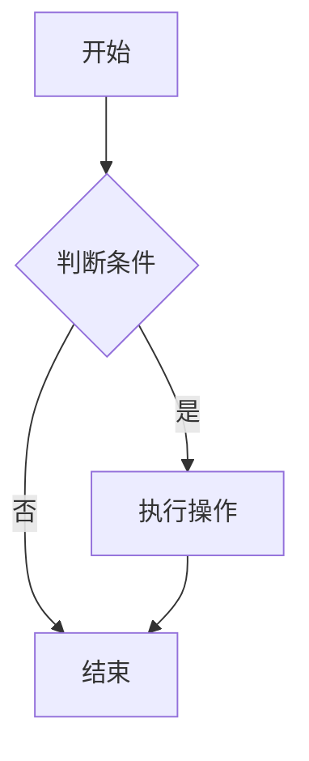
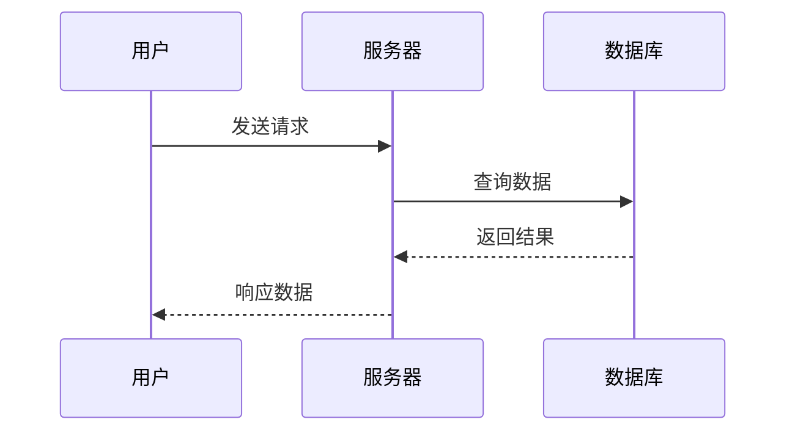
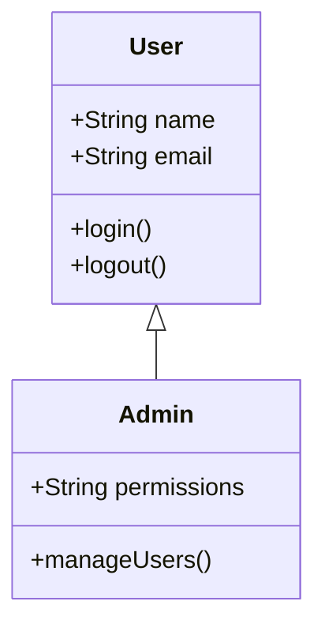
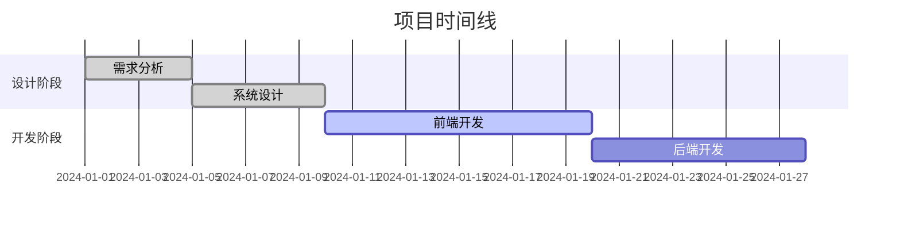

# Mermaid 图表使用指南

本项目已集成 Mermaid 图表支持，可以在 Markdown 文件中直接使用 Mermaid 语法创建各种图表。

## 特性

- ✅ **服务端渲染（SSR）**：图表在构建时转换为 SVG，无需客户端 JavaScript
- ✅ **自动主题切换**：使用 `<picture>` 元素自动适应亮色和暗色主题
- ✅ **SEO 友好**：搜索引擎可以直接索引 SVG 图表内容
- ✅ **性能优化**：页面加载时不需要额外的 JavaScript 处理
- ✅ **中文支持**：完全支持中文标签和文本
- ✅ **多种图表类型**：支持流程图、时序图、类图、甘特图、状态图、饼图等
- ✅ **响应式设计**：图表自动适应容器宽度

## 使用方法

在 Markdown 文件中使用 `mermaid` 代码块：

````markdown

````

## 支持的图表类型

### 1. 流程图 (Flowchart)


### 2. 时序图 (Sequence Diagram)



### 3. 类图 (Class Diagram)



### 4. 甘特图 (Gantt Chart)



## 配置说明

项目中的 Mermaid 配置位于：

1. `astro.config.ts` - Astro 构建时的配置
2. `src/utils/markdown.ts` - Markdown 处理时的配置

当前配置：

- **策略**: `img-svg` (服务端渲染)
- **主题**: 自动切换（亮色/暗色）
- **字体**: `arial,sans-serif`
- **前缀**: `mermaid`

## 主题切换原理

项目使用 `rehype-mermaid` 的 `img-svg` 策略和 `dark: true` 选项：

1. **双版本生成**：构建时为每个图表生成亮色和暗色两个 SVG 版本
2. **Picture 元素**：使用 HTML `<picture>` 元素包装图表
3. **媒体查询**：通过 `(prefers-color-scheme: dark)` 自动切换
4. **无 JavaScript**：完全基于 CSS 媒体查询，无需客户端脚本

### 生成的 HTML 结构

```html
<picture>
  <source media="(prefers-color-scheme: dark)" srcset="data:image/svg+xml,..." />
  
</picture>
```

## 注意事项

1. **构建时渲染**：图表在构建时就被转换为 SVG，因此修改图表后需要重新构建
2. **中文支持**：完全支持中文标签，无需特殊配置
3. **性能优化**：由于是服务端渲染，页面加载速度更快
4. **兼容性**：生成的 SVG 在所有现代浏览器中都能正常显示
5. **主题切换**：基于系统主题偏好自动切换，响应速度极快

## 更多资源

- [Mermaid 官方文档](https://mermaid.js.org/)
- [Mermaid 语法参考](https://mermaid.js.org/syntax/flowchart.html)
- [rehype-mermaid 插件文档](https://github.com/remcohaszing/rehype-mermaid)
