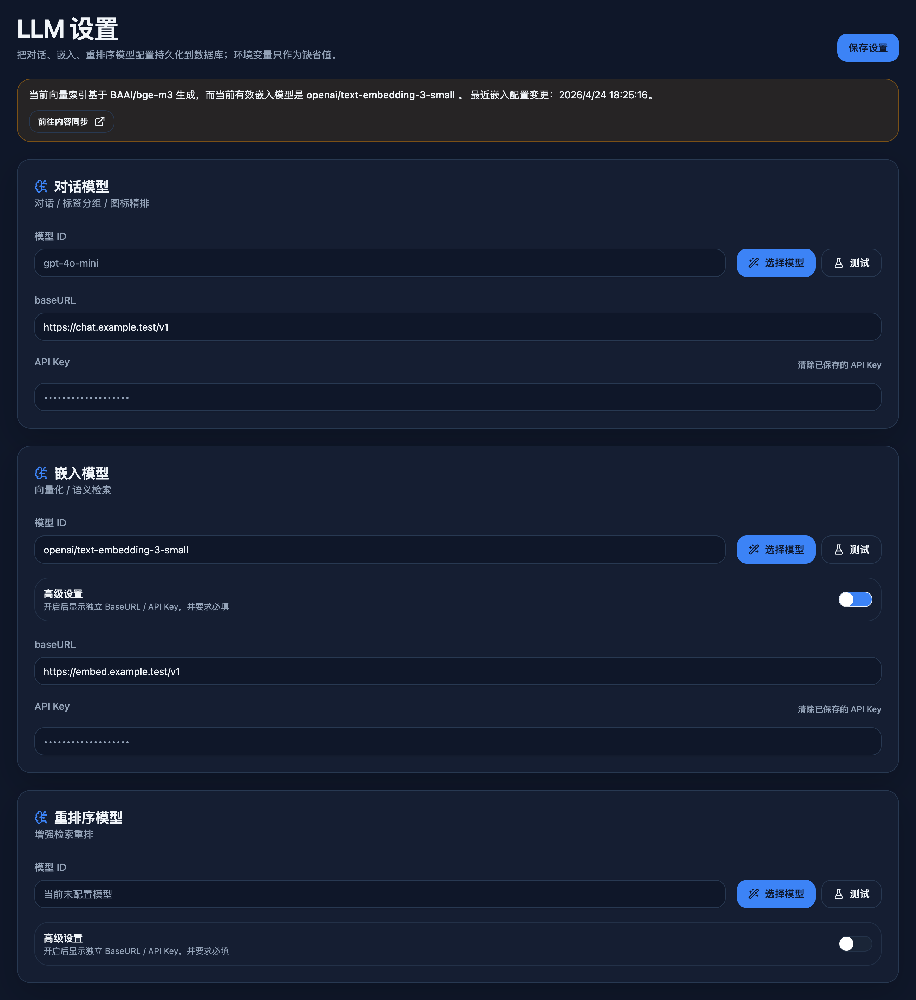
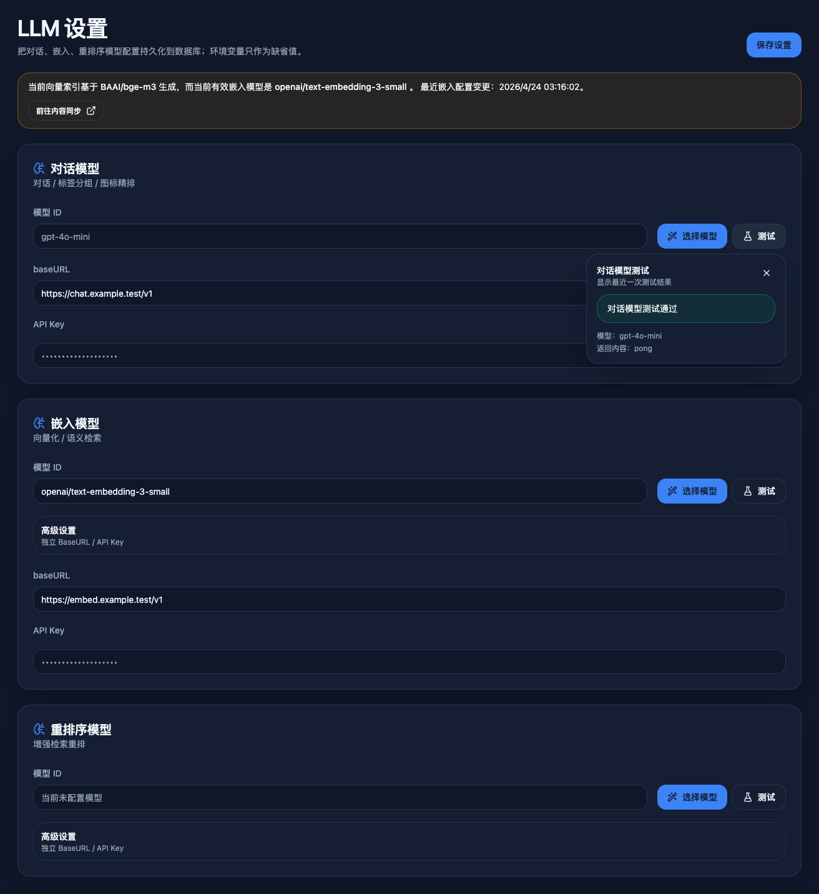
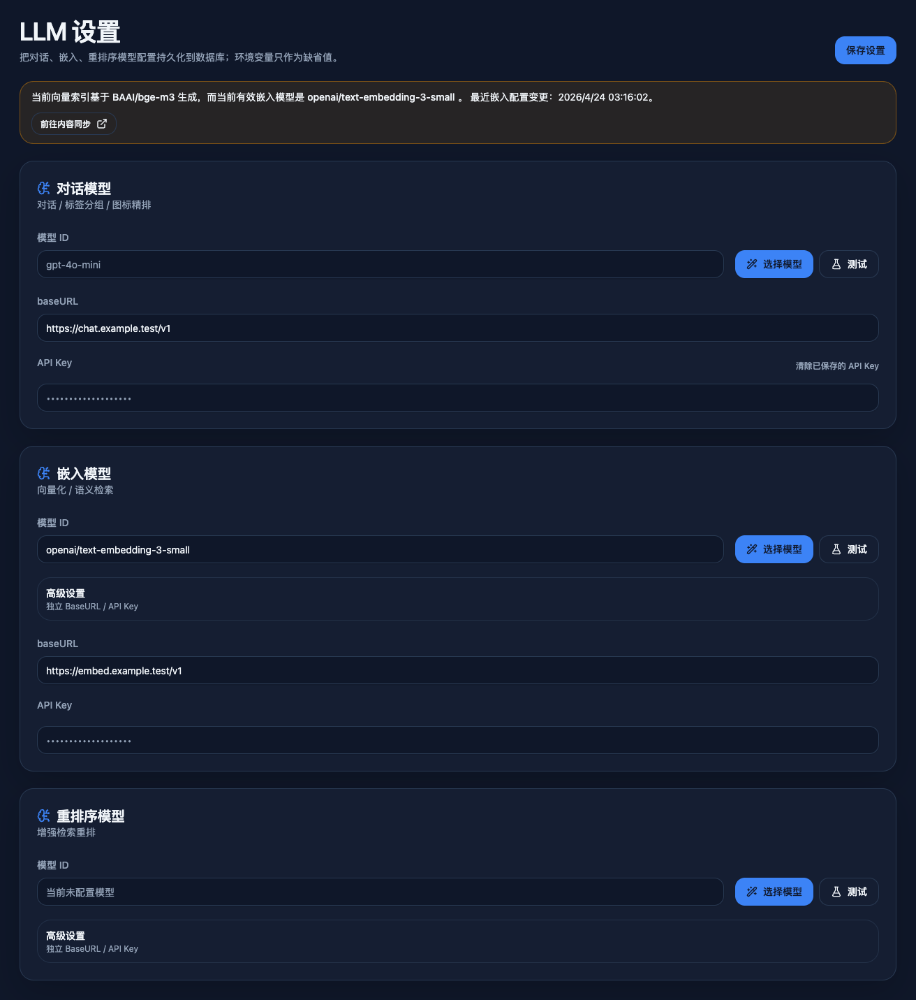
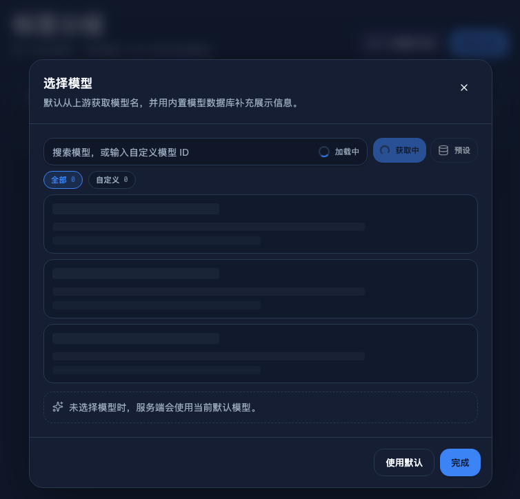
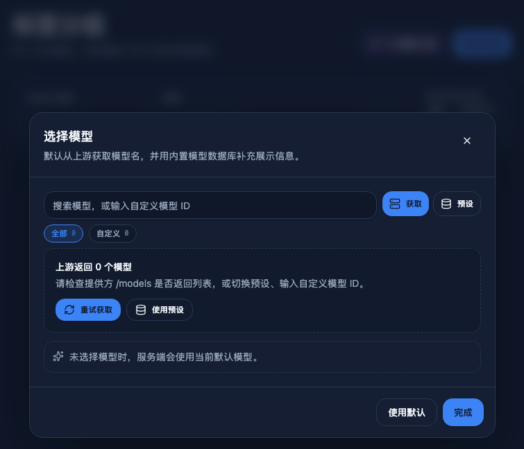
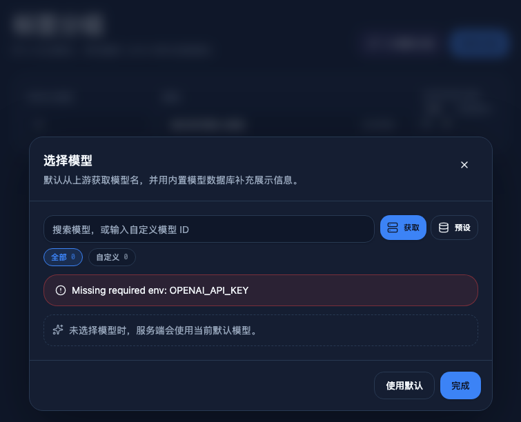

# SPEC: Admin LLM settings + model catalog

- Spec ID: `2dvb9`
- Status: `active`
- Owner: `main-agent`

## 1. Background

The admin already exposes AI-backed workflows such as tag grouping, icon reranking, vectorization, and semantic search, but the effective provider configuration is scattered across environment-variable reads in multiple modules. That makes runtime behavior opaque, blocks per-capability provider overrides, and forces deploy-time restarts for every model/base URL change.

The admin needs a durable control plane for LLM configuration with safe secret handling, tier-specific defaults, compact advanced settings for independent providers, and a model picker that stays useful even when external catalog refresh is unavailable during local development or CI.

## 2. Goals

1. Add a new admin page at `/admin/llm-settings` for chat, embedding, and rerank settings.
2. Persist effective overrides in SQLite while keeping environment variables as defaults/fallbacks.
3. Route all existing AI code paths through one runtime config resolver instead of module-load env snapshots.
4. Provide a reusable model picker dialog with capability badges, context length, descriptions, and provider availability hints.
5. Keep model-catalog data available offline through a repo-tracked fallback while allowing build-time refresh from OpenRouter metadata.
6. Let operators run tier-level connectivity tests from the page before saving.

## 3. Non-goals

- Auto-running connectivity checks or vector rebuild jobs after saving settings.
- Multi-tenant provider profiles or arbitrary per-feature provider routing beyond chat / embedding / rerank.
- Making the catalog refresh a hard build dependency.

## 4. Scope

### In scope

- Admin navigation entry and page for `/admin/llm-settings`.
- Browser-facing HTTP resources:
  - `GET /api/admin/llm-settings`
  - `PUT /api/admin/llm-settings`
  - `GET /api/admin/llm-settings/catalog`
  - `POST /api/admin/llm-settings/test`
- SQLite single-row persistence for encrypted secrets and non-secret overrides.
- AES-GCM secret handling gated by `LLM_SETTINGS_MASTER_KEY`; secret writes without it return an actionable admin API error instead of a generic internal error.
- Runtime resolution for chat, embedding, and rerank settings with inheritance.
- Build-time OpenRouter catalog refresh plus repo fallback metadata.
- UI validation, tests, and visual evidence for the settings page and model picker.

### Out of scope

- Automatic migration of existing env values into the database.
- Background catalog sync jobs.
- Automatic provider normalization for every third-party OpenAI-compatible gateway beyond documented heuristics.

## 5. Runtime contract

### 5.1 Persistence model

- New table: `llm_settings`
- Single row keyed by `id='default'`
- Stores a validated JSON blob plus `created_at` / `updated_at`
- Secret fields are stored as encrypted payload metadata only; plaintext never leaves server memory

### 5.2 Inheritance rules

- `chat`
  - `model`: DB override -> env (`TAG_AI_MODEL` / `CHAT_COMPLETION_MODEL`) -> built-in default
  - `baseURL`: DB override -> env (`OPENAI_API_BASE_URL` / `OPENAI_BASE_URL`) -> built-in OpenAI URL
  - `apiKey`: DB override -> env (`OPENAI_API_KEY`) -> missing
- `embedding`
  - `model`: DB override -> env (`EMBEDDING_MODEL_NAME`) -> built-in default
  - `baseURL`: if `inherit`, reuse chat effective base URL; if `custom`, use DB override -> env common base URL -> built-in OpenAI URL
  - `apiKey`: if `inherit`, reuse chat effective key; if `custom`, use DB override -> env common key -> missing
- `rerank`
  - `model`: DB override -> env (`RERANKER_MODEL_NAME`) -> missing
  - `baseURL`: if `inherit`, reuse embedding effective base URL; if `custom`, use DB override -> env common base URL -> built-in OpenAI URL
  - `apiKey`: if `inherit`, reuse embedding effective key; if `custom`, use DB override -> env common key -> missing

### 5.3 Save semantics

- `GET /api/admin/llm-settings` never returns plaintext API keys.
- Secrets return masked state only (`hasValue`, `maskedValue`, `source`, and inheritance/custom mode).
- `PUT /api/admin/llm-settings`
  - empty secret input keeps the existing stored secret unchanged
  - explicit clear removes the stored encrypted secret
  - explicit replacement re-encrypts and stores the new secret
- `embedding.useCustomProvider=false` or `rerank.useCustomProvider=false` hides independent provider fields in the browser and resolves both `baseURL` and `apiKey` through the tier default chain.
- Switching a child tier advanced switch off does not implicitly delete its saved custom secret or custom base URL.
- Switching a child tier advanced switch on requires both a valid `baseURL` and an available custom API key for that tier.
- All `baseURL` inputs must pass browser `type=url` validation and server-side `http|https` URL validation before save/test.

### 5.4 Catalog behavior

- Primary refresh source: OpenRouter models API snapshot generated during `prebuild`.
- Repo fallback: tracked curated JSON used when generated data is unavailable.
- Provider `/models` probing is best-effort and only annotates availability for the requested tier; it does not replace the snapshot/fallback catalog.

### 5.5 Browser interaction rules

- Chat always exposes `baseURL` and `API Key` fields directly.
- Embedding and rerank expose a single `高级设置` switch that controls whether independent `baseURL` / `API Key` fields are shown and used.
- When a field is empty, its placeholder reflects the current effective value; API key placeholders use same-length bullet masking.
- Each tier exposes a `测试` button beside `选择模型`; the result bubble shows staged progress while pending, then either success details or the returned error.

## 6. Acceptance criteria

1. `/admin/llm-settings` renders in the admin SPA and persists settings to SQLite.
2. Saved settings survive reloads and show the correct DB/env/default source labels.
3. Chat settings affect tag grouping and icon reranking defaults.
4. Embedding settings affect vectorization, semantic search, and admin vectorization status checks.
5. Rerank settings affect enhanced search reranking defaults.
6. API keys remain masked in API responses and the UI, with replace/clear semantics working as documented.
7. The model picker dialog supports capability badge filtering, search, and selection from fallback data without network access; upstream fetch states distinguish loading, not-yet-fetched, upstream-empty, filtered-empty, and error outcomes.
8. Changing embedding settings surfaces a reindex notice without auto-triggering a job; model mismatches are treated as required reindexing, while provider-only changes surface an advisory resync warning.
9. Embedding and rerank hide independent provider fields while `高级设置` is off, preserve previously saved custom values, and require both `baseURL` and `API Key` when the switch is on.
10. Tier test actions return visible progress and result feedback without leaving the page.
11. Production gateway/admin container startup fails fast when `LLM_SETTINGS_MASTER_KEY` is missing and does not print raw environment variables or secret values to startup logs.

## 7. Validation

- `bun run check`
- `bun run test`
- `bun run build`
- Admin HTTP compatibility tests covering settings GET/PUT/catalog/test
- Admin Playwright coverage for page open, modal filtering, advanced-setting toggle behavior, tier testing, persistence, and embedding reindex notice

## 8. References

- `docs/specs/8amg2-admin-shadcn-spa-phase2/SPEC.md`
- `docs/design/tag-icons.md`
- `docs/ai-tag-organizer-spec.md`

## 9. Visual Evidence

### Settings page overview

### Tier test result bubble

### Advanced settings enabled with preserved provider data

### Model picker loading and feedback states

