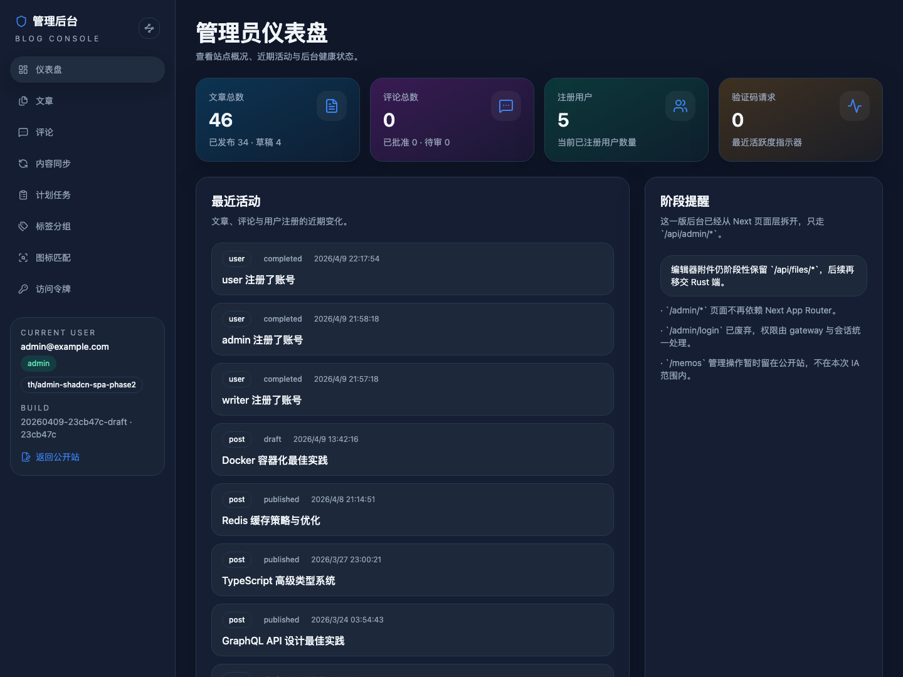
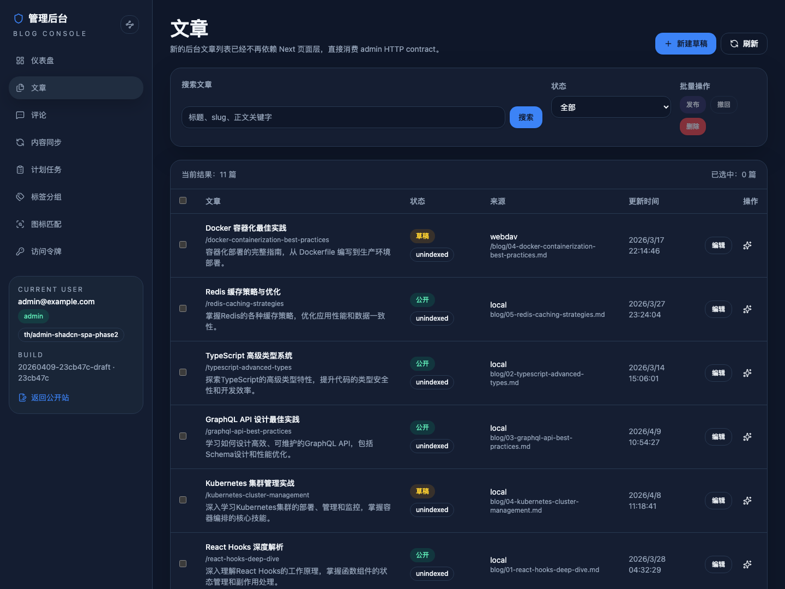
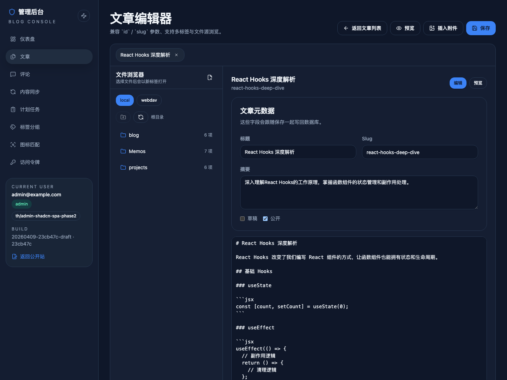
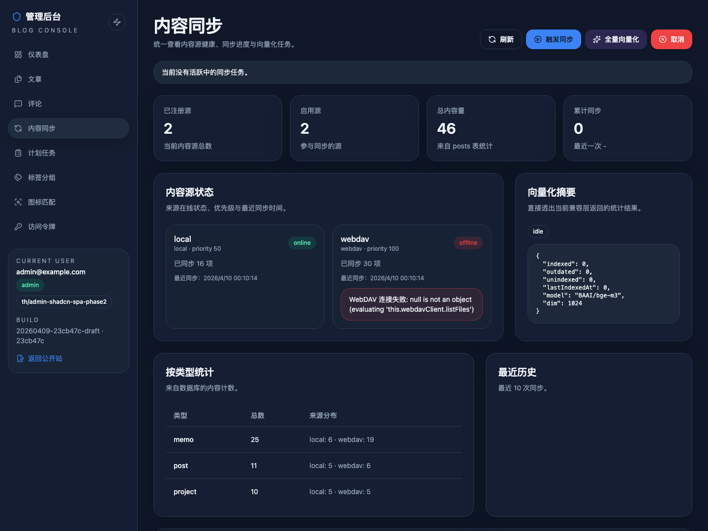

# SPEC: Admin shadcn SPA + `/admin/*` ownership migration

- Spec ID: `8amg2`
- Status: `done`
- Owner: `main-agent`

## 1. Background

Phase 1 moved the public frontend to Astro while intentionally keeping `/admin/*` on the legacy Next App Router runtime. Before this phase, the repo shipped DaisyUI-heavy admin pages under `src/app/admin/**`, and those pages talked directly to tRPC/Next route handlers.

That shape blocks the project-wide “no Next.js UI runtime” direction and keeps backend/admin contracts coupled to page-layer implementation details. Phase 2 splits the admin surface into an explicit SPA boundary and introduces stable admin HTTP resources that the future Rust service can adopt without changing the browser contract.

## 2. Goals

1. Deliver a new `apps/admin` based on `Vite + React + TanStack Router + TanStack Query + shadcn/ui`.
2. Move `/admin/*` page ownership away from `src/app/admin/**` and into the new admin SPA.
3. Introduce `/api/admin/*` HTTP compatibility resources so admin pages no longer depend on `/api/trpc` from the browser.
4. Preserve current admin workflows for dashboard, posts, editor, comments, content sync, schedules, tags, tag-icons, PATs, and access control states.
5. Remove DaisyUI from shipped public/admin surfaces and upgrade the Daisy guard to enforce that boundary.
6. Stop this fast-track run at latest PR merge-ready, not auto-merged.

## 3. Non-goals

- Rust-native admin API cutover and final zero-Next production runtime cleanup.
- Moving `/memos` admin affordances into the new admin IA in this phase.
- Full repo-wide Daisy removal for dev/test/demo/editor leftovers.
- Large repo reshapes unrelated to admin delivery (for example renaming `site/` to `apps/site`).

## 4. Scope

### In scope

- New `apps/admin` source tree, build output, dev flow, and gateway integration.
- `/admin`, `/admin/dashboard`, `/admin/posts`, `/admin/posts/editor`, `/admin/comments`, `/admin/content-sync`, `/admin/data-sync`, `/admin/cache`, `/admin/schedules`, `/admin/schedules/:key`, `/admin/schedules/runs/:id`, `/admin/tags`, `/admin/tag-icons`, `/admin/pats`.
- shadcn/Radix-based admin theme tokens and primitives for the new SPA.
- Browser-facing admin HTTP resources rooted at `/api/admin/*`.
- Compatibility implementation that may still call existing services/tRPC callers server-side.
- Gateway/runtime changes needed so `/admin/*` no longer renders through the Next page layer.
- Validation updates, visual evidence, and PR convergence to merge-ready.

### Out of scope

- `/memos` admin mutation UI relocation.
- Replacing the compatibility implementation with Rust in this phase.
- Cleaning Daisy from legacy compat-only or dev-only surfaces that are not shipped as the new public/admin UI.

## 5. Route Ownership

| Route family | Owner in Phase 2 | Notes |
| --- | --- | --- |
| `/admin/*` (listed above) | `apps/admin` SPA + gateway guard | New page shell and navigation |
| `/api/admin/*` | admin compatibility HTTP layer | Future Rust-friendly contract |
| `/api/files/*` | legacy runtime | Kept for editor/file flows in this phase |
| `/api/*` outside `/api/admin/*` and `/api/public/*` | legacy runtime | Unmigrated backend surface |
| `/_next/*` | legacy Next | Must not be requested by the new admin SPA |
| `/memos*` | Astro public frontend | Admin affordances stay in place for now |

## 6. HTTP Contract Summary

The new admin SPA must only talk to HTTP resources rooted at `/api/admin/*` plus the explicitly retained file/upload endpoints required by editor flows.

Required resource families for this phase:

- `/api/admin/session`
- `/api/admin/dashboard/*`
- `/api/admin/posts/*`
- `/api/admin/comments/*`
- `/api/admin/content-sync/*`
- `/api/admin/jobs/*`
- `/api/admin/pats/*`
- `/api/admin/tags/organize`
- `/api/admin/tag-icons/*`
- `/api/admin/upload/*`
- `/api/admin/files/*`

Detailed shape lives in [contracts/http-apis.md](./contracts/http-apis.md).

## 7. Acceptance Criteria

1. `/admin/*` pages listed in scope render through the new admin SPA instead of `src/app/admin/**`.
2. The browser admin UI no longer calls `/api/trpc` and does not request `/_next/*` assets for migrated admin pages.
3. Gateway/admin auth keeps the existing status semantics:
   - unauthenticated admin page requests return `401`
   - authenticated non-admin requests return `403`
   - `/admin/login` remains `404`
4. Dashboard, posts list, posts editor, comments, content sync, schedules, tags, tag-icons, and PATs remain usable through the new SPA.
5. Historical admin entry aliases `/admin`, `/admin/data-sync`, `/admin/content-sync`, and `/admin/cache` still land on the correct SPA routes.
6. Shipped public/admin surfaces pass the no-Daisy guard.
7. Visual evidence for the new admin shell, posts list, editor, and one data-heavy page is captured in this spec and shown in chat before handoff.
8. Fast-track closes at latest PR merge-ready with review/comments/checks converged, without auto merge.

## 8. Validation

- Phase 2 shipped on `main` via PR #66 and keeps `/admin/*` owned by the gateway + `apps/admin` SPA topology.
- `DB_PATH=./dev-data/sqlite.db LOCAL_CONTENT_BASE_PATH=./dev-data/local WEBDAV_URL=http://127.0.0.1:30101 bun run build` ✅
- `bun run test` ✅ (`277 pass`)
- `bun run check` ✅
- `bun run check:public-no-daisy` ✅
- `BASE_URL=http://127.0.0.1:30100 bunx playwright test tests/e2e/guest/admin-access-denied.spec.ts --project=guest-chromium` ✅ (`2 passed`)
- `BASE_URL=http://127.0.0.1:30100 bunx playwright test tests/e2e/user/admin-access-denied.spec.ts --project=user-chromium` ✅ (`1 passed`)
- `BASE_URL=http://127.0.0.1:30100 bunx playwright test tests/e2e/admin/session-header-auth-admin.spec.ts tests/e2e/admin/admin-spa-phase2.spec.ts --project=admin-chromium` ✅ (`4 passed`)
- Browser verification on `http://127.0.0.1:30100/admin` ✅ (401 / 403 / admin session, alias routing, `/api/admin/*` only, no `/_next/*`)
- Closeout cleanup removed the obsolete legacy Next admin page layer (`src/app/admin/**`, `src/components/admin/**`) while keeping the shared 401/403 UI in `src/components/auth/AdminAccessDenied.tsx` for Next-owned status pages.

## 9. Milestones

- [x] M1: Add the Phase 2 spec, contract docs, and repo/build scaffolding for `apps/admin`.
- [x] M2: Deliver the new admin SPA shell, shadcn theme, auth bootstrap, and `/api/admin/*` data layer.
- [x] M3: Migrate the standard admin pages plus compatibility aliases to the new SPA.
- [x] M4: Migrate the posts editor off Next page/router dependencies and keep editor workflows functional.
- [x] M5: Upgrade the shipped-surface Daisy guard, capture visual evidence, converge validation/PR state to merge-ready, and remove the obsolete legacy Next admin page layer during closeout.

## 10. Approach

- Keep the repository transitional: Phase 2 introduces the browser/runtime contract and page ownership split, but it does not force the final Rust cutover in the same patch.
- Implement the admin HTTP resources as a compatibility layer backed by the current server services/tRPC caller pattern.
- Use the gateway as the single routing/auth truth for `/admin/*`, including status code preservation for 401/403/404 cases.
- Keep `apps/admin/**` as the only shipped admin UI, then remove the obsolete `src/app/admin/**` and `src/components/admin/**` page layer once gateway ownership and validation are proven stable.
- Contain Daisy cleanup to shipped public/admin surfaces while enforcing “no new Daisy on shipped UI” with a guard script.

## 11. Risks / Assumptions

- Risk: the editor currently depends on `next/navigation`, `next/link`, `next/image`, and tRPC hooks; adapter work is required before it can mount inside Vite.
- Risk: preserving HTTP status semantics for admin auth requires gateway-side guarding, not a client-only session gate.
- Risk: some existing admin services were designed around tRPC shapes, so the compatibility layer must normalize responses before freezing the contract.
- Assumption: reusing the existing server caller path is acceptable for Phase 2 as long as the browser contract is HTTP-first and Rust-friendly.
- Assumption: `/memos` admin actions remain untouched in this phase except for regression coverage.

## 12. Visual Evidence

### Admin shell / dashboard

### Posts list

### Posts editor

### Content sync

