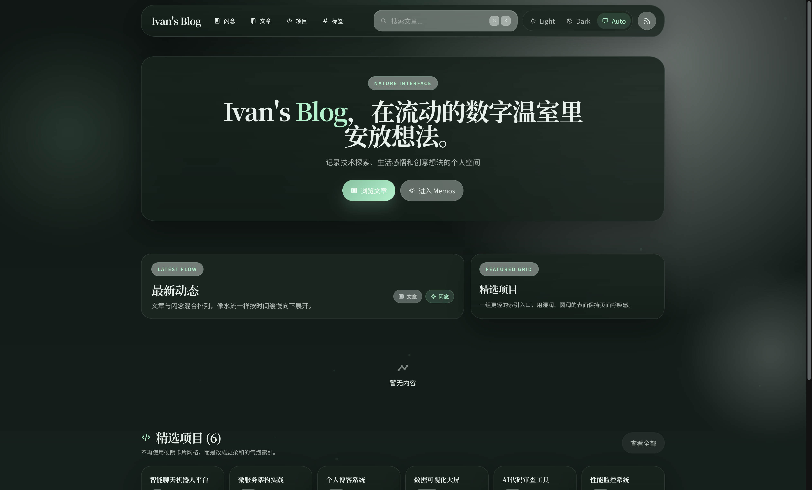
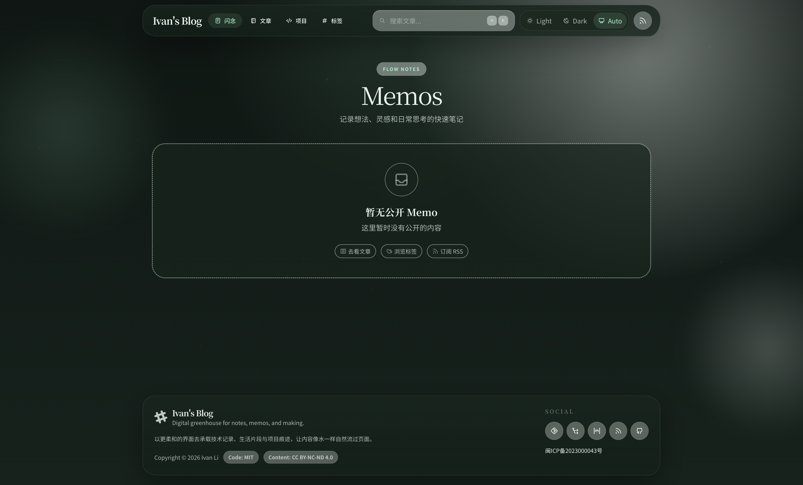
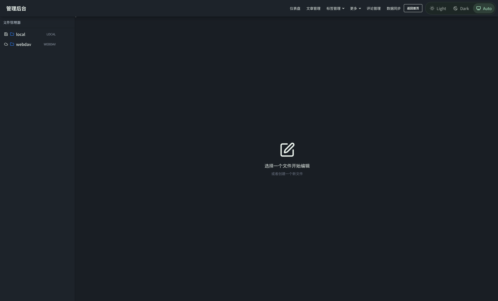

# 全量 Direct 依赖升级到 Latest

## 背景 / 问题陈述

- 当前仓库的 direct `dependencies` 与 `devDependencies` 存在一批可更新版本，包含多个 major 升级点。
- 继续滞后会放大后续一次性升级成本，也会让本地开发、CI 和类型系统逐步偏离上游工具链。
- 本轮目标是把 direct 依赖统一升级到 latest stable，并在不扩 scope 的前提下完成兼容性收敛。

## 目标 / 非目标

### Goals

- 升级 `package.json` 中全部 direct `dependencies` 与 `devDependencies` 到执行时的 latest stable。
- 刷新 `bun.lock`，保持依赖安装可复现。
- 修复因升级导致的编译、类型、测试、构建与 E2E 回归。
- 保持现有产品行为不变，不引入额外功能。

### Non-goals

- 不处理 Next 开发态资源占用优化开关或额外性能调优。
- 不做无关重构、依赖替换、未使用依赖清理或数据库 schema 变更。
- 不升级 Bun runtime；仅同步 direct 依赖中的 Bun 相关类型包。

## 范围（Scope）

### In scope

- `package.json` 与 `bun.lock` 的 direct 依赖升级。
- 升级导致的最小必要源码、测试与配置兼容性修复。
- 通过仓库既有质量门槛：`bun outdated`、`bun run check`、`bun test`、`bun run build`、`bun run test:e2e`。

### Out of scope

- 任何产品功能、UI、交互或公开 API 行为调整。
- 额外的开发体验优化、端口策略调整、Storybook 增补或视觉样式改动。
- PR 合并与 post-merge cleanup。

## 需求（Requirements）

### MUST

- 所有 direct 依赖升级到 latest stable，不保留“跳过 major”的默认例外。
- `bun outdated` 在收口时为空，或只剩明确记录的允许例外；本计划默认无例外。
- 修复 major 升级导致的 breaking changes，至少覆盖 `typescript`、`lucide-react`、`rate-limiter-flexible`、`@types/nodemailer` 以及 Next/React/tooling 相关变化。
- 最终 PR 必须达到 merge-ready，但不自动合并。

### SHOULD

- 保持兼容性修复聚焦在升级必需范围内，避免顺手重构。
- 在文档中记录关键 breaking changes、验证结果和仍需关注的风险点。

### COULD

- 若某个升级点需要额外的 targeted validation，可在 full validation 之前先补充局部验证加速排障。

## 功能与行为规格（Functional/Behavior Spec）

### Core flows

- 运行 direct 依赖升级命令后，仓库依赖面更新到最新稳定版本。
- 针对升级产生的编译、类型、测试、构建或 E2E 回归做最小必要修复。
- 推送分支并创建 PR，完成 CI 与 review 收敛，直到 PR 可以立即合并。

### Edge cases / errors

- 若某个 latest 版本导致不可接受的 breaking change，必须先定位真实断点，再以最小兼容修复处理；只有无法收敛时才作为阻断上抛。
- 若 PR 阶段发现同一根因重复回归，按根因批次修复，不做逐条 findings 式噪音返工。
- 若远端 CI 与本地表现不一致，需要保留证据并在 PR 描述与 spec 中记录差异。

## 接口契约（Interfaces & Contracts）

### 接口清单（Inventory）

None

### 契约文档（按 Kind 拆分）

None

## 验收标准（Acceptance Criteria）

- Given 当前分支完成 direct 依赖升级
  When 运行 `bun outdated`
  Then 输出为空。

- Given 当前分支完成兼容性修复
  When 运行 `bun run check`
  Then 检查通过。

- Given 当前分支完成兼容性修复
  When 运行 `bun test`
  Then 测试通过。

- Given 当前分支完成兼容性修复
  When 运行 `bun run build`
  Then 构建通过。

- Given 当前分支完成兼容性修复
  When 运行 `bun run test:e2e`
  Then E2E 通过。

- Given 分支已推送并创建 PR
  When CI 与 review 收敛完成
  Then latest PR 处于可立即合并状态，且未执行 merge。

## 实现前置条件（Definition of Ready / Preconditions）

- direct latest 升级范围已锁定为全部 direct 依赖
- 关键 breaking risks 已知并允许在本轮一并适配
- 质量门槛与收工条件已明确
- PR 终点锁定为 merge-ready

## 非功能性验收 / 质量门槛（Quality Gates）

### Testing

- Unit tests: `bun test`
- Integration tests: 由 `bun test` 覆盖现有集成用例
- E2E tests (if applicable): `bun run test:e2e`

### UI / Storybook (if applicable)

- 依赖升级曾引入公开页面样式回归，已通过本地浏览器复核与聊天回图完成 owner-facing 验证。

### Quality checks

- Dependency drift: `bun outdated`
- Lint / typecheck / formatting: `bun run check`
- Production build: `bun run build`

## 文档更新（Docs to Update）

- `docs/specs/README.md`: 增加本 spec 索引并更新状态
- `docs/specs/deps-update-latest/IMPLEMENTATION.md`: 记录实现覆盖与验证结果

## 计划资产（Plan assets）

- Directory: `docs/specs/deps-update-latest/assets/`
- In-plan references: ``
- Visual evidence source: maintain `## Visual Evidence` in this spec when owner-facing or PR-facing screenshots are needed.

## Visual Evidence

- 2026-04-07: 已在本地预览复核 `/`、`/memos`、`/admin/posts/editor`，并将首页、Memos、后台编辑器的修复后截图回传给主人验收；以下资产与当前 `HEAD` 绑定。

- PR 正文默认无图，保留以上 spec 资产作为 owner-facing 视觉证据来源。

## 资产晋升（Asset promotion）

None

## 方案概述（Approach, high-level）

- 先完成 docs/specs 迁移与分支准备，再执行一次全量 direct latest 升级。
- 优先以本地验证定位真实 breaking changes，按根因聚合做最小必要修复。
- 本地质量门槛通过后再进入 PR 收敛，避免把明显回归带到远端反复抖动。

## 风险 / 开放问题 / 假设（Risks, Open Questions, Assumptions）

- 风险：远端 CI 仍可能暴露本地未覆盖的平台差异，但本地验证已全部通过。
- 风险：`bun run build` 仍保留 1 条 Next/Turbopack NFT tracing warning，当前不影响构建产物与运行行为，但后续若继续深挖 Turbopack tracing，可能需要再做一轮定向收敛。
- 需要决策的问题：None。
- 假设（需主人确认）：None。

## 参考（References）

- `package.json`
- `bun.lock`
