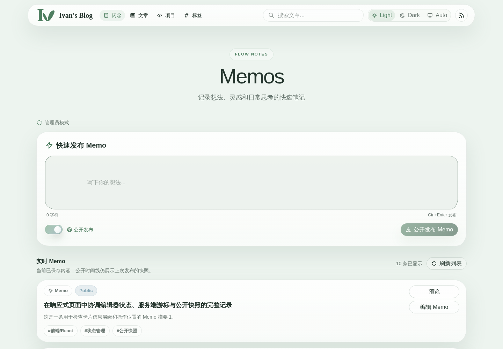
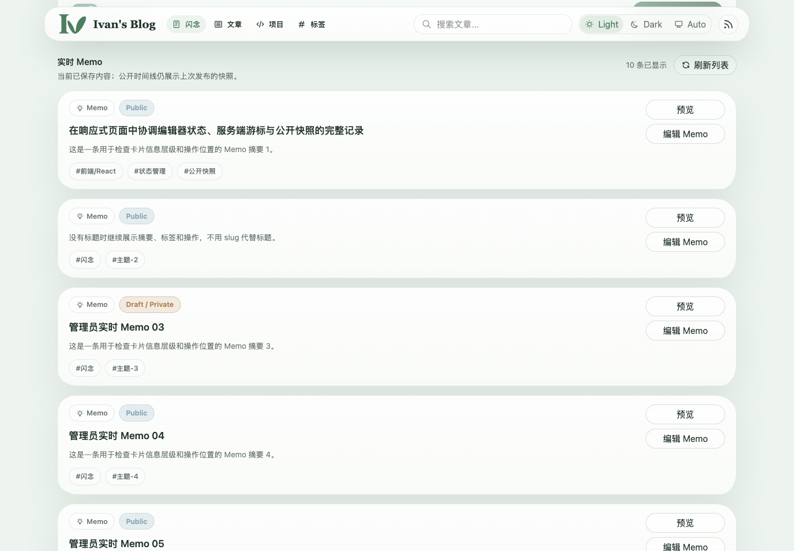
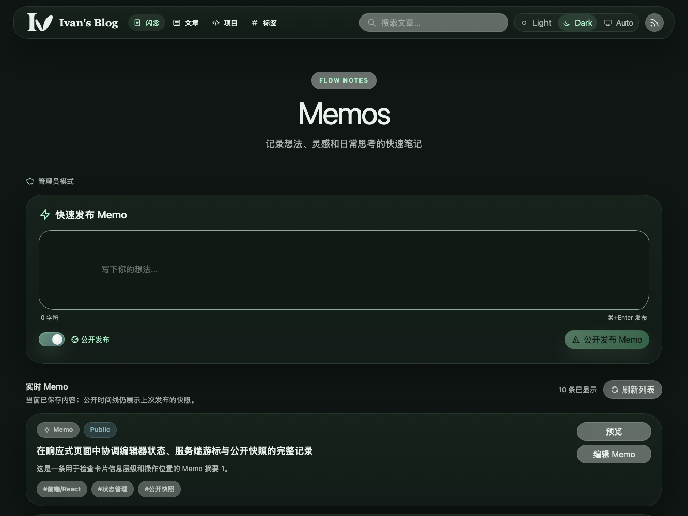
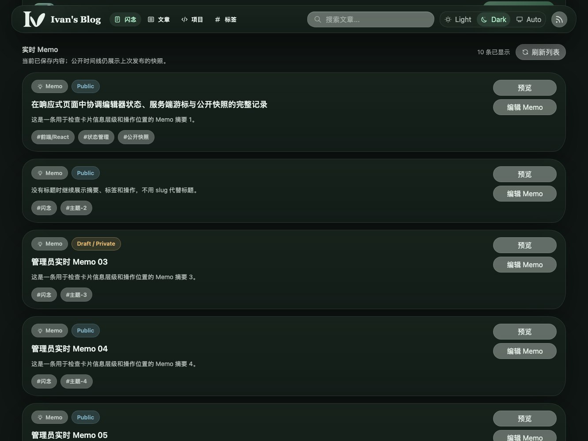
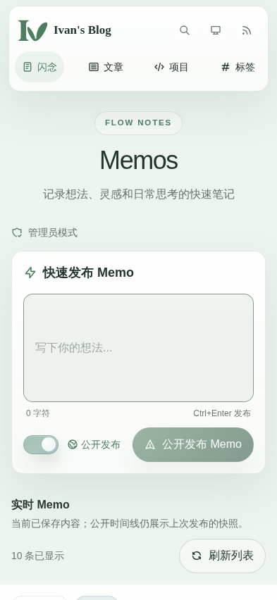
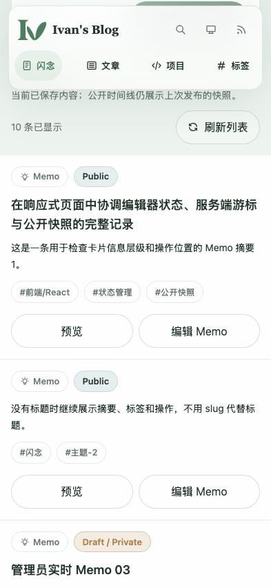
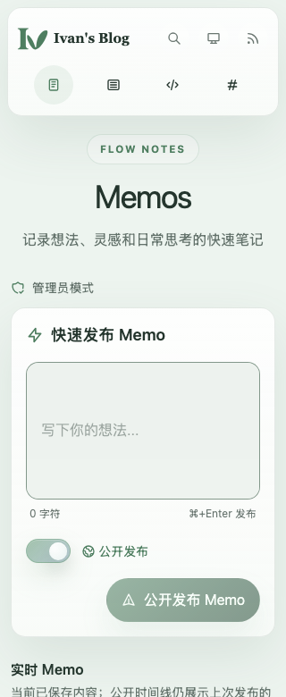
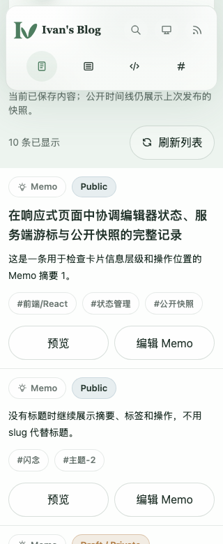

# Inline Memo Admin View

## Context and Scope

- Context: The public Memos page also exposes authoring and recent management controls to an authenticated administrator. The current saved content and the published public timeline are distinct states on the same page.
- In scope: administrator-only layout and interaction on `/memos`, quick creation, the recent management list, preview and edit actions, feedback, and responsive accessibility.
- Out of scope: a dedicated Memo admin route, the guest reading layout, public timeline content, Memo storage and publication timing, API contract changes, Memo detail redesign, and changes to the established Memo title contract.

## Terms and Interfaces

- Real-time Memo: the administrator's current saved Memo, whether public or private.
- Public Memo timeline: the published reader-facing Memo snapshot, which can lag behind current saved content.
- Interface: `/memos` remains the shared public route. Administrator-only controls use the existing Memo API and preview and edit capabilities.

## Composition

The page reads in this order: existing public introduction; administrator-only status line and full-size quick editor; administrator-only recent Memo section; existing public timeline. The administrator status line identifies the mode without becoming another large surface around the editor. A clear vertical gap separates the editor from recent management. The recent section gives its heading, item count, and refresh action a single clear header, followed by the existing Memo cards and an in-place load-more action. It does not add a second search control; site-wide search remains the discovery entry point.

On wide screens, each card reserves a stable area for actions beside its content. On narrow screens, the administrator list follows the public Nature mobile content-stream pattern: one edge-to-edge reading surface with separators, no individual card shells, and row content inset 16px at 393px or 12px below 375px. The same actions move below the content in a consistent order. All Memo fields and information density remain intact, and desktop cards retain their existing form.

## Requirements

### REQ-MAIV-001

- The system MUST keep the public Memos introduction and public timeline on `/memos` for both guests and administrators. Only administrators may see the authoring and management area between them; guest content and navigation MUST remain unchanged.
- The administrator area MUST NOT become a separate `/admin/memos` route or replace the public page with a distinct admin shell.

### REQ-MAIV-002

- Quick Memo creation MUST be the first administrator task after the public introduction. The editor MUST remain directly available, with its current usable writing area and full editing capabilities; it MUST NOT be collapsed or reduced in size to make room for the list.
- Administrator-mode explanation MUST be a low-emphasis status line rather than a prominent extra surface around the editor. The editor MUST keep its established Nature visual language.

### REQ-MAIV-003

- The management section MUST follow the editor and show the first 10 Memos in the existing administrative list order by default. An in-place load-more action MUST provide access beyond that initial set without requiring a new route; refresh MUST return to the first page.
- The management heading MUST distinguish current saved Memos from the published public timeline. The list MUST NOT introduce a local search control that duplicates site-wide search; its refresh action MUST remain associated with the list.
- The list MUST preserve its existing Nature card form, fields, and information density on desktop. Below 640px, it MUST follow the public Nature mobile content-stream contract: a full-bleed translucent surface, row separators, and no individual card shells. This responsive presentation MUST NOT remove fields or reduce Memo information density. The public timeline MUST remain below the administrator area.

### REQ-MAIV-004

- Each management card MUST keep its information and actions in stable positions when titles, excerpts, or tags vary in length. Wide layouts MUST reserve a stable action area beside content; narrow layouts MUST place actions below content in a consistent order without clipped text or horizontal page overflow.
- “Preview” MUST open the read-only preview destination. “Edit Memo” MUST open the existing edit dialog in the current list context, retaining the list position and item identity when the dialog closes.

### REQ-MAIV-005

- Quick creation MUST preserve the current default public/private behavior and underlying publication timing. Its primary command MUST name the selected visibility outcome clearly.
- Success feedback MUST distinguish a saved current Memo from the published public timeline. Validation and save failures MUST be announced near the editor command with a useful recovery path; a long management list MUST NOT separate the error from its source.

### REQ-MAIV-006

- The administrator area MUST use the existing public Nature colors, typography, spacing, radii, and light/dark/system theme behavior. The list MUST retain desktop cards and use the established mobile content-stream presentation below 640px; its fields and information density MUST remain the same at every viewport.
- The editor, visibility control, primary command, load-more action, and card actions MUST be operable in logical keyboard order with visible focus. At 393px and 320px, control labels MUST remain on one line, the full-size editor surface MUST NOT create horizontal scrolling, content MUST remain readable without horizontal page overflow, and touch controls MUST retain the public surface's 44px minimum target.

### REQ-MAIV-007

- The view MUST preserve the established Memo title, visibility, public snapshot, storage, and API semantics. This design contract MUST NOT introduce a new title fallback, publication step, content source, or administrator permission shortcut.

## Verification

### VER-MAIV-001

- Method: authenticated and guest route checks with desktop and mobile visual inspection.
- covers: `REQ-MAIV-001`, `REQ-MAIV-002`
- Pass condition: the guest page retains its introduction and timeline without admin controls; the administrator sees the full editor before the recent list and the same public timeline afterward.

### VER-MAIV-002

- Method: list interaction checks using more than 10 Memos with different title, excerpt, tag, and visibility lengths.
- covers: `REQ-MAIV-003`, `REQ-MAIV-004`
- Pass condition: 10 items appear initially; load-more reaches older items and refresh returns to the first page; no local search box appears in the management list; the existing card fields and visual density remain; actions align across varied content, and edit opens the current-page dialog while preview opens the read-only view.

### VER-MAIV-003

- Method: quick creation and failure-state checks for public and private outcomes.
- covers: `REQ-MAIV-005`, `REQ-MAIV-007`
- Pass condition: defaults and persistence semantics remain unchanged; command copy matches the selected visibility; the new item appears in the current list; success explains the public snapshot boundary; a failed save leaves content available and shows a nearby actionable error.

### VER-MAIV-004

- Method: keyboard, focus, theme, and viewport checks at desktop, 393px, and 320px.
- covers: `REQ-MAIV-004`, `REQ-MAIV-006`
- Pass condition: focus can move from the editor to visibility and submit controls; the editor action labels remain intact on one line at narrow widths; the full-size editor surface has no internal horizontal scroll; actions remain reachable and legible; no horizontal page overflow or clipped editor content occurs; light, dark, system, and reduced-motion states preserve meaning and contrast.

## Visual Evidence

The approved captures below were rendered from the Storybook page fallback using mock API data. They were re-rendered against the repaired candidate at the same source-bound viewports; comparison found no visible layout change, so the approved assets remain canonical. List captures show the administrator management area; top captures show the full-size editor and page hierarchy.

source_type=storybook_canvas; target_program=mock-only; capture_scope=element; viewport_strategy=storybook-viewport; evidence_surface=page; sensitive_exclusion=N/A; submission_gate=approved
- Story: `public-memo-authoring--admin-page-fallback-visual-light`; viewport: `memoDesktop` (1440x1000); state: light theme, page top.

source_type=storybook_canvas; target_program=mock-only; capture_scope=element; viewport_strategy=storybook-viewport; evidence_surface=page; sensitive_exclusion=N/A; submission_gate=approved
- Story: `public-memo-authoring--admin-page-fallback-visual-light`; viewport: `memoDesktop` (1440x1000); state: light theme, management list.

source_type=storybook_canvas; target_program=mock-only; capture_scope=element; viewport_strategy=storybook-viewport; evidence_surface=page; sensitive_exclusion=N/A; submission_gate=approved
- Story: `public-memo-authoring--admin-page-fallback-dark`; viewport: `memoDesktop` (1440x1000); state: dark theme, page top.

source_type=storybook_canvas; target_program=mock-only; capture_scope=element; viewport_strategy=storybook-viewport; evidence_surface=page; sensitive_exclusion=N/A; submission_gate=approved
- Story: `public-memo-authoring--admin-page-fallback-dark`; viewport: `memoDesktop` (1440x1000); state: dark theme, management list.

source_type=storybook_canvas; target_program=mock-only; capture_scope=element; viewport_strategy=storybook-viewport; evidence_surface=page; sensitive_exclusion=N/A; submission_gate=approved
- Story: `public-memo-authoring--admin-page-fallback-393`; viewport: `memo393` (393x852); state: light theme, page top.

source_type=storybook_canvas; target_program=mock-only; capture_scope=element; viewport_strategy=storybook-viewport; evidence_surface=page; sensitive_exclusion=N/A; submission_gate=approved
- Story: `public-memo-authoring--admin-page-fallback-393`; viewport: `memo393` (393x852); state: light theme, management list.

source_type=storybook_canvas; target_program=mock-only; capture_scope=element; viewport_strategy=storybook-viewport; evidence_surface=page; sensitive_exclusion=N/A; submission_gate=approved
- Story: `public-memo-authoring--admin-page-fallback-320`; viewport: `memo320` (320x780); state: light theme, page top.

source_type=storybook_canvas; target_program=mock-only; capture_scope=element; viewport_strategy=storybook-viewport; evidence_surface=page; sensitive_exclusion=N/A; submission_gate=approved
- Story: `public-memo-authoring--admin-page-fallback-320`; viewport: `memo320` (320x780); state: light theme, management list.

Normalization used `trim_only`: the six light/mobile captures were unchanged; the two desktop dark captures each had 54px of uniform side margin removed. The owner approved these eight current-only destinations for persistence. No PR screenshot or screenshot commit exists yet.

## Related ADRs

- [Keep Memo Authoring on the Public Memos Page](../../adr/0009-inline-memo-admin-authoring.md)

## References

- [Nature Frontend Redesign Without DaisyUI](../nature-front-ui/SPEC.md)
- [Memo Title Semantics](../memo-title-semantics/SPEC.md)
- [Implementation](./IMPLEMENTATION.md)
- [History](./HISTORY.md)
