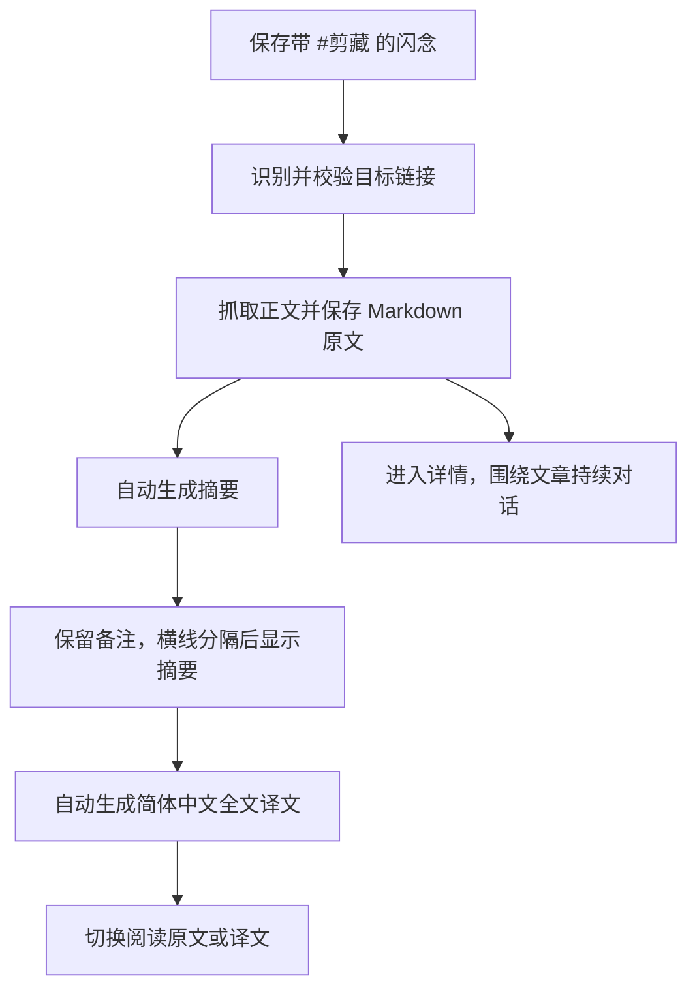
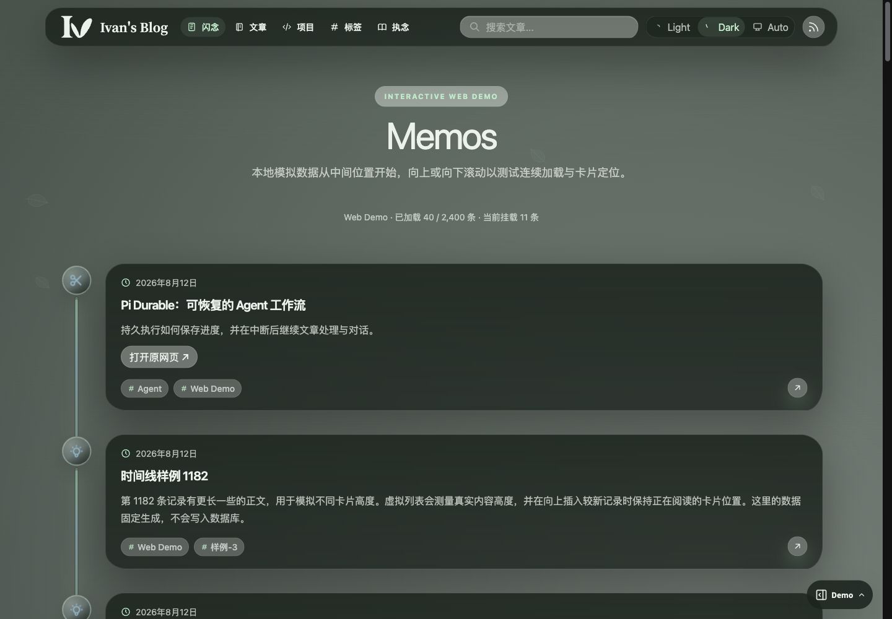
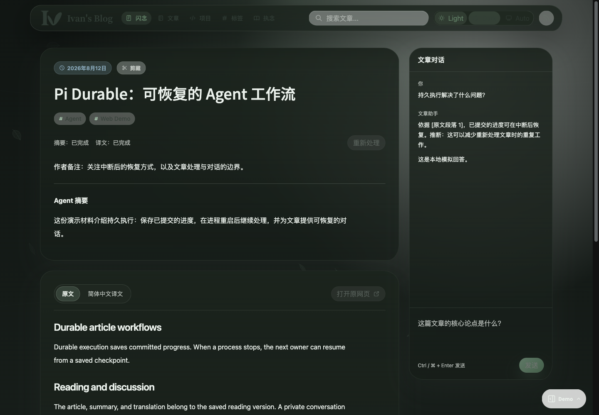
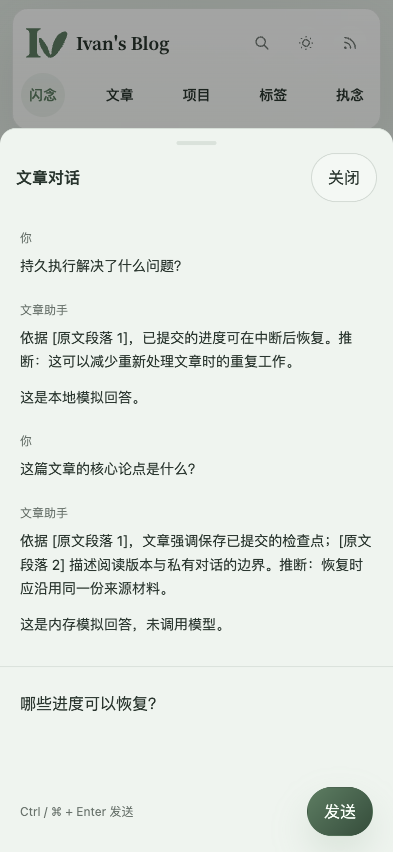

# Memo Clipping Workflow

> This file is the durable requirements contract for URL clipping from Memos. Implementation facts belong in IMPLEMENTATION.md; lifecycle history belongs in HISTORY.md.

## Context and Scope

- Context: A Memo can capture one external article when it carries the #剪藏 tag. The product needs a durable Agent workflow that preserves the author's Memo, produces readable article materials, and attaches a private discussion without turning the captured source into an unrelated post.
- In scope: trigger recognition, URL extraction, asynchronous processing, source Markdown, summary and Simplified Chinese translation, content visibility, source-link policy, persistent article conversations, responsive reading and chat surfaces, versioning, retry behavior, and cross-entry consistency.
- Out of scope: PDF/OCR, authenticated or CAPTCHA-protected sources, complex JavaScript-only extraction, recursive web research, automatic publication or deployment, provider-specific prompts, and a general-purpose crawler.

## Terms and Interfaces

- 剪藏闪念: an existing Memo with the exact 剪藏 tag and one captured target URL.
- 剪藏: the reader-facing content type for a clipping Memo, presented alongside 闪念 without changing its stored identity or permissions.
- 剪藏目标链接: the HTTP(S) URL represented by the first non-empty authored line, as plain text or a Markdown link.
- 剪藏备注: author-authored Memo content other than the target-link line; it remains before the generated summary.
- 剪藏摘要: the Agent-generated Simplified Chinese summary displayed as Memo content after any author remarks.
- 剪藏原文: the captured source article converted to safe, readable Markdown.
- 剪藏译文: the captured article translated into Simplified Chinese Markdown.
- 剪藏标题: the visible title resolved from explicit author title, page title, link text, or no title.
- 剪藏处理版本: one source snapshot with its summary, translation, processing metadata, and result state.
- 剪藏处理状态: progress or outcome with distinguishable summary and translation completion.
- 剪藏对话: the persistent, creator/admin-only conversation associated with a clipping's target; replacing the target creates a new conversation.
- Validation boundary: pages MUST NOT be created in Storybook. Page layout and behavior verification MUST use actual application routes.
- Web Demo MUST use the separately enabled Demo build on the official Memo list and detail routes with the production reader. Deterministic captured materials and in-memory discussion/reprocess operations MUST need no login, backend, article fetch, or model. The shared Inspector MUST expose clipping processing, success, translation failure, previous-version fallback, long content, persona, network, data, and reset/share controls; runtime query parameters MUST NOT activate Demo behavior in live artifacts.
- Interface: the existing Memo create/edit/detail/list, local Markdown source, database index, MCP, public snapshot, and live console boundaries remain authoritative for their respective surfaces.

## Reading Flow

The reading header keeps author remarks and the generated summary visible. The original/translation control switches only the article body beneath it. The source-page button opens the external page; it is distinct from reading the captured original Markdown.

## Requirements

### REQ-MCL-001

- The system MUST treat a Memo as a clipping when its effective authored tag set contains the exact 剪藏 tag, while preserving the Memo identity, existing permissions, dates, attachments, and other tags.
- Tag detection MUST use frontmatter and authored Markdown only. It MUST ignore fenced code, inline code, Markdown link destinations, generated clipping artifacts, URL fragments, and unrelated text containing the characters #剪藏.
- A literal authored #剪藏 tag serialized by the editor as `\#剪藏` MUST retain its tag meaning; Markdown escaping MUST NOT prevent clipping recognition or leave an escape character in the reading projection.
- Processing MUST retain the 剪藏 tag; Agent output MUST NOT add or remove authored tags.
- The same recognition rule MUST apply to browser authoring, MCP writes, filesystem synchronization, reprocessing, and public snapshot generation.

### REQ-MCL-002

- The system MUST identify exactly one 剪藏目标链接 from the first non-empty authored input line, excluding frontmatter and generated artifacts.
- A separately stored title that consists entirely of a URL or Markdown link MUST act as that target line. Otherwise, title metadata remains an explicit author title and the first non-empty body line MUST supply the target. An ATX H1, H2, or H3 wrapping the target line MUST be recognized after removing only its heading syntax.
- The line MUST be either a complete plain http:// or https:// URL, or a complete Markdown link whose destination is an http:// or https:// URL. A line containing surrounding prose, an unsupported scheme, or a URL in a later line MUST NOT silently select a target.
- The system MUST retain the original input for editing and diagnostics and MUST NOT infer the target from a truncated or derived database title.
- When the stored link-only title and first body line repeat the same target, the reading projection MUST omit the repeated target line while preserving the authored file.
- An invalid target MUST NOT discard the saved Memo or fetch a substitute URL; the author MUST receive an explicit correction path.

### REQ-MCL-003

- Saving a valid clipping MUST persist the Memo immediately and enqueue Agent processing asynchronously.
- Successful capture MUST schedule summary generation first, followed by automatic full-text translation without another user action.
- The workflow MUST survive page closure, client reconnect, process restart, and a retry of the same submission without losing committed source, result, or conversation state.
- The workflow MUST expose processing, completed, and failed states. Summary and translation progress MUST be independent so a completed summary remains readable while translation is pending or failed.
- Saved checkpoints and result writes MUST prevent duplicate summaries, duplicate active conversations, or unbounded automatic retries. A repeated external model call after an interruption MAY occur; exactly-once model invocation or billing is not a product guarantee.

### REQ-MCL-004

- The workflow MUST fetch only the submitted target page and MUST NOT recursively follow or search links discovered in that page.
- Fetching MUST validate every redirect target, allow only HTTP(S), bound redirects, timeout, response size, and concurrency, and reject loopback, private-network, link-local, cloud-metadata, and other disallowed destinations.
- Retrieved HTML MUST be treated as untrusted data. Scripts, navigation, forms, advertisements, and executable instructions MUST NOT be carried into the rendered Markdown or Agent authorization context.
- Unsupported, inaccessible, or non-article sources MUST produce an explicit failure or completeness warning; a title-only or navigation-only extraction MUST NOT count as successful article capture.

### REQ-MCL-005

- On successful extraction, the system MUST save a 剪藏原文 source snapshot as safe Markdown with preserved semantic headings, paragraphs, lists, quotes, tables, code blocks, resolvable content links, and safe body media where available.
- The system MUST produce a Simplified Chinese 剪藏摘要 that is clearly attributable to the Agent and covers the article's main thesis, important points, and useful conclusions without claiming unsupported facts.
- If the author supplied 剪藏备注, the visible Memo content MUST preserve it first, then append one horizontal separator and the generated summary. If no remark exists, the summary MUST appear without an empty remark section or leading separator.
- The target URL MUST be removed from the visible Memo body and represented by an explicit source-page action that readers can invoke.
- The composed remarks/summary MUST be the Memo content used by its list, timeline, detail, and authorized search/feed projections. The generated summary MUST remain distinguishable from author-authored input and be appended or replaced exactly once for the current version.

### REQ-MCL-006

- The system MUST generate a 剪藏译文 in Simplified Chinese for the successfully extracted article body.
- Translation MUST preserve the source's section order and meaningful Markdown structure, including code blocks, links, tables, and terminology consistency. Long inputs MUST be processed in bounded segments whose results can resume independently.
- The detail surface MUST offer an original/translation switch for the article body. The summary and author remarks MUST remain visible independently of that switch.
- The system MUST disclose incomplete extraction or translation and MUST NOT label partial output as a complete full-text translation.

### REQ-MCL-007

- The visible 剪藏标题 MUST resolve in this order: explicit author title, captured page title, Markdown link text, and absent title. An absent title MUST follow the existing titleless Memo contract and MUST NOT fall back to a slug or filename.
- A target-link line or URL-only title MUST NOT count as an explicit author title. A link label MUST NOT overwrite a separately supplied explicit author title.
- This precedence MUST apply only to clipping Memos; ordinary Memo title semantics MUST remain unchanged.

### REQ-MCL-008

- Each clipping MUST retain its processing versions, identify one current reading version, and maintain one active persistent conversation for its current target. Previous successful reading materials MUST remain available internally for failed-reprocess fallback. User-facing version history, past-conversation browsing, and manual version restoration are out of scope; no history/restore UI or business API may be exposed.
- The conversation MUST be accessible only to the Memo creator and administrators, even when the parent Memo is public.
- Conversation context MUST include the current source Markdown, translation when available, summary, and author remarks. Answers SHOULD distinguish source claims from Agent inference and SHOULD identify relevant sections or passages.
- Discussion MUST be available once source Markdown exists, without waiting for translation. Without a captured source, the Agent MUST NOT imply that it has read the article.
- Messages and generation state MUST survive reload, disconnect, and closing/reopening the mobile drawer. Context compaction MUST preserve the ability to locate source passages; long articles MUST NOT be silently omitted because they exceed the model context.
- The conversation MUST NOT receive arbitrary shell, unrelated user content, credential, or publication-management access by default.

### REQ-MCL-009

- Reader-facing lists, timeline entries, detail headers, search results, and management previews MUST identify clipping Memos as 剪藏 with the scissors icon rather than the ordinary Memo label and bulb icon. The icon MUST match the existing article and Memo outline family, stroke weight, rendered size, and shared timeline node frame. Displayed tag chips MUST omit only the exact 剪藏 marker for clipping Memos; other tags MUST remain visible. Authoring fields, stored tags, tag-based retrieval, routes, and permission boundaries MUST retain their existing behavior.
- Clipping type presentation MUST NOT change ordinary Memo list appearance. Ordinary entries retain their existing metadata, icon sizes, card structure, width, spacing, and responsive behavior. Memo lists MUST identify clipping entries through the existing type icon and MUST NOT add a redundant clipping badge beside the date or visibility metadata. Detail headers and surfaces with existing type labels MUST use the clipping label.
- Search result presentation MUST distinguish 剪藏 from ordinary 闪念 while preserving Memo detail URLs. The public search UI MUST offer a separate 剪藏 filter/count using the result's display classification, without changing the indexed Memo type.
- For authorized conversation participants, desktop detail MUST present the article reading surface on the left and the clipping conversation on the right, with a stable boundary that does not make either column unusable.
- The left reading column MUST contain two separate sibling cards in an unframed stack: a Memo card for its heading, remarks, summary, processing status, and actions, followed by an article card for language controls and captured source/translation Markdown. The cards MUST have a 24px vertical gap and MUST NOT be nested inside another card. The conversation MUST remain its own card alongside that unframed reading column, owning its heading, internally scrolling messages, and composer.
- The conversation composer MUST blend into the discussion card or mobile drawer without an additional rounded input surface. Input text MUST align with the messages, and keyboard focus MUST remain visible.
- The reprocess action MUST form a low-emphasis management group beside the Memo's processing status. The original-page entry MUST accompany the article's language controls. These toolbars MUST wrap their groups without overflow on narrow screens and MUST NOT combine all three actions into equal-emphasis pills beneath the title.
- Authorized desktop detail MUST use the wide content container with a 24px inter-card gap and a 320–360px discussion column. Ordinary Memos and visitor-only clipping reading MUST retain the existing single-column reading width. Card hover or focus MUST NOT shift the reading position or discussion layout.
- Language controls MUST clearly identify the displayed source or translation through their selected state and a non-color visual indicator. Focus on an inactive control MUST NOT imply selection; activation MUST update both the selected indicator and the displayed article together.
- For authorized conversation participants, narrow detail MUST prioritize continuous article reading and expose the conversation through an explicit button that opens a bottom-sheet overlay. Other readers MUST receive the authorized reading surface without loading private conversation data.
- The bottom sheet MUST support a clear close action, focus capture and return, controlled background scrolling, safe-area padding, software-keyboard avoidance, preserved scroll position, and preserved unsent draft state.
- The UI MUST follow the Nature responsive contract: continuous reading surfaces, no unnecessary nested cards, minimum 44px touch targets outside fine-pointer desktop, readable long text, light/dark/system themes, and reduced-motion behavior.

### REQ-MCL-010

- The summary, source Markdown, and translation MUST inherit the parent Memo's public/private visibility and existing publication rules.
- A private clipping MUST NOT appear in public lists, search, RSS, static snapshots, public media exports, or unauthenticated APIs.
- A public clipping MAY appear in public exports only after the existing publication path includes the parent Memo. Processing completion MUST NOT imply automatic publication or deployment.
- The private conversation, conversation transcript, private identity metadata, Agent runtime records, credentials, raw processing logs, and unapproved historical artifacts MUST never enter public exports. Existing explicitly public author attribution remains governed by the Memo contract.
- Conversation and private-artifact authorization MUST be enforced server-side; hidden controls, noindex, and cache headers MUST NOT be treated as authorization.
- Visibility changes MUST apply to current and retained reading artifacts at the live authorization boundary. Public snapshots MUST follow the existing publication lifecycle rather than claim immediate revocation of already deployed public files.

### REQ-MCL-011

- The source-page action MUST open in a new tab and carry the nofollow, noopener, and noreferrer rel tokens. Every clipping-specific external link, including links in remarks, source Markdown, translation, and generated output, MUST carry nofollow; new-tab external links MUST also carry noopener and noreferrer.
- The policy MUST NOT apply nofollow to normal same-site navigation or use link attributes as a substitute for crawler, fetch, or content authorization controls.
- The product MUST NOT describe nofollow as an absolute crawler prohibition or guarantee about ranking credit. It expresses the outbound-link policy without making the whole public clipping unindexable.
- The system MUST explain or expose a retry path when extraction, summary, translation, or persistence fails. A failed run MUST preserve author content and the source action and MUST NOT append a false or duplicate summary.
- When a previous successful version exists, a failed reprocess MUST keep that version as the reader-visible fallback while exposing the failed attempt for recovery.

### REQ-MCL-012

- Editing clipping remarks MUST NOT automatically re-run the Agent or overwrite a newer author edit.
- Changing the target URL MUST create a new processing version and a new conversation; previous successful material MAY remain as an explicitly attributed fallback; earlier conversations are not available through user-facing history operations.
- Removing #剪藏 MUST stop unfinished clipping work, restore ordinary Memo presentation, and retain saved reading materials internally without exposing manual historical recovery.
- Manual reprocessing of the same target MUST retain the previous successful version until the replacement reaches a usable state.
- Manual reprocessing of the same target MUST retain its conversation. Source, summary, and translation used for automatic fallback MUST belong to one matched processing version; unrelated source versions MUST NOT be silently mixed into one reading result or conversation.
- If the reader sees a previous successful version while a changed target is processing or has failed, the displayed material MUST identify its actual source and version rather than imply it belongs to the new URL.
- Every new Memo with the same URL MUST remain an independent clipping and conversation; implementations MAY reuse safe fetch/cache material without merging user-facing records.
- Deleting a Memo MUST stop its work and obey the existing deletion/retention policy. A delayed completion MUST NOT recreate deleted content, restore a removed tag, or overwrite a newer target.

### REQ-MCL-013

- UI authoring, MCP writes, and filesystem synchronization MUST preserve the clipping relationship, generated-output boundary, version metadata, and current author content.
- Existing Memo content remains file-backed with the database as its synchronized index; a clipping implementation MUST prevent ordinary edits or resync from silently discarding clipping metadata or generated artifacts.
- Generated summary, original, and translation content MUST not re-trigger #剪藏 detection or become a second target link.
- Retained processing versions MUST identify their target, capture time, source fingerprint, model/prompt identity, and result completeness so fallback summaries and translations can be traced to the same source snapshot. Ordinary readers need not receive runtime diagnostics.

### REQ-MCL-014

- Durable Agent execution MUST sit behind an application-owned interface. The experimental runtime's task/conversation APIs MUST NOT become public Memo, UI, or MCP business contracts.
- Runtime execution state MUST use a separate persistence boundary from canonical Memo content and retained reading artifacts; the application MUST own source extraction, permissions, version association, and publication.
- Summary, translation, and conversation MUST reuse the project's configured LLM provider resolution. Missing or invalid configuration MUST leave saved author input intact and expose a recoverable processing error.
- Execution ownership and bounded retry/concurrency MUST prevent simultaneous workers from corrupting one task or conversation. Replacing or removing an active target MUST invalidate stale result writes.

## Verification

### VER-MCL-001

- Method: parser and tag fixture tests covering plain URLs, Markdown links, URL-only title metadata, separate custom titles, first-line H1/H2/H3 links, leading blanks, surrounding prose, unsupported schemes, later links, code spans, fenced code, link destinations, URL fragments, and generated content.
- covers: REQ-MCL-001 and REQ-MCL-002
- Pass condition: only the exact first-line target and authored 剪藏 tag activate clipping, across UI, MCP, sync, and snapshot inputs; invalid targets remain saved and expose correction without fetching a later link.

### VER-MCL-002

- Method: durable workflow integration tests with process interruption, duplicate request retry, independent summary/translation completion, failed-step retry, conflicting worker ownership, missing provider configuration, and source-version replacement.
- covers: REQ-MCL-003, REQ-MCL-004, REQ-MCL-005, REQ-MCL-006, REQ-MCL-011, and REQ-MCL-014
- Pass condition: summary precedes automatic translation; committed progress resumes without duplicate summaries; unsafe destinations and unsupported sources are rejected; partial results are labeled; missing provider configuration is recoverable; and previous successful output remains available after a failed replacement.

### VER-MCL-003

- Method: content contract tests against Memo create/edit/delete, concurrent author edits, MCP create/update, filesystem sync, automatic previous-success fallback, absent history/restore endpoints, duplicate-URL Memos, target replacement/removal, and database/public snapshot projection.
- covers: REQ-MCL-005, REQ-MCL-007, REQ-MCL-010, REQ-MCL-012, and REQ-MCL-013
- Pass condition: author remarks, titles, tags, visibility, attachments, clipping metadata, matched fallback materials, and source ownership survive every supported write path; removing a tag or Memo stops stale writes; same-URL Memos remain independent; remarks precede exactly one summary with a separator only when needed; private records never enter public projections.

### VER-MCL-004

- Method: authenticated API and route tests for creator, administrator, unauthenticated visitor, public Memo, private Memo, public snapshot, and live console; conversation recovery and grounded-answer evaluation before/after translation and context compaction.
- covers: REQ-MCL-008 and REQ-MCL-010
- Pass condition: creator/admin conversation access and recovery work, all other access is denied, public exports contain only authorized reading artifacts without conversation state, and answers can locate source evidence without pretending to read unavailable text.

### VER-MCL-005

- Method: desktop and narrow browser interaction tests at the project responsive contract viewports (including 393px, 375px, 360px, and 320px), with guest/authorized-reader views, keyboard, touch, software keyboard, reduced motion, theme changes, and focus return.
- covers: REQ-MCL-009
- Pass condition: desktop split reading/chat remains usable; mobile bottom sheet opens, closes, preserves reading position and draft state, respects safe areas, and has no horizontal overflow or inaccessible controls.

### VER-MCL-006

- Method: rendered-link and crawler-policy inspection of public and console output.
- covers: REQ-MCL-011
- Pass condition: every clipping external link carries nofollow; source/new-tab external actions also carry noopener noreferrer; ordinary internal links remain unaffected; public pages remain indexable under existing publication rules; and failed processing exposes a recoverable state without false content.

## Related ADRs

- [ADR 0003: Public Mobile Content Stream](../../adr/0003-public-mobile-content-stream.md)
- [ADR 0010: Use a Self-Contained SSR Console Beside the Static Public Site](../../adr/0010-self-contained-console-runtime.md)
- [ADR 0012: Keep Clipping Attached to a Memo With a Private Conversation](../../adr/0012-memo-clipping-content-boundaries.md)

## Visual Evidence

The native Web Demo demonstrates the shared list, detail cards, and responsive private discussion. Fixtures are isolated from live APIs and model services.

## References

- [Implementation facts](./IMPLEMENTATION.md)
- [Topic history](./HISTORY.md)
- [Domain glossary](../../../CONTEXT.md)
- [Memo title semantics](../memo-title-semantics/SPEC.md)
- [Nature frontend responsive contract](../nature-front-ui/SPEC.md)
- [Remote MCP contract](../remote-mcp/SPEC.md)
- [Pi Durable introduction](https://earendil.com/posts/pi-durable/)
- [Google Search Central: Qualify outbound links](https://developers.google.com/search/docs/crawling-indexing/qualify-outbound-links)
