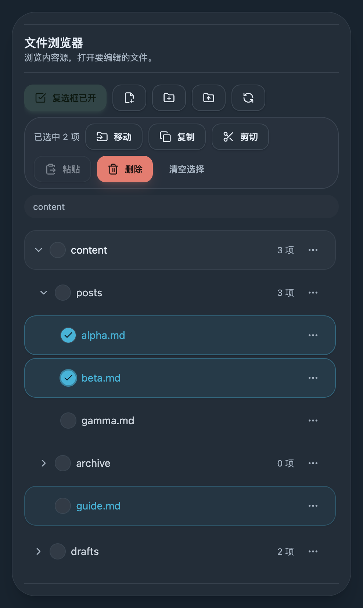
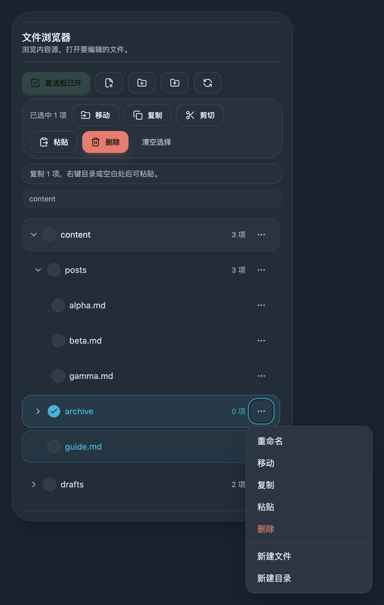
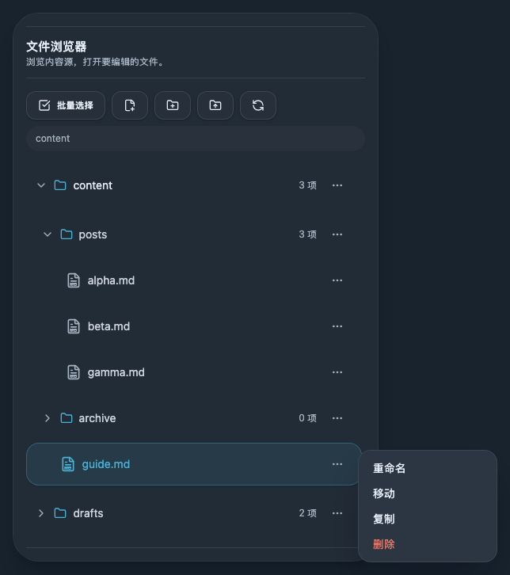
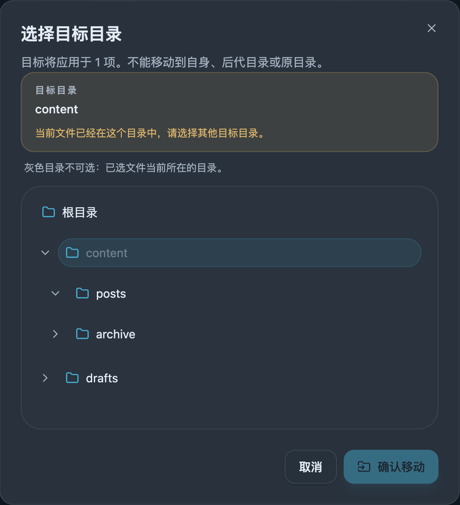
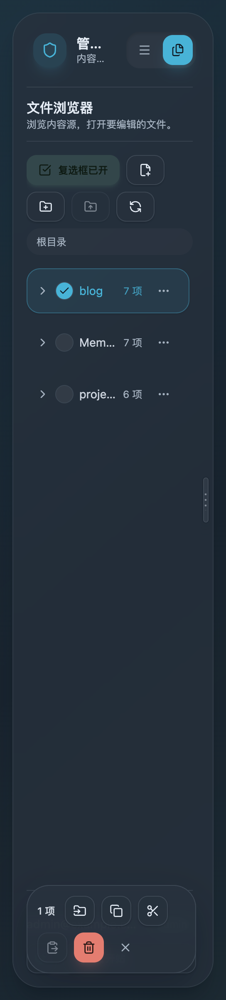
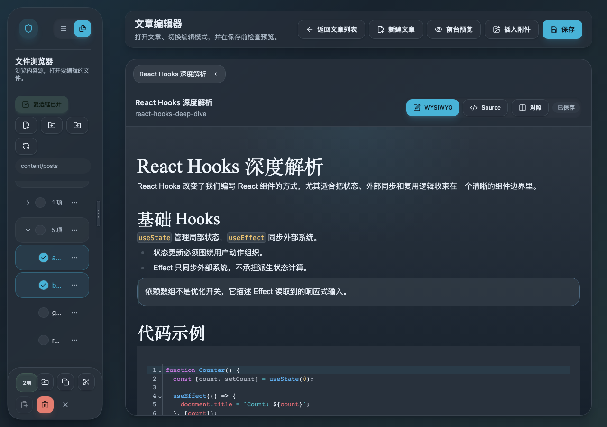
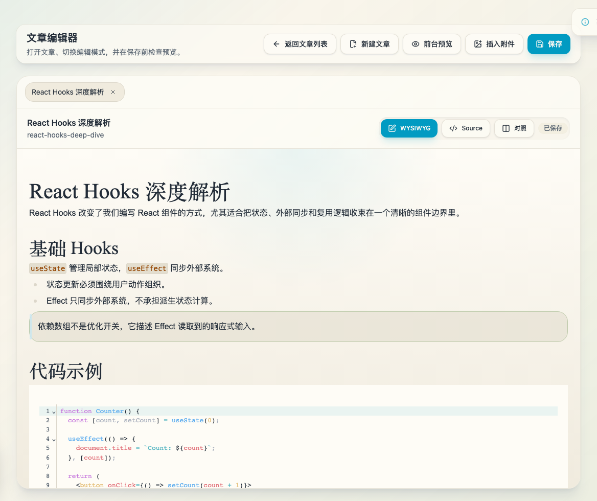
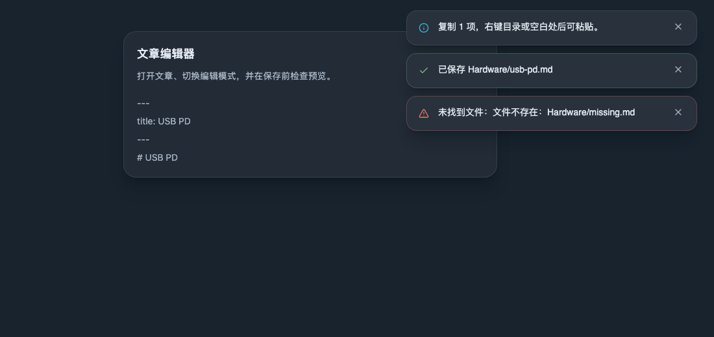

# SPEC: Local Content Source Uses Real Directory Layout

- Spec ID: `mivez`
- Status: `in-progress`
- Last Updated: `2026-03-11`
- Owner: `main-agent`

## 1. Background

Production reads content from the local content source.
The real upstream note tree is rooted at `Notes/` and stores content directly under directories such as `Memos/`, `Hardware/`, `HomeLab/`, `Ops/`, and `Project/`.
The current blog local setup still depends on synthetic wrapper directories like `posts/` and a stale lowercase `memos/`, which distorts the real filesystem layout and leaks that distortion into the admin file tree.

## 2. Goals

1. Let the local content source scan and classify content directly from the real on-disk directories.
2. Keep public routes stable (`/posts/*`, `/memos/*`) even when on-disk directories are `Hardware/`, `HomeLab/`, `Ops/`, `Project/`, and `Memos/`.
3. Keep current content semantics unchanged during the migration: directories explicitly configured as local post roots remain `post` content even if their names are not `posts/`.
4. Make the admin local file tree reflect configured real roots instead of synthetic compatibility folders.

## 3. Non-goals

- No change to public route structure or permalink format.
- No rewrite of existing markdown files solely to rename directories.
- No broad rewrite of unrelated asset path semantics in the same change.
- No introduction of a new public `project` route in this follow-up.

## 4. Contract

### 4.1 Real local roots

- `LOCAL_CONTENT_BASE_PATH` may point at the real notes root.
- `LOCAL_BLOG_PATH` may list one or more real directories such as `/Hardware,/HomeLab,/Ops,/Project`.
- `LOCAL_MEMOS_PATH` continues to point at the real memo root, defaulting to `/Memos`.
- The local content source must scan only configured content roots instead of recursively treating the whole base path as content.

### 4.2 Type inference

- Local content type inference must be driven by configured local roots rather than hard-coded synthetic prefixes like `posts/`, `projects/`, and `memos/`.
- Local post roots configured through `LOCAL_BLOG_PATH` must still produce `type="post"`.
- Memo root matching remains case-safe and continues to recognize `Memos/*.md`.
- Legacy dev/test roots such as `/blog` and `/projects` remain supported through the same configured-root matcher.

### 4.3 Admin file browser behavior

- Local root listing must expose configured real roots, not synthetic compatibility folders.
- Unconfigured stray directories under the local base path must not appear in the top-level local content browser.
- Local file read/list operations should stay constrained to configured content roots.
- Local file creation/write operations must self-initialize the selected `local` content source before the first write, so creating a file inside configured real roots such as `Hardware/` does not depend on an earlier directory scan or sync run.

## 5. Acceptance criteria

1. With `LOCAL_CONTENT_BASE_PATH` pointing at a notes root and `LOCAL_BLOG_PATH=/Hardware,/HomeLab,/Ops,/Project`, local sync indexes those directories without requiring a `posts/` wrapper.
2. `Memos/*.md` continues to sync as `memo` content and keeps `/memos/<slug>` routes unchanged.
3. A configured real post root such as `Hardware/foo.md` syncs as `type="post"` and keeps `/posts/<slug>` routes unchanged.
4. The admin local file tree top level shows configured real roots and does not require `posts/` or lowercase `memos/` to exist.
5. Regression tests cover configured-root inference and local-source scanning against real root names.
6. Creating a new local file from the admin file tree inside a configured real root such as `Hardware/` succeeds without surfacing a “内容源 local 尚未初始化” error.

## 6. Risks and rollback

### Risks

- Reclassifying local paths incorrectly could change post counts or hide content from existing `/posts` pages.
- Browsing the whole notes root without root filtering could accidentally surface unrelated directories such as `Journals/`.

### Mitigations

- Preserve current `post` semantics by driving inference from configured `LOCAL_BLOG_PATH` roots.
- Restrict local scanning and local root listing to configured roots only.
- Keep legacy `/blog` and `/projects` layouts working through the same matcher so dev/test fixtures do not break.

### Rollback

- Revert the configured-root matcher and local root filtering.
- Restore the previous compatibility bind mounts if the local source cannot correctly classify real directories.

## 7. Change log

- 2026-03-11: Initial spec for removing synthetic local wrapper directories and recognizing the real note tree directly.
- 2026-06-09: Clarified that admin local file writes must initialize the selected local source lazily so real-root file creation works before any prior sync or scan.

## 8. Visual Evidence

### Checkbox mode and batch toolbar

### Context menu with clipboard-ready paste

### Context menu escapes the sidebar card and stays within the viewport

### Delete confirmation dialog

### Move dialog invalid-target guidance

### Sidebar-bottom batch action footer

### Compact icon-only footer at constrained width

### Sidebar-wide adaptive footer at minimum sidebar width

### Floating editor operation feedback

PR: include
source_type=storybook_canvas; target_program=mock-only; capture_scope=browser-viewport; sensitive_exclusion=N/A; submission_gate=approved

