# SPEC: Nature Frontend Redesign Without DaisyUI

- Spec ID: `n8ure`
- Status: `done`
- Last Updated: `2026-04-12`
- Owner: `main-agent`

## 1. Background

The public blog frontend currently mixes content-focused pages with DaisyUI theme tokens and component classes.
That keeps the UI tied to rectangular, component-library-driven styling and prevents a coherent nature-inspired visual language.
We need a frontend-owned design system that keeps routes and content behavior stable while replacing the public presentation layer with a calmer, more organic interface.

## 2. Goals

1. Replace DaisyUI-driven public styling with a dedicated Nature design system for the visitor-facing frontend.
2. Keep public routes, data fetching, metadata, comments, tags, search, and memo behavior unchanged.
3. Reduce theme behavior to `light`, `dark`, and `system`, driven by a custom `data-ui-theme` runtime.
4. Provide deterministic visual verification for the redesigned public pages through a stable local preview surface and recorded screenshots.

## 3. Non-goals

- No admin panel redesign or admin-only component migration.
- No content model, API, search contract, comment moderation, or sync workflow changes.
- No repository-wide DaisyUI dependency removal in the same change.
- No Storybook adoption for this task.

## 4. Contract

### 4.1 Theme runtime

- The public frontend uses `light`, `dark`, and `system` only.
- The root document stores the resolved public theme in `data-ui-theme`.
- Legacy `data-theme` stays synchronized to `light` or `dark` only for un-migrated surfaces that still expect it.

### 4.2 Public styling boundary

- Public pages and their shared components must not rely on DaisyUI classes such as `btn`, `card`, `badge`, `alert`, `input`, `dropdown`, `navbar`, `loading`, `modal`, or `tabs`.
- Public pages and their shared components must not rely on DaisyUI semantic color tokens such as `bg-base-*`, `text-base-*`, `border-base-*`, `text-primary`, or similar public-facing theme shortcuts.
- The public frontend instead uses custom CSS variables, custom surface/button/input classes, and page-specific layout primitives.

### 4.3 Visual language

- The public shell uses soft gradients, translucent surfaces, organic radii, and low-frequency ambient motion.
- Reading-heavy pages keep motion density lower than index/list pages.
- Reduced-motion users receive the same layout and hierarchy with heavily reduced animation and particle effects.

## 5. Acceptance criteria

1. `/`, `/posts`, `/posts/[slug]`, `/memos`, `/memos/[slug]`, `/tags`, `/tags/[...tagSegments]`, `/search`, `/about`, and `/projects` render with the Nature design system in `light`, `dark`, and `system`.
2. The public theme toggle exposes only `light`, `dark`, and `system`.
3. Public-path source checks fail if DaisyUI public classes or DaisyUI semantic color tokens reappear in the guarded frontend files.
4. `/theme-test` acts as a stable visual preview surface for the shared public design language.
5. Existing public behaviors keep working: search, pagination, tag navigation, comments, memo browsing, markdown rendering, and theme persistence.
6. Reduced-motion mode disables or significantly softens particles, gooey motion, and ripple effects without harming usability.

## 6. Validation

- `bun run check:public-no-daisy`
- `git diff --name-only -- '*.ts' '*.tsx' '*.css' '*.json' '*.md' | xargs bunx biome check`
- `bun test src/lib/__tests__/theme.test.ts`
- `DB_PATH=$(pwd)/test-data/sqlite.db LOCAL_CONTENT_BASE_PATH=$(pwd)/test-data/local CONTENT_SOURCES=local NEXT_PUBLIC_SITE_URL=http://localhost:30090 PUBLIC_SITE_URL=http://localhost:30090 bun run build`
- `BASE_URL=http://localhost:30090 WEBDAV_URL=http://localhost:30091 PLAYWRIGHT_REUSE_APP=true PLAYWRIGHT_REUSE_WEBDAV=true DB_PATH=$(pwd)/test-data/sqlite.db LOCAL_CONTENT_BASE_PATH=$(pwd)/test-data/local CONTENT_SOURCES=local bunx playwright test tests/e2e/guest/astro-front-phase1.spec.ts tests/e2e/guest/hover-stability.spec.ts tests/e2e/guest/nature-front-coverage.spec.ts --project=guest-chromium`
- `bun run check` is still blocked by pre-existing repository-wide issues outside this scope:
  - `biome.jsonc` schema mismatch against the globally installed Biome CLI
  - existing admin/editor lint findings unrelated to the public Nature redesign

## 7. Visual Evidence

- Evidence captured against local branch `th/nature-front-redesign` on the refreshed Nature frontend worktree state after the width, comment-form, and code-highlighting fixes.
- Assets stored under `docs/specs/n8ure-nature-front-ui/assets/`.

PR: include
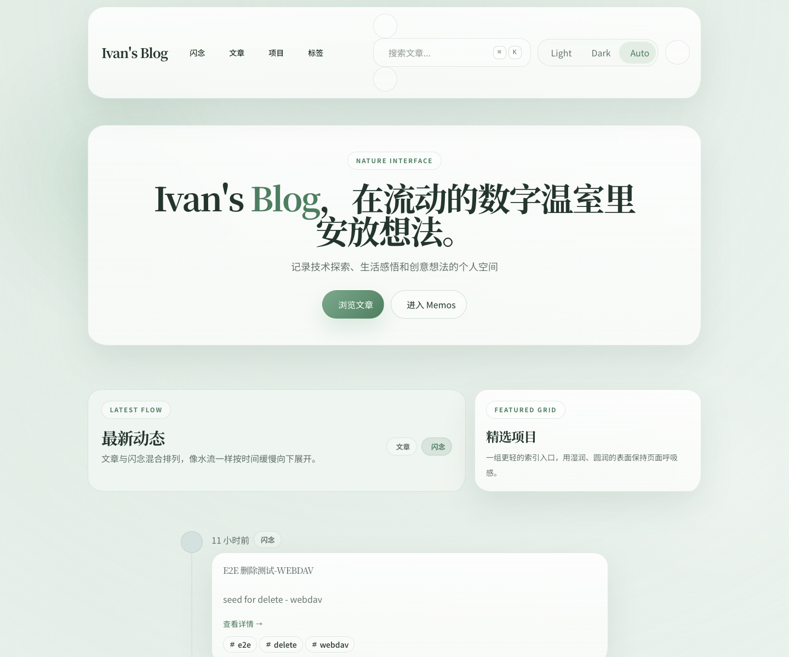

PR: include
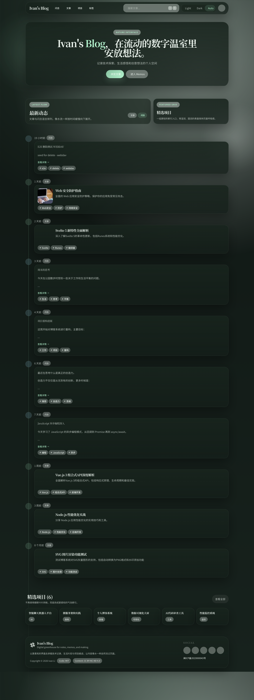

PR: include
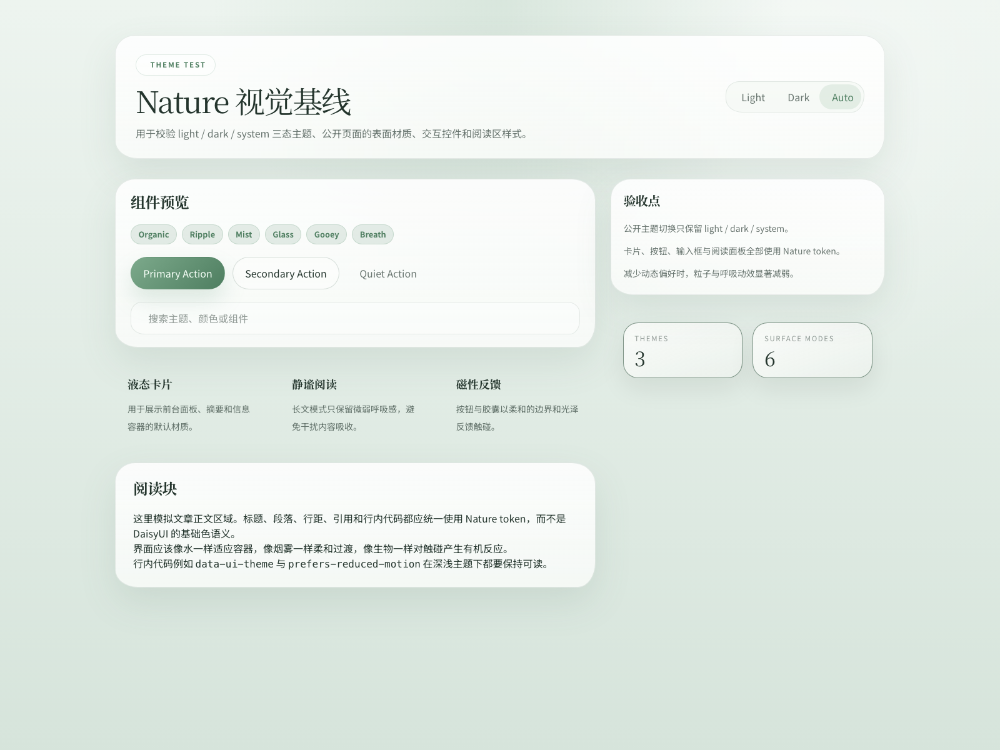

PR: include
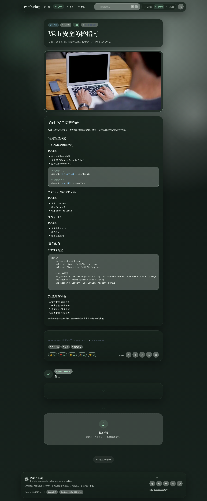

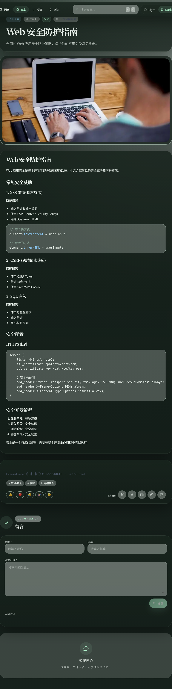

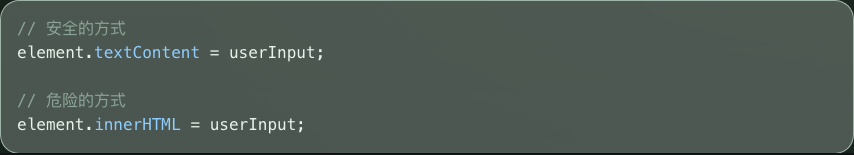

### Related posts responsive cards

- Evidence bound to local HEAD `f0606193b047c9e2e466fd17cac9e1a98a811ed1` from the stable local Astro preview.
- Desktop keeps four equal cards, tablet keeps two reduced-height wide cards, and mobile keeps one adaptive column where no-cover cards omit the media block.

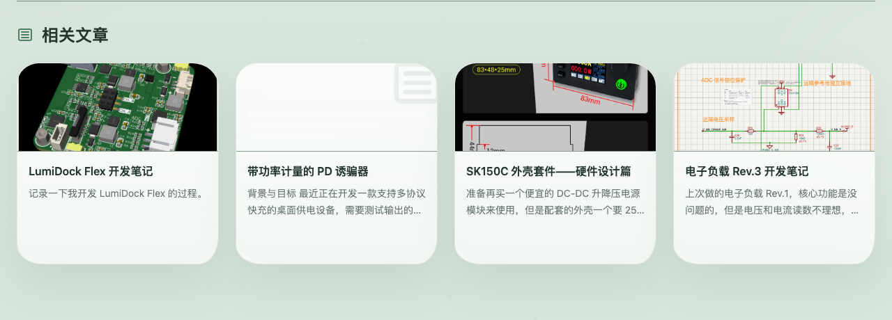

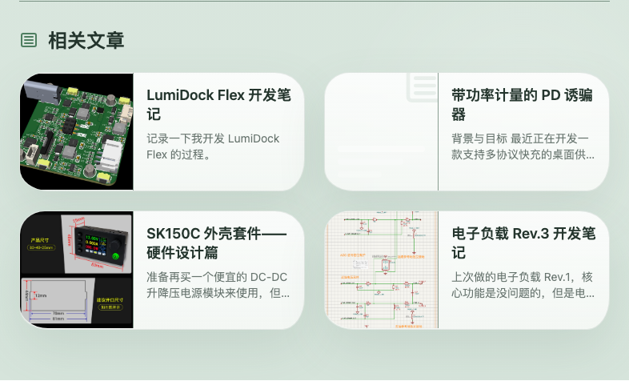

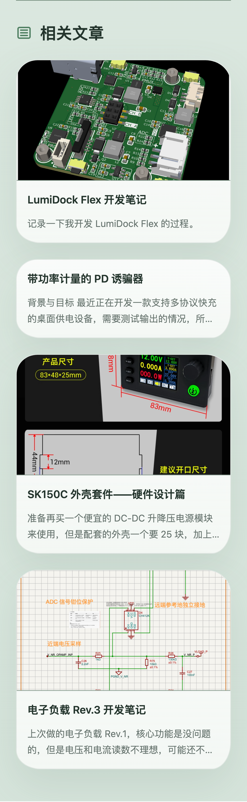

### Home and memos timeline restoration

- Evidence captured from the stable production gateway preview on local branch `th/timeline-visual-restore`.
- Desktop restores a shared timeline rail and node rhythm across `/` and `/memos`, verifies the memos guide line in both light and dark themes, and removes the extra intro cards that previously sat between the home hero and the first timeline item.
- Mobile keeps a reduced-but-visible rail instead of collapsing into plain stacked cards, and the memo detail affordance is hidden there so it does not compete with tags or content.

PR: include
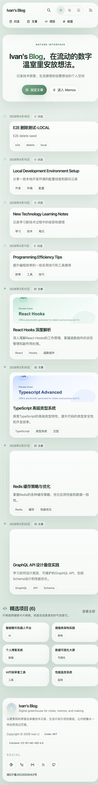

PR: include
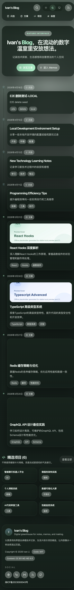

PR: include
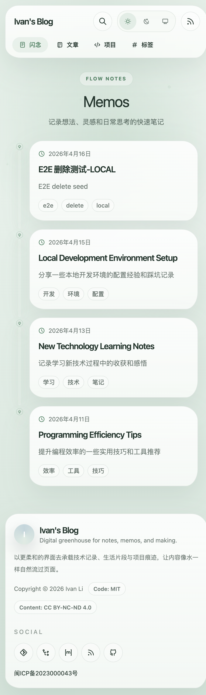

PR: include
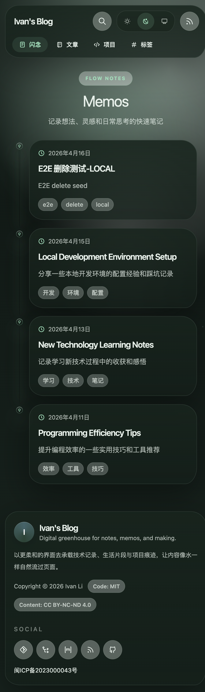

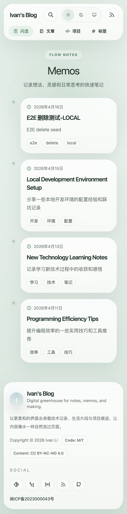

### Hover stability on dense public lists

- Evidence captured from the local hover-stability preview on `2026-04-11` using the shared `nature-hover-hitbox` + `nature-hover-lift` contract.
- The outer hitbox stays stationary while the inner surface carries the lifted shadow/border state, preventing hover thrash near the lower edge of related-post cards, tag cards, search results, and tag badges.

PR: include
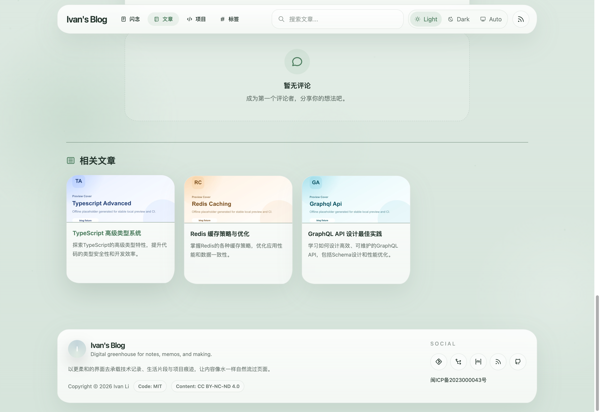

PR: include
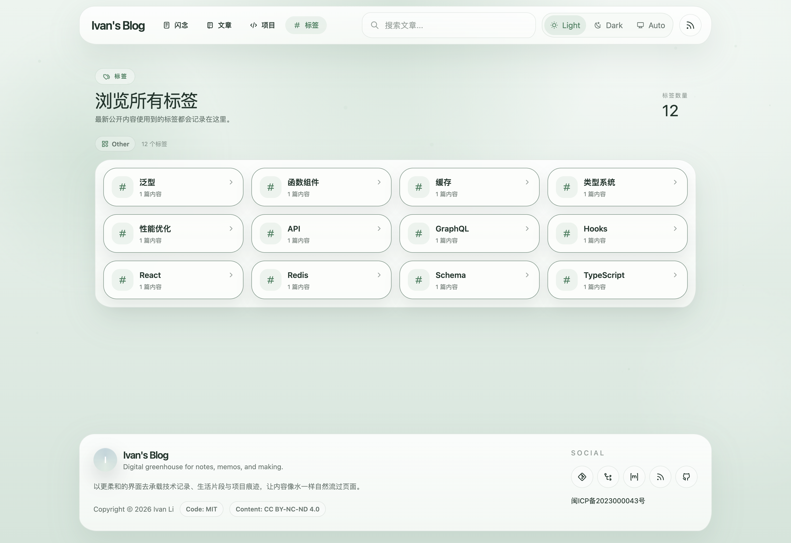

PR: include
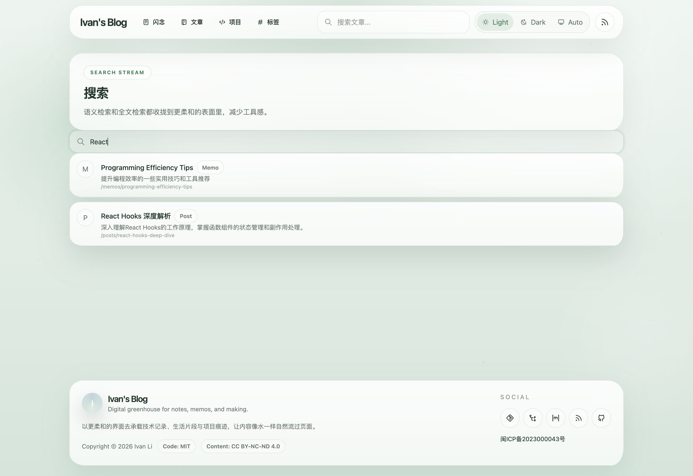

## 8. Change log

- 2026-04-05: Created spec for the public Nature redesign and DaisyUI decoupling.
- 2026-04-06: Refreshed local visual evidence after the layout, comment-form, and syntax-highlighting fixes.
- 2026-04-10: Added responsive related-post card evidence for desktop, tablet, and mobile states.
- 2026-04-11: Added a shared hover hitbox/lift contract, refreshed dense-list coverage, and stored hover-stability visual evidence for related posts, tags, and search results.
- 2026-04-11: Closed the spec after the final Astro public-route, theme shell, and hover-stability regression pass.
- 2026-04-12: Fixed the Astro public theme bootstrap regression so dark/system-dark theme state persists across route navigation and extended the Astro guest regression suite to block the issue.
- 2026-04-16: Restored the shared public timeline rail/node contract for the home mixed feed and memos list, refreshed light/dark/mobile evidence, removed the extra home intro cards, and extended guest regression coverage for timeline visibility.
