# SPEC: Nature Frontend Redesign Without DaisyUI

- Spec ID: `n8ure`
- Status: `done`
- Last Updated: `2026-08-03`
- Owner: `main-agent`

## 1. Background

The public blog frontend currently mixes content-focused pages with DaisyUI theme tokens and component classes.
That keeps the UI tied to rectangular, component-library-driven styling and prevents a coherent nature-inspired visual language.
We need a frontend-owned design system that keeps routes and content behavior stable while replacing the public presentation layer with a calmer, more organic interface.

## 2. Goals

1. Replace DaisyUI-driven public styling with a dedicated Nature design system for the visitor-facing frontend.
2. Keep public routes, data fetching, metadata, comments, tags, search, and memo behavior unchanged.
3. Reduce theme behavior to `light`, `dark`, and `system`, driven by a custom `data-ui-theme` runtime.
4. Provide deterministic visual verification for the redesigned public pages through a stable local preview surface and recorded screenshots.

## 3. Non-goals

- No admin panel redesign or admin-only component migration.
- No content model, API, search contract, comment moderation, or sync workflow changes.
- No repository-wide DaisyUI dependency removal in the same change.
- No Storybook adoption for this task.

## 4. Contract

### 4.1 Theme runtime

- The public frontend uses `light`, `dark`, and `system` only.
- The root document stores the resolved public theme in `data-ui-theme`.
- Legacy `data-theme` stays synchronized to `light` or `dark` only for un-migrated surfaces that still expect it.

### 4.2 Public styling boundary

- Public pages and their shared components must not rely on DaisyUI classes such as `btn`, `card`, `badge`, `alert`, `input`, `dropdown`, `navbar`, `loading`, `modal`, or `tabs`.
- Public pages and their shared components must not rely on DaisyUI semantic color tokens such as `bg-base-*`, `text-base-*`, `border-base-*`, `text-primary`, or similar public-facing theme shortcuts.
- The public frontend instead uses custom CSS variables, custom surface/button/input classes, and page-specific layout primitives.

### 4.3 Visual language

- The public shell uses soft gradients, translucent surfaces, organic radii, and low-frequency ambient motion.
- Reading-heavy pages keep motion density lower than index/list pages.
- Reduced-motion users receive the same layout and hierarchy with heavily reduced animation and particle effects.
- Public route transitions expose a non-blocking pending indicator anchored to the site header. The indicator floats below the header frame without shifting document flow, sets page busy state while navigation is preparing, and clears after the next page load.
- Article and memo detail pages preserve server-rendered Markdown content for first paint while deferring interactive Markdown hydration until the content approaches the viewport; neither page may expose a persistent live loading state or static interaction guidance after content is readable.

### 4.4 Responsive control and code density

- At `min-width: 1024px` with a fine pointer, public text actions use a `36px` target; navigation, icon controls, and link-style badges use a `32px` target.
- Outside that desktop condition, interactive public controls use a minimum `44px` target. Static status badges remain compact and do not imply an interactive hit area.
- `MarkdownRenderer` owns the public Markdown code surface. Dark code blocks use a low-brightness green surface, AA-readable foreground and syntax tokens, `12px` vertical by `14px` horizontal padding, and a `12px` radius. Horizontal overflow and code folding remain available.
- Below `640px`, public page containers keep `12px` viewport gutters, content panels use `16px` horizontal padding, and surface radii step down to `16px`, `14px`, and `12px`. Touch targets remain at least `44px`; the reduced spacing must not be achieved by shrinking interactive controls.
- Below `360px`, timeline rails and gaps compact further so the reading column gains width, while navigation labels may collapse to their already-labelled icons.

### 4.5 Static search deep links

- The static `/search/` document must inspect the runtime URL before the first paint. When a non-blank `q` is present, the search input, query-aware status, and full loading skeleton expose the decoded keyword until React search results are ready.
- On narrow viewports, the public site header uses the same content-width container as the page body. Its primary navigation stays visible as the second header row; theme selection and RSS remain directly available without a navigation menu. The RSS control keeps a compact 36px visual frame so it does not compete with the theme selector.
- While the search island is pending hydration, its build-time empty state stays `hidden`, `inert`, and `aria-hidden`. The query-aware bootstrap is the only visible and accessible search surface.
- The bootstrap fills keyword nodes with `textContent` and the input `value`; it must not inject URL-derived HTML.
- The bootstrap hands off in place only after the React island emits its component-level ready signal from a committed query-aware render, including after Astro ClientRouter swaps. Missing, empty, or whitespace-only `q` values bypass it and keep the existing exploration state.
- If the island does not become ready within a bounded interval, the bootstrap keeps the keyword visible, replaces the result skeleton with an accessible loading-failure message, and offers a page reload instead of waiting indefinitely.
- At `438x852` and below the `sm` breakpoint, the query panel prioritizes the title, input, loading state, and result-type controls. The page-title kicker is omitted at every breakpoint so `搜索内容` remains the sole page-purpose label; its descriptive copy and redundant non-loading no-result summary recede on narrow viewports, while the first result surface starts in the first half of the viewport; desktop spacing and the no-keyword exploration state remain unchanged.
- The search query field uses the shared `nature-input-shell` color surface without an elevated shadow. Its compact 48px search variant uses a visible 1px border, 20px corners, and a 2px focus ring so the field remains recognizable without dominating adjacent controls or results.

## 5. Acceptance criteria

1. `/`, `/posts`, `/posts/[slug]`, `/memos`, `/memos/[slug]`, `/tags`, `/tags/[...tagSegments]`, `/search`, `/about`, and `/projects` render with the Nature design system in `light`, `dark`, and `system`.
2. The public theme toggle exposes only `light`, `dark`, and `system`.
3. Public-path source checks fail if DaisyUI public classes or DaisyUI semantic color tokens reappear in the guarded frontend files.
4. `/theme-test` acts as a stable visual preview surface for the shared public design language.
5. Existing public behaviors keep working: search, pagination, tag navigation, comments, memo browsing, markdown rendering, and theme persistence.
6. Reduced-motion mode disables or significantly softens particles, gooey motion, and ripple effects without harming usability.
7. Same-site Markdown links, including same-origin absolute URLs, navigate in the current tab, while external Markdown links keep a new tab target and safe `rel` attributes.
8. Query-bearing search deep links keep the decoded keyword visible before, during, and after island hydration without exposing the no-keyword empty state or duplicate accessible controls; at `393px`, the public header aligns to the body container, exposes `Main navigation` as its second row, and keeps theme selection plus RSS directly available.
9. At a `438x852` mobile viewport with a non-empty query, the first result surface begins at or before `y=426`, leaving at least half of the first viewport for search results.
10. Public desktop and touch control density follow the `36px` / `32px` and `44px` contracts respectively without enlarging static status badges.
11. Public Markdown rendering never depends on a light highlighter stylesheet; dark code blocks retain readable syntax colors, horizontal overflow, and folding behavior.
12. Public pages at `393px` and `320px` do not overflow horizontally, keep `44px` touch targets, and use the compact mobile spacing and radius contract without changing desktop density.

## 6. Validation

- `bun run check:public-no-daisy`
- `git diff --name-only -- '*.ts' '*.tsx' '*.css' '*.json' '*.md' | xargs bunx biome check`
- `bun test src/lib/__tests__/theme.test.ts`
- `DB_PATH=$(pwd)/test-data/sqlite.db LOCAL_CONTENT_BASE_PATH=$(pwd)/test-data/local CONTENT_SOURCES=local NEXT_PUBLIC_SITE_URL=http://localhost:30090 PUBLIC_SITE_URL=http://localhost:30090 bun run build`
- `BASE_URL=http://localhost:30090 PLAYWRIGHT_REUSE_APP=true DB_PATH=$(pwd)/test-data/sqlite.db LOCAL_CONTENT_BASE_PATH=$(pwd)/test-data/local CONTENT_SOURCES=local bunx playwright test tests/e2e/guest/astro-front-phase1.spec.ts tests/e2e/guest/hover-stability.spec.ts tests/e2e/guest/nature-front-coverage.spec.ts --project=guest-chromium`
- `PLAYWRIGHT_START_PUBLIC_MEDIA_SIDECAR=0 bunx playwright test --project=guest --grep "Code Block Rendering"`
- `bun run build-storybook`
- `bun run check`

## Visual Evidence

PR: none

- Evidence captured against local branch `th/nature-front-redesign` on the refreshed Nature frontend worktree state after the width, comment-form, and code-highlighting fixes.
- Assets stored under `docs/specs/n8ure-nature-front-ui/assets/`.

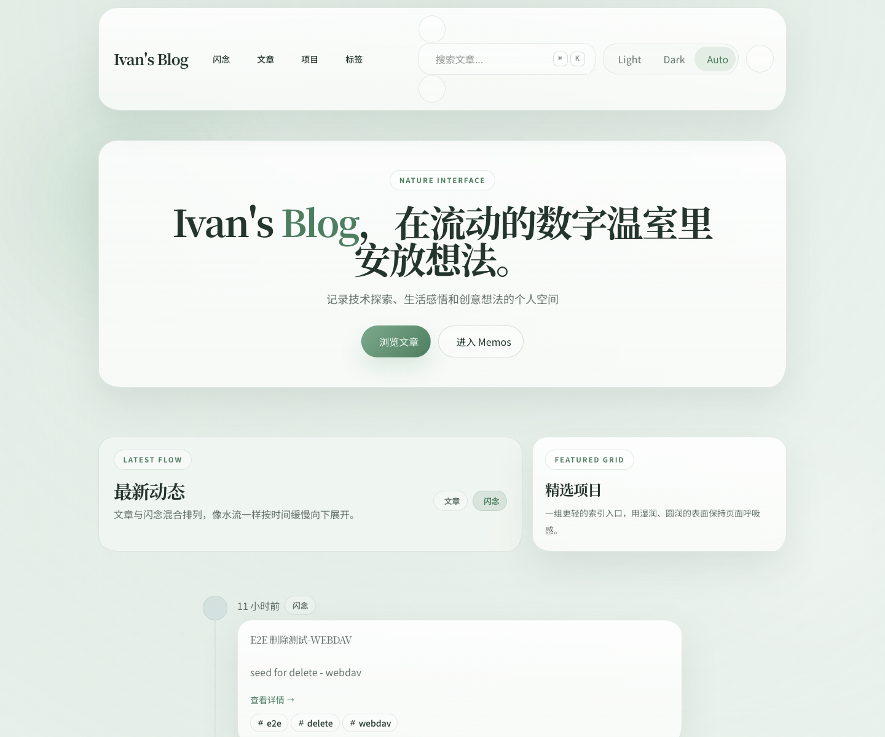

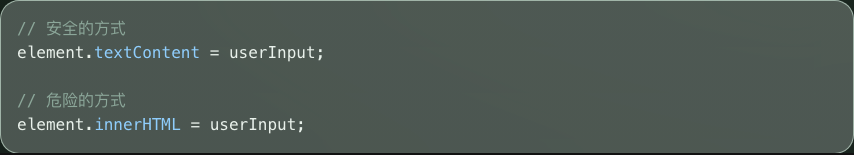

### Responsive control and dark code surface

- Evidence binding `7b2e49e54b241941b30c5350351d3a1392336471`; source type `storybook_canvas`, target program `mock-only`, capture scope `iframe-element`, sensitive exclusion `N/A`.
- Fine-pointer desktop keeps the public navigation compact at `32px`, Memo text actions at `36px`, and code at `12px × 14px` with a `12px` radius. The coarse-pointer mobile canvas restores `44px` navigation targets while retaining the same readable dark code surface. Both canvases confirm that the obsolete article interaction hint is absent.
- The dedicated desktop and mobile code stories use media-free Markdown fixtures so code-surface evidence does not depend on image-facade availability.

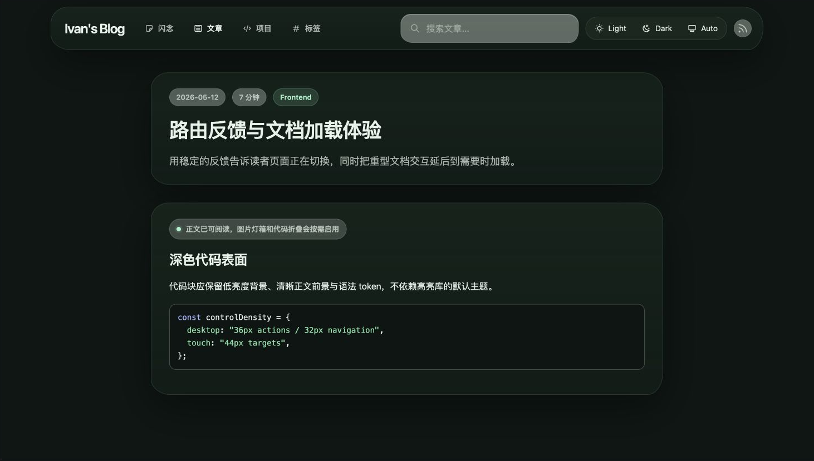

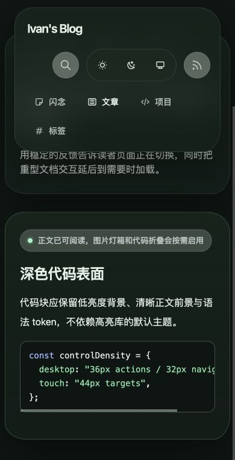

### Current mobile density refresh

- Evidence binding `7b2e49e54b241941b30c5350351d3a1392336471`; source type `storybook_canvas`, target program `mock-only`, capture scope `iframe-element`, requested viewport `393px × 852px`, sensitive exclusion `N/A`.
- The current mobile canvas keeps the public search controls and result cards aligned to the 12px shell gutter while retaining touch-sized actions.

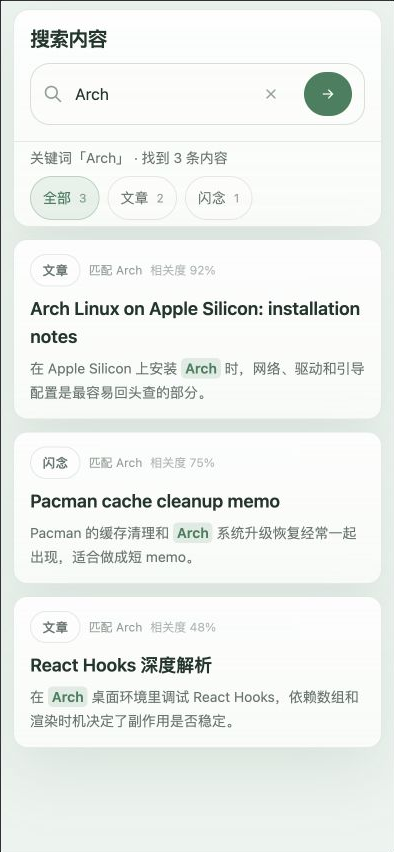

### Narrow mobile search density

- Evidence bound to implementation commit `59d66e54`; source type `storybook_canvas`, target program `mock-only`, capture scope `iframe element`, requested viewport `320x700`, viewport strategy `storybook-viewport`, margin policy `trim_only`, sensitive exclusion `N/A`.
- The narrow search state keeps its query panel at the mobile spacing contract, uses low-luminance surfaces for the filters and recommended terms, preserves 44px interactive controls, and does not overflow horizontally.

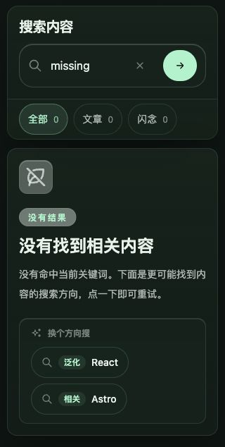

### Desktop header search width

- Evidence bound to implementation commit `1aa481c5`; source type `storybook_canvas`, target program `mock-only`, capture scope `browser-viewport`, requested viewport `1280x720`, viewport strategy `storybook default`, sensitive exclusion `N/A`.
- The desktop search shell is `288px × 36px`. Its width balances the adjacent theme surface and RSS control cluster (`299px`) without changing the header's established vertical control sizes.

### Desktop header control heights

- Evidence bound to implementation commit `0233f4a9`; source type `storybook_canvas`, target program `mock-only`, capture scope `browser-viewport`, requested viewport `browser default`, viewport strategy `storybook canvas`, sensitive exclusion `N/A`.
- On fine-pointer desktop, the search shell, theme-toggle outer surface, and RSS action are each exactly `36px` high with matching top and bottom edges. The mobile story separately measures search, theme selection, and RSS at `44px` each.

### Compact mobile density

- Evidence bound to implementation commit `d7c1f8c4`; source type `ui_demo`, target program `mock-only`, capture scope `browser-viewport`, sensitive exclusion `N/A`.
- The controlled static fixture uses `393px × 852px` and `320px × 700px` viewports. Both keep the mobile header, main container, and footer on the same `12px` left/right gutter, use a `16px` maximum surface radius, and preserve `44px` navigation targets.
- At `320px`, navigation labels collapse to labelled icons and the timeline rail compacts so the content card retains a usable reading width instead of losing space to chrome.

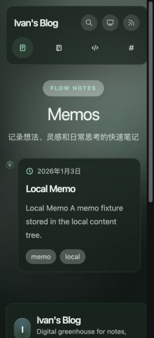

### Related posts responsive cards

- Evidence bound to local HEAD `f0606193b047c9e2e466fd17cac9e1a98a811ed1` from the stable local Astro preview.
- Desktop keeps four equal cards, tablet keeps two reduced-height wide cards, and mobile keeps one adaptive column where no-cover cards omit the media block.

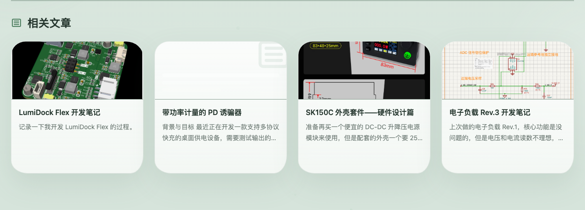

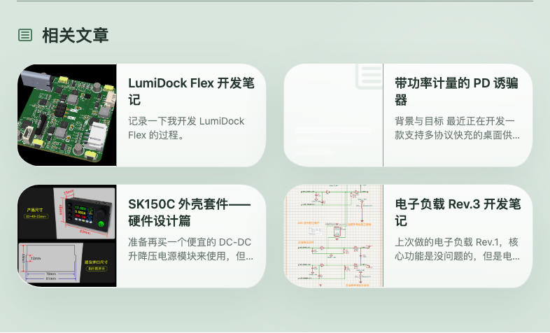

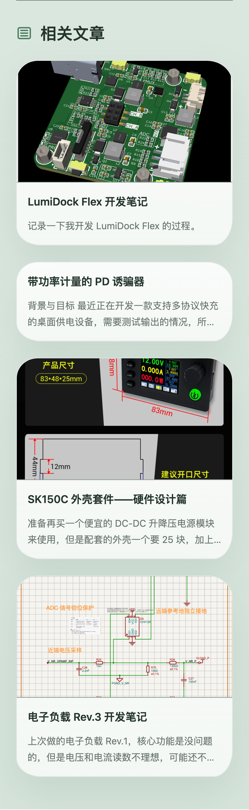

### Home and memos timeline restoration

- Evidence captured from the stable production gateway preview on local branch `th/timeline-visual-restore`.
- Desktop restores a shared timeline rail and node rhythm across `/` and `/memos`, verifies the memos guide line in both light and dark themes, and removes the extra intro cards that previously sat between the home hero and the first timeline item.
- Mobile keeps a reduced-but-visible rail instead of collapsing into plain stacked cards, and the memo detail affordance is hidden there so it does not compete with tags or content.

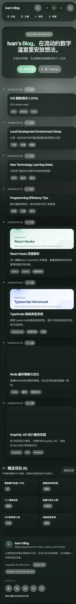

### Memo detail hierarchy

- Evidence bound to local HEAD `0ed11b57` from Storybook mock stories for the public memo detail shell.
- Memo detail renders as a single card instead of a split header/body pair.
- Time, type, title, tags, and Markdown body live inside the same surface so short memos read as one unit.

### Hover stability on dense public lists

- Evidence captured from the local hover-stability preview on `2026-04-11` using the shared `nature-hover-hitbox` + `nature-hover-lift` contract.
- The outer hitbox stays stationary while the inner surface carries the lifted shadow/border state, preventing hover thrash near the lower edge of related-post cards, tag cards, search results, and tag badges.

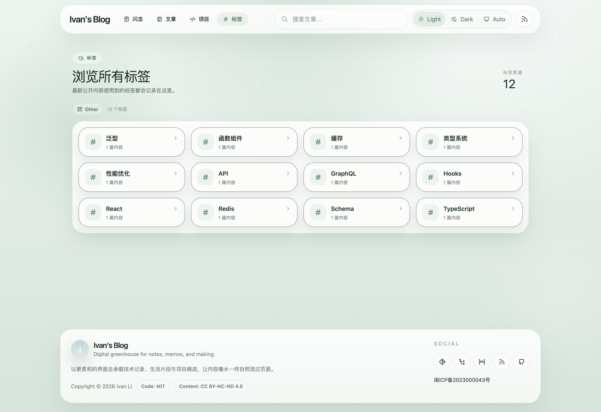

### Search interface redesign

- Evidence captured from Storybook mock canvas for the public search page on branch `th/search-interface-redesign`.
- The page now renders the deep-linked query in the first paint, uses query-aware status, exposes type filters with counts, and presents result cards with readable content type, keyword-aware snippets, highlight marks, and relevance metadata.
- Keyword snippet evidence was captured with Chrome DevTools from the controlled Storybook canvas served on a local preview lease.
- Search stories render only the real search component. Header and full-page behavior must be verified against the actual public route, not a Storybook shell that imitates production-only components.
- Prompt states use a shared status panel for initial, loading, empty, error, and filtered-empty stories, keeping the message aligned to the content grid with a stronger icon, title, description, and recovery action.
- Empty, error, and filtered-empty recovery actions now use recommended search terms. The public API generates suggestions with the configured chat LLM when available and falls back to public content tags, titles, and excerpts when it is not configured.
- Empty-result recovery keeps concept-direction fallback terms even when strict result validation finds no current hit, so the user still gets query-related generalized, related, sibling, and alternative search routes instead of unrelated popular terms.
- Empty-result recommendations now render as a single compact retry strip instead of a grouped explanation panel. The strip appears only for true no-result searches, keeps generalized/related/sibling/alternative labels as subdued metadata, and lets each term immediately launch a new pushed search route.
- Markdown excerpts are cleaned before rendering: emphasis syntax, escaped inline-code markers, and HTML line-break artifacts are removed, while line breaks, indentation, and code-like command snippets remain readable across multiple lines.
- The search page now prioritizes the search box as the primary tool, keeps relevance percentages as subdued metadata, presents recovery terms by generalized, related, sibling, and alternative directions, and uses compact result rows for faster scanning.

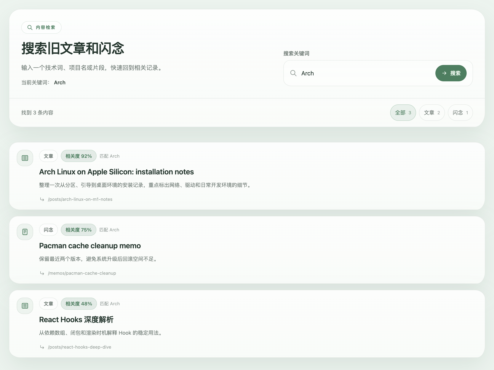

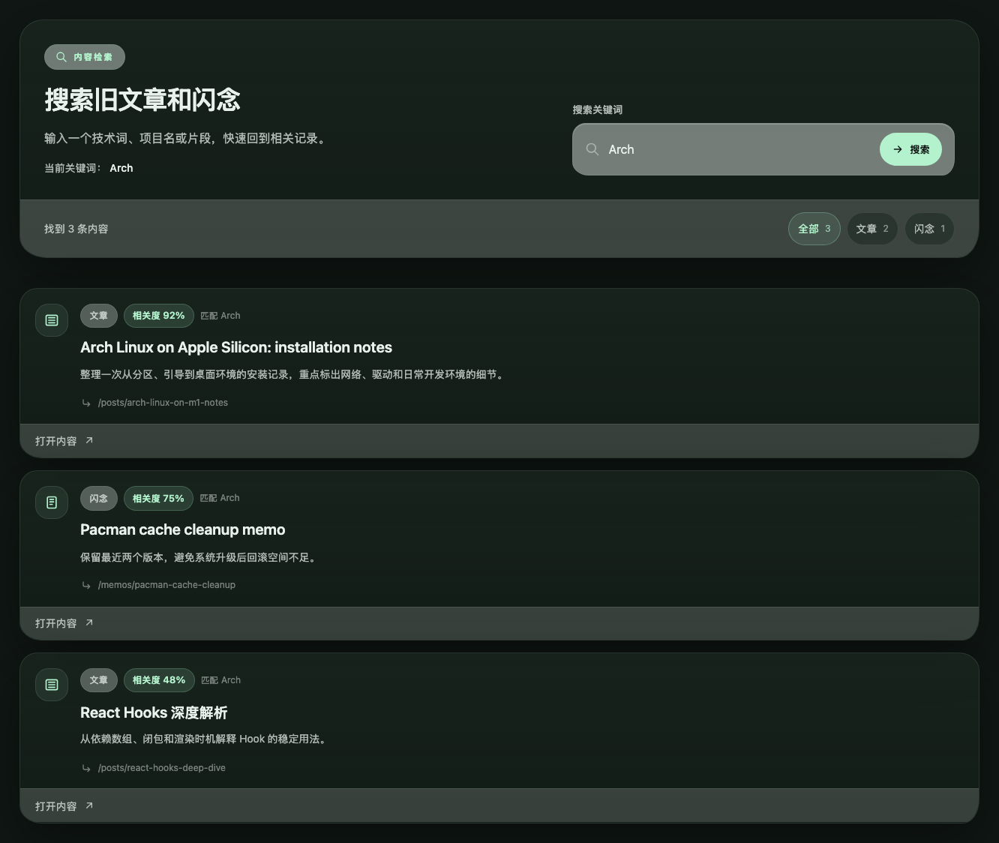

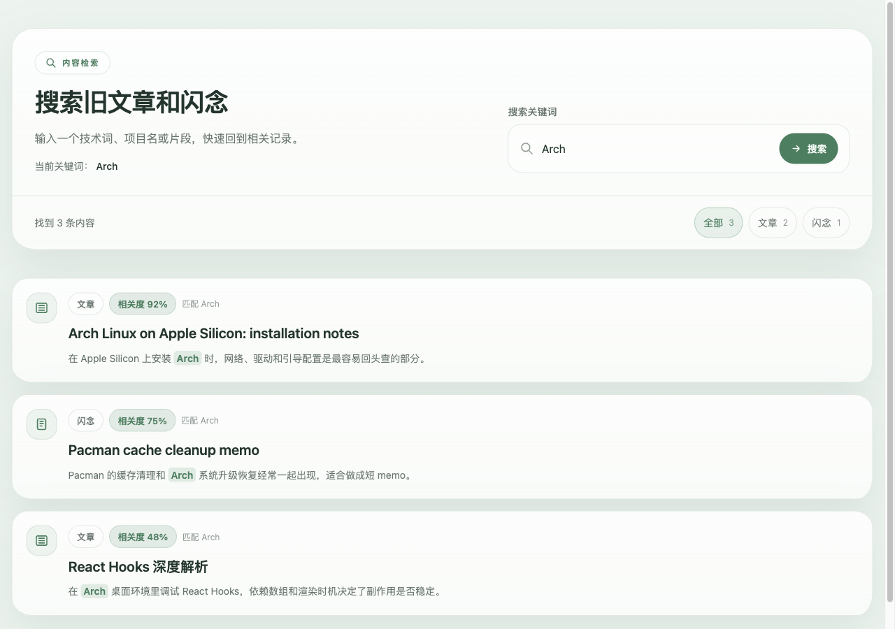

### Query-aware search viewport evidence

- Evidence captured from the real production static search route at `/search/?q=SSH`, not from a Storybook shell.
- `Storybook覆盖=已通过`; `视觉证据目标源=target_app_window`; `视觉证据=存在`; `聊天回图=已展示`; `证据落盘=已落盘`.
- `证据绑定sha=98a280d63e2363c9bce0fd279c474ed429b6e7cc`; `submission_gate=approved`.

Desktop viewport evidence:

- `source_type=target_app_window`; `target_program=Chrome`; `capture_scope=browser-viewport`; `sensitive_exclusion=only the search preview page`; `viewport=1762x1169 CSS px`.

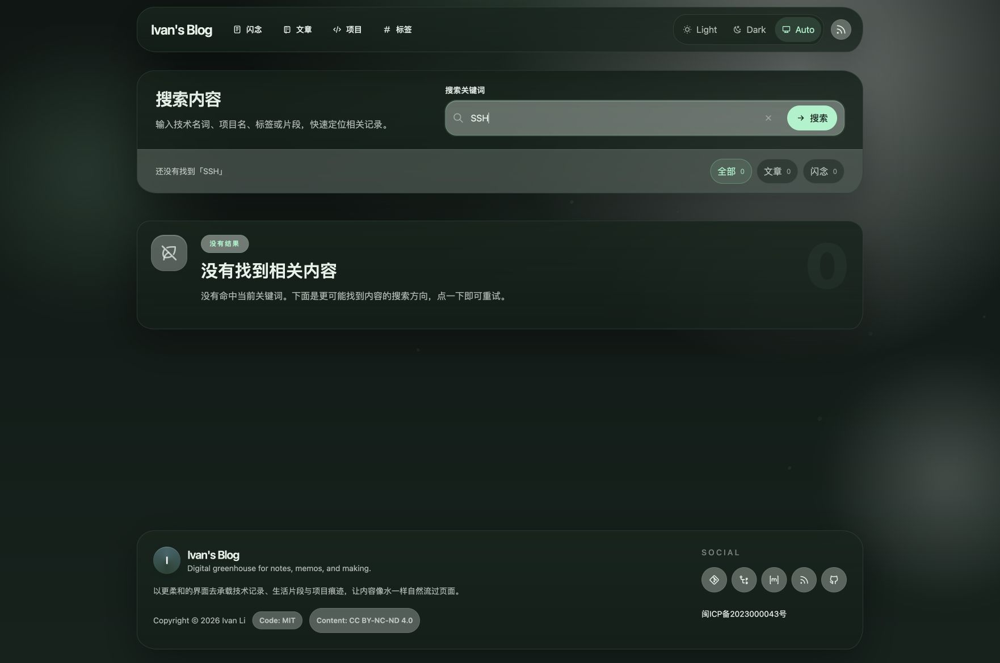

Mobile viewport evidence:

- `source_type=target_app_window`; `target_program=Chromium production preview`; `capture_scope=browser-viewport`; `sensitive_exclusion=only the search preview page`; `viewport=393x852 CSS px`.

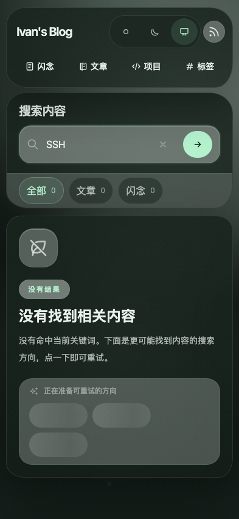

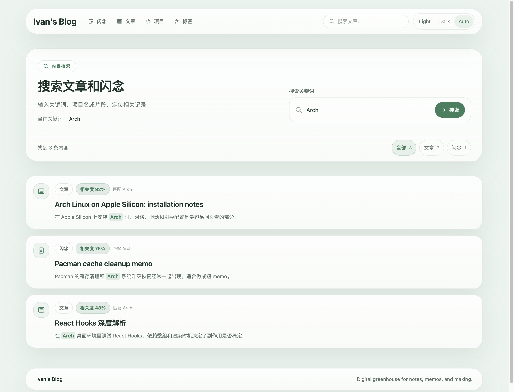

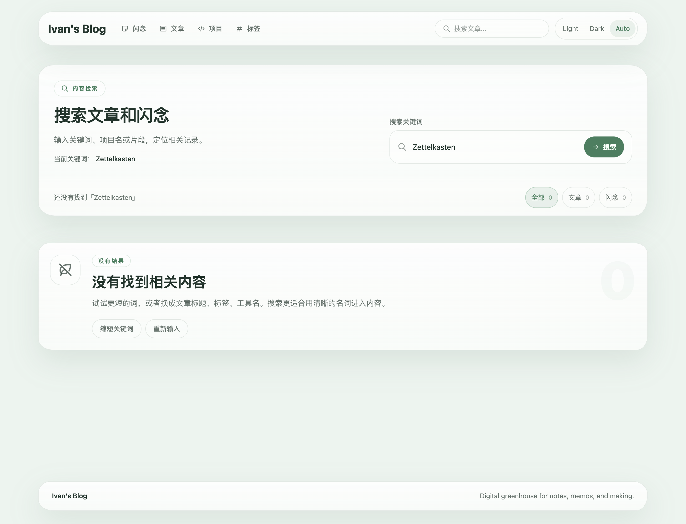

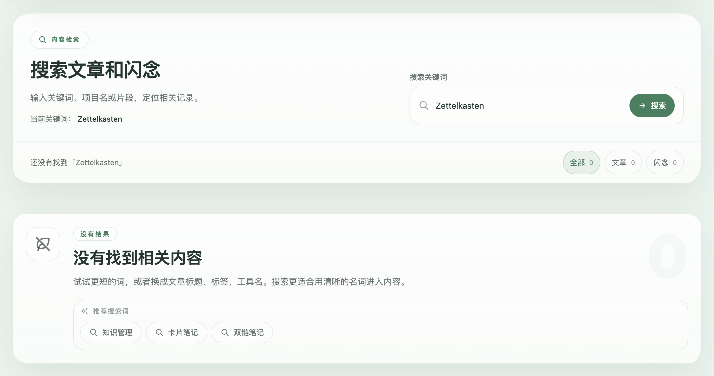

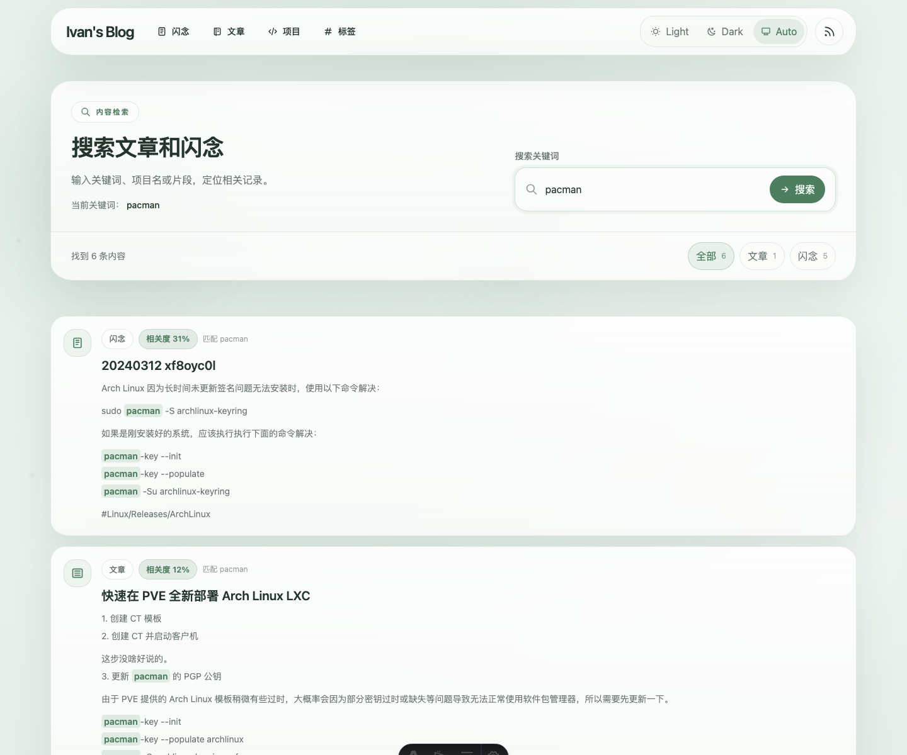

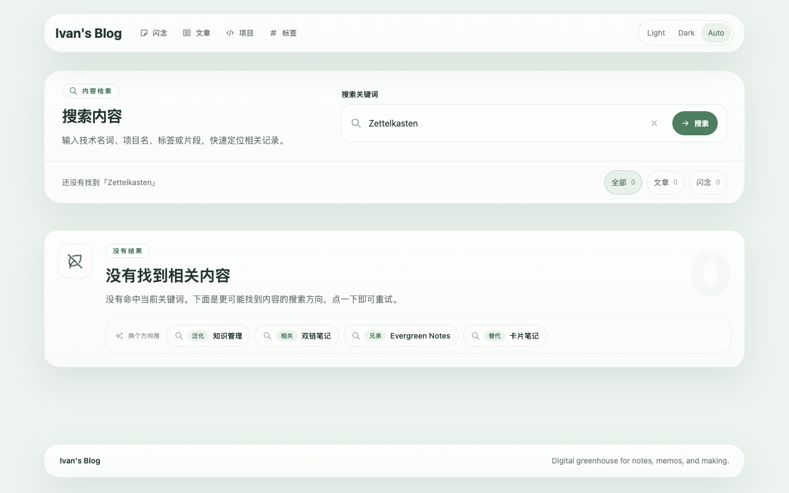

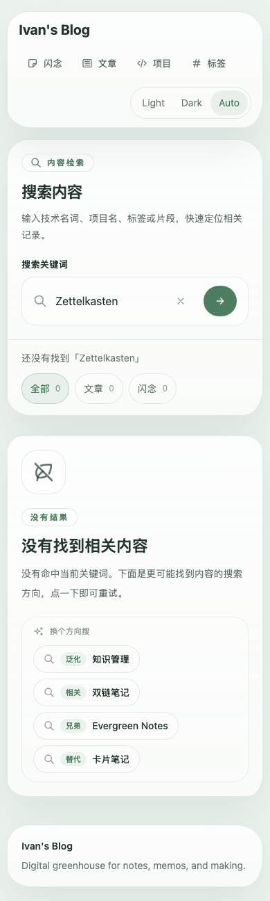

## Change log

- 2026-04-05: Created spec for the public Nature redesign and DaisyUI decoupling.
- 2026-04-06: Refreshed local visual evidence after the layout, comment-form, and syntax-highlighting fixes.
- 2026-04-10: Added responsive related-post card evidence for desktop, tablet, and mobile states.
- 2026-04-11: Added a shared hover hitbox/lift contract, refreshed dense-list coverage, and stored hover-stability visual evidence for related posts, tags, and search results.
- 2026-04-11: Closed the spec after the final Astro public-route, theme shell, and hover-stability regression pass.
- 2026-04-12: Fixed the Astro public theme bootstrap regression so dark/system-dark theme state persists across route navigation and extended the Astro guest regression suite to block the issue.
- 2026-04-16: Restored the shared public timeline rail/node contract for the home mixed feed and memos list, refreshed light/dark/mobile evidence, removed the extra home intro cards, and extended guest regression coverage for timeline visibility.
- 2026-04-30: Redesigned the public search page around query-aware discovery, shared result presentation, Storybook state coverage, and refreshed visual evidence.
- 2026-05-03: Added LLM-backed recommended recovery terms for non-normal search prompt states, with public-content fallback suggestions and refreshed Storybook evidence.
- 2026-05-04: Tightened the search page toward a faster tool workflow, reduced result-card weight, grouped recovery terms by concept direction, subdued relevance metadata, and refreshed visual evidence.
- 2026-05-05: Kept query-related concept-direction recovery terms when strict validation returns no hit, and added real dev-stack evidence for the empty-result recovery state.
- 2026-05-05: Reworked empty-result recovery recommendations into a single-row retry strip that appears only on true no-result searches, with refreshed light, dark, and mobile Storybook evidence.
- 2026-05-12: Added public route pending feedback, deferred visible Markdown hydration for article and memo details without dropping server-rendered content, same-site Markdown link behavior, and Storybook article-detail coverage.
- 2026-05-13: Anchored the route pending indicator to the complete site header mock and production header frame, keeping it visually attached to navigation while floating outside the static document flow.
- 2026-05-13: Changed the Markdown interaction note to static guidance so deferred hydration is discoverable without leaving a persistent loading live region.
- 2026-05-13: Clarified same-site Markdown link handling so same-origin absolute URLs stay in the current tab while true external URLs still open safely.
- 2026-06-19: Collapsed memo detail into a single card, removed the memo-only interaction prompt and separate summary treatment, and added Storybook coverage plus visual evidence for the memo detail shell.
- 2026-08-01: Added a query-aware static search bootstrap and accessible hydration handoff so deep-linked keywords remain visible from first paint through result loading.
- 2026-08-01: Bound mobile search stories to a deterministic 393x852 viewport and based narrow-screen containers on available content width so classic scrollbars cannot skew horizontal margins.
- 2026-08-01: Delayed bootstrap handoff until the React search island has committed its URL-synchronized state, preventing a concurrent-hydration empty-state flash.
- 2026-08-01: Added a bounded hydration fallback that preserves the query and replaces a permanently stalled skeleton with an accessible reload action.
- 2026-08-02: Kept the public mobile navigation visible as the second header row and aligned the header frame with the shared page container.
- 2026-08-02: Compressed the mobile query panel so the first result surface remains visible in at least half of a `438x852` search viewport.
- 2026-08-02: Removed the duplicate `内容检索` page-purpose kicker from search so the title is the only page label at every viewport.
- 2026-08-02: Removed the mobile no-result query summary when the no-results surface already communicates the same outcome.
- 2026-07-31: Separated public desktop and touch control density, moved Markdown code styling into a surface-aware renderer scope, and recorded dark desktop/mobile code evidence.
