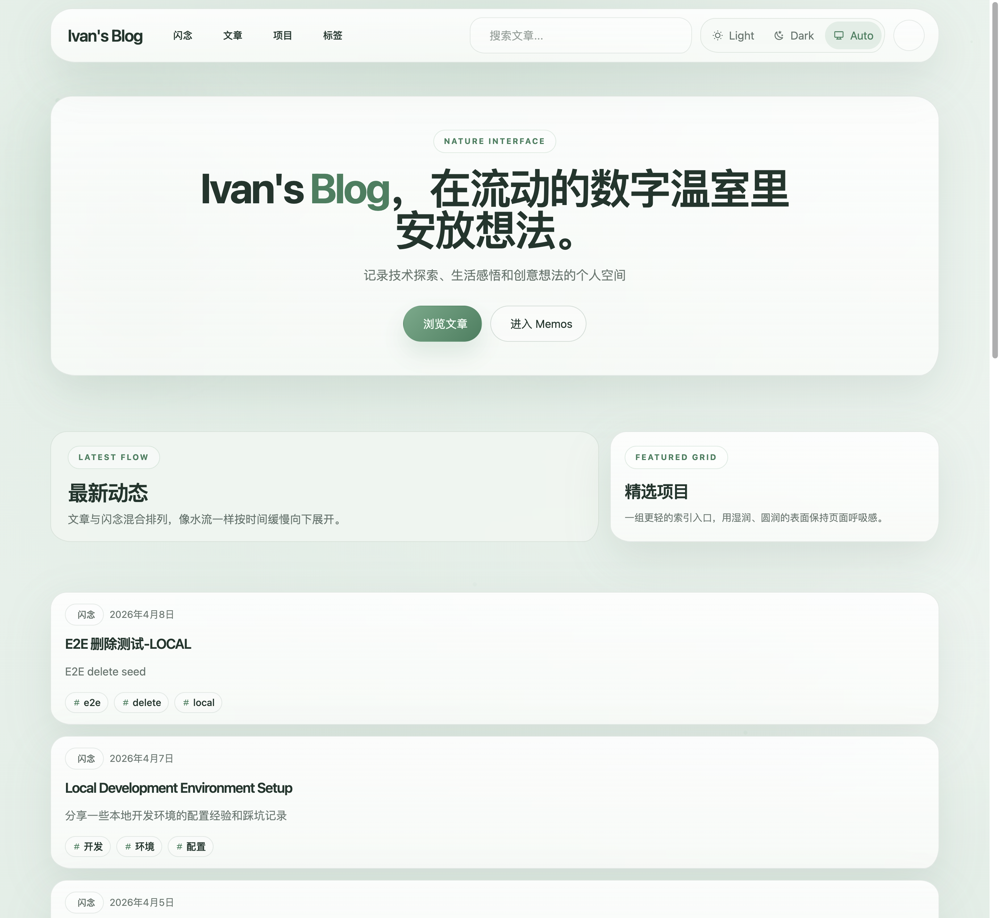
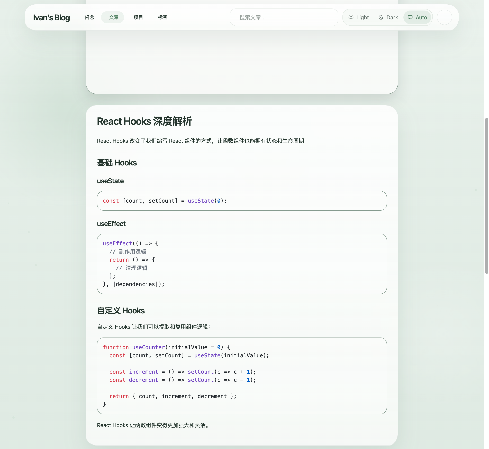
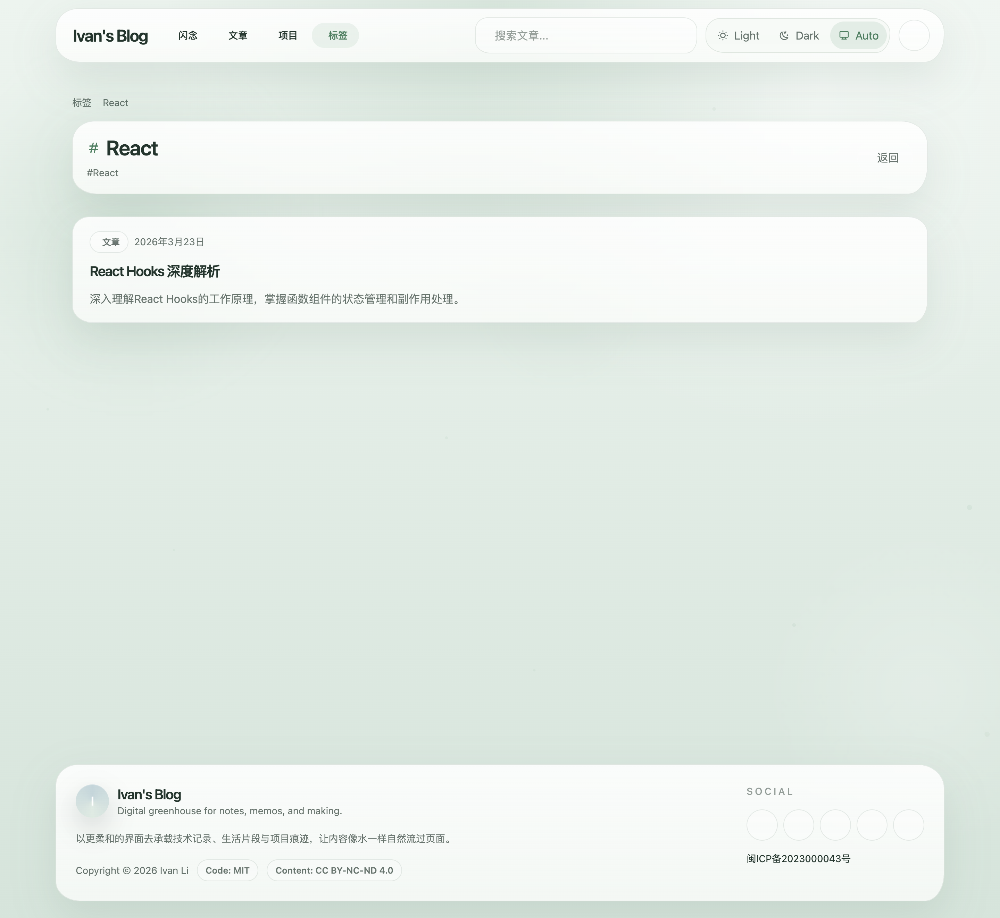
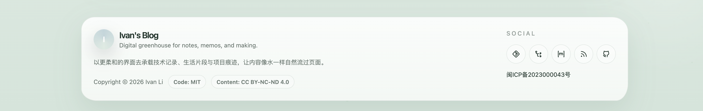
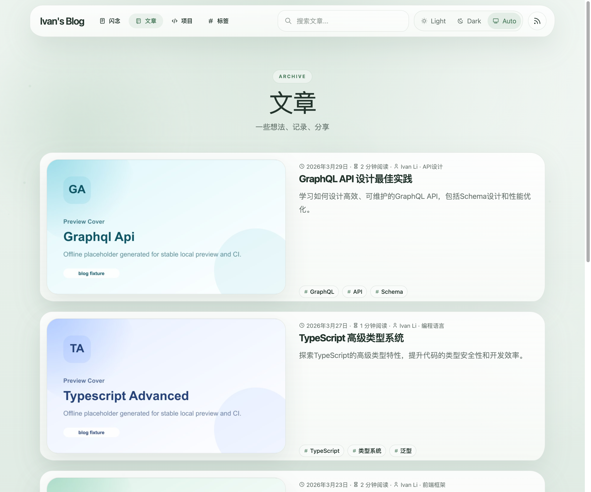
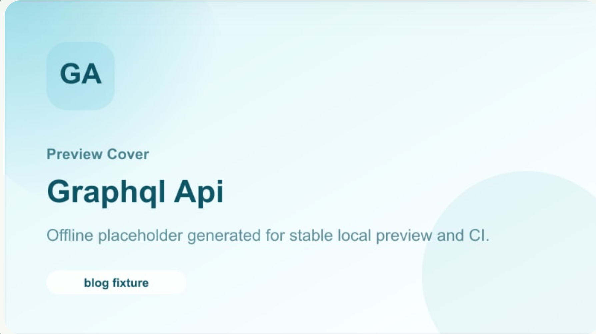

# SPEC: Astro Public Frontend Migration + Single-Image Transition

- Spec ID: `phgpd`
- Status: `in-progress`
- Owner: `main-agent`

## 1. Background

The current public frontend is deeply coupled to the Next.js App Router runtime. That coupling keeps visitor-facing pages tied to Next SSR/tRPC page execution and makes frontend development performance unacceptable for ongoing work.

Phase 1 splits the public surface away from the legacy runtime without changing the single-image deployment model. Visitor-facing pages move to Astro SSG, while legacy Next remains inside the same release image to keep `/admin` and un-migrated backend capability working until later phases.

## 2. Goals

1. Move the entire visitor-facing public site to Astro static generation.
2. Replace direct public-page dependence on Next page SSR/tRPC with stable HTTP compatibility APIs.
3. Keep single-image, single-port deployment by introducing a gateway in front of Astro and the internal legacy Next runtime.
4. Preserve `/admin` reachability during the transition.
5. Update CI, E2E, and release workflows to validate and ship the new runtime topology.

## 3. Non-goals

- No TanStack Router admin migration in this phase.
- No Rust API implementation in this phase.
- No migration of demo/dev/theme preview routes into Astro.
- No removal of legacy Next internal runtime from the release image yet.

## 4. Scope

### In scope

- `docs/specs/` primary migration spec and index update.
- Astro public routes:
  - `/`
  - `/about`
  - `/posts`
  - `/posts/:slug`
  - `/tags`
  - `/tags/:segments`
  - `/projects`
  - `/memos`
  - `/memos/:slug`
  - `/search`
  - `/feed.xml`
  - `/rss.xml`
  - `/atom.xml`
  - `/feed.json`
  - `/sitemap.xml`
  - `/robots.txt`
- Build-time public content export/manifest generation from the existing synced content state.
- Compatibility HTTP APIs for the public frontend, rooted at `/api/public/*`.
- Single-image gateway + internal legacy Next runtime topology.
- CI/E2E/release updates for the new topology.

### Out of scope

- `/admin/*` UI rewrite.
- Legacy demo/test/theme-only routes.
- Replacing compatibility APIs with Rust.
- Reworking the original sync/content parsing pipeline beyond what is needed to export public snapshots.

## 5. Runtime Contract

### 5.1 Public content build contract

- The public site consumes build-time exported snapshot data generated from the existing synced SQLite/content state.
- Astro pages must not rely on Next SSR page execution for public content rendering.
- Public detail/list pages may hydrate client islands for interaction, but the page shell and primary content must come from Astro static output.
- The release image does not bake a fixed public snapshot. During container startup, the entrypoint rebuilds the Astro public output against the current mounted database and synced content state before the gateway begins serving traffic.

### 5.2 Public HTTP API contract

- Public islands must only call `/api/public/*` HTTP endpoints.
- `/api/public/*` is a compatibility layer aligned with the future Rust resource boundaries.
- In Phase 1, the outer gateway handles `/api/public/*` directly via the shared compatibility router instead of routing those requests back through legacy Next page handlers.
- Compatibility APIs must cover at least:
  - viewer/session state
  - logout
  - comments read/create/edit/delete/moderate as needed by current public UI
  - reactions read/toggle
  - search
  - public list/timeline pagination endpoints needed by hydrated public islands

### 5.3 Single-image deployment contract

- The release artifact remains one Docker image.
- One external port is exposed.
- Gateway responsibilities:
  - serve Astro public assets/pages
  - serve or proxy public assets required by Astro
  - expose composite health checks
  - proxy `/admin/*`, `/_next/*`, and legacy APIs to internal Next
- Internal Next responsibilities in Phase 1:
  - `/admin/*`
  - legacy internal APIs and compatibility APIs
  - file proxy endpoints and any remaining admin-only runtime behavior

## 6. Route Ownership

| Route family | Owner in Phase 1 | Notes |
| --- | --- | --- |
| `/`, `/about`, `/posts*`, `/tags*`, `/projects`, `/memos*`, `/search` | Astro | Primary public surface |
| `/feed.xml`, `/rss.xml`, `/atom.xml`, `/feed.json`, `/sitemap.xml`, `/robots.txt` | Astro | Static artifacts/endpoints |
| `/api/public/*` | compatibility HTTP API | Public frontend only |
| `/api/files/*` | legacy Next | Kept for content assets during transition |
| `/admin/*` | legacy Next | Phase 2 migration target |
| `/_next/*` | legacy Next | Internal assets for admin/runtime |
| `/api/*` except `/api/public/*` and health | legacy Next | Unmigrated backend surface |

## 7. Acceptance Criteria

1. All visitor-facing public routes listed in scope render through Astro rather than Next page SSR.
2. Public dynamic features use `/api/public/*` and no longer depend on `/api/trpc` from visitor-facing pages.
3. The release image still ships as a single image and starts a gateway plus internal legacy Next behind one exposed port.
4. `/admin` remains reachable behind the same external origin.
5. CI validates public build, compatibility API reachability, admin smoke reachability, and single-image build smoke.
6. Release workflow continues publishing the same GHCR image channels/tags while packaging the new runtime shape.

## 8. Validation

- `bun run public:export`
- `bun run site:build`
- `bun run build`
- `bun run test`
- `bun run test:e2e -- --project=guest-chromium`
- `bun run test:e2e -- --project=admin-chromium`
- Docker single-image smoke build/start through CI workflow
- Shared testbox smoke:
  - build `app-image-built`
  - run one container with `CONTENT_SOURCES=local`
  - verify `/api/health`, `/posts`, `/posts/:slug`, `/api/public/*`, and `/admin` auth gate through the single exposed port

## 9. Milestones

- [ ] M1: Add the spec, public snapshot export pipeline, and Astro site skeleton.
- [ ] M2: Migrate all scoped public routes to Astro and wire public interaction islands to `/api/public/*`.
- [ ] M3: Add gateway + single-image runtime transition and update Docker/start scripts.
- [ ] M4: Update CI/E2E/release workflows for the new topology.
- [ ] M5: Capture visual evidence and converge review/validation to merge-ready.

## 10. Approach

- Keep the repository transitional instead of forcing the final multi-app split in one patch.
- Introduce Astro as the public frontend build/runtime boundary first.
- Export a stable JSON snapshot for public pages at build time from the current database/services.
- Reuse existing public-safe utilities/components where they do not depend on Next runtime APIs.
- Prefer explicit gateway route ownership over implicit fallback so the public surface is decisively moved off Next.

## 11. Risks / Assumptions

- Risk: current public components are heavily coupled to `next/link`, `next/image`, and `next/navigation`; some views will need Astro-native replacements instead of direct reuse.
- Risk: public memo management features previously available on `/memos` remain out of scope for Phase 1 and are expected to move behind the later admin migration boundary.
- Risk: compatibility APIs are still implemented inside the legacy runtime during Phase 1, so we must keep their resource contracts future-Rust-friendly.
- Assumption: synced content in SQLite remains the source of truth for the exported public snapshot.

## 12. Docker Runtime Notes

- The single release image rebuilds Astro output during container startup against the mounted runtime data volume.
- Runtime Astro build artifacts must use writable cache directories inside the container, including Astro type generation output and Vite dependency cache output.
- CI must validate both image build success and container startup success; build-only validation is insufficient because startup performs migrations plus Astro rebuilds.

## 13. Visual Evidence

- Storybook覆盖=不适用
- 视觉证据目标源=mock_ui
- 视觉证据=存在
- 空白裁剪=无需裁剪
- 聊天回图=已展示
- 证据落盘=已落盘
- 证据绑定sha=`6f5d34dd70900b3b3eaf55a23b18eb8a5c2e6ec6`
- 视觉证据原因=公开站无 Storybook，使用当前 worktree 租约端口 `http://127.0.0.1:30170` 的真实浏览器视口作为前台 Phase 1 验收来源。

### Home

### Post detail

### Tag timeline

### Footer social icons

### Posts cover images

### Post detail cover corners

