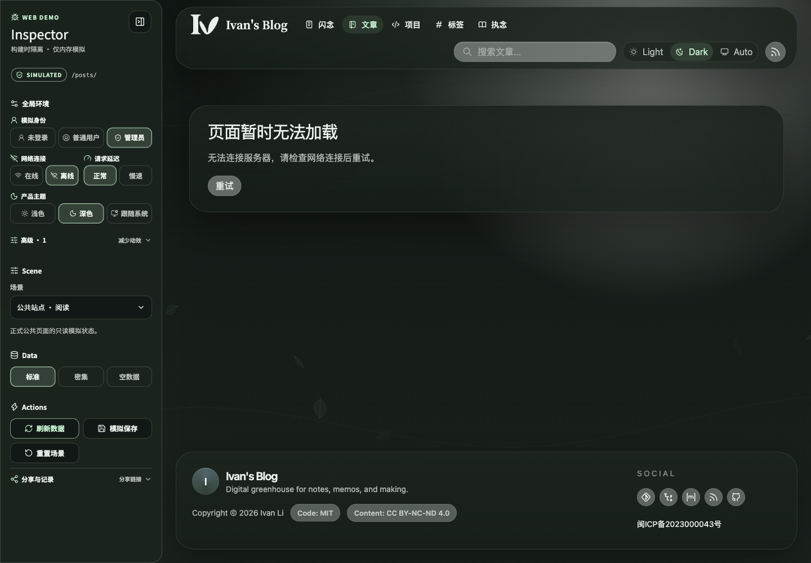
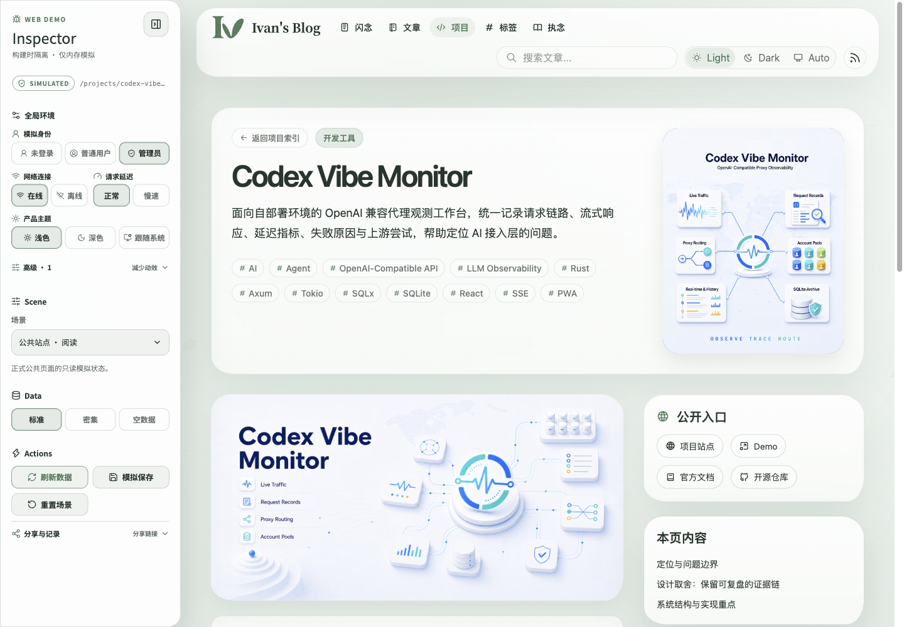
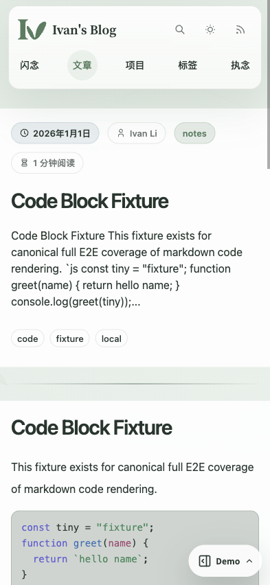
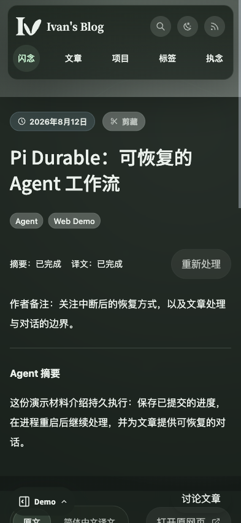
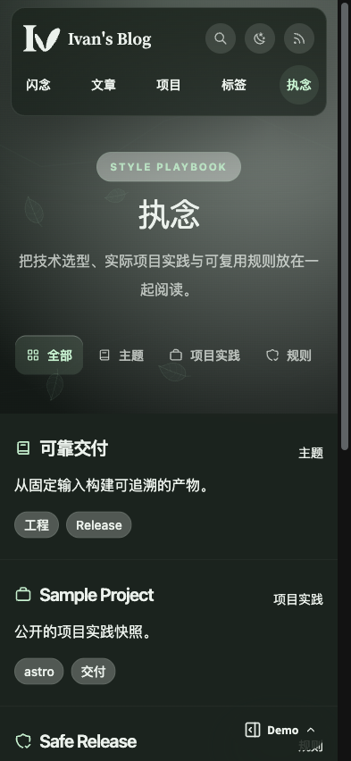

# 公共产品首屏与 CSR 导航

## Context and Scope

- Context: 客户端修改 URL 或交换服务端 HTML，不足以提供页面级 CSR。公共产品需要在保留首屏内容的同时，让后续页面的数据读取、加载、失败与恢复由客户端拥有。
- In scope: 正式公共路由的客户端导航、共享页面渲染与数据接口；SSR 入口的首屏 hydration；Web Demo 通过 API/数据适配器应用已有全局环境；路由历史、取消、恢复和首屏数据边界。
- Out of scope: Inspector 视觉重做、后台 SPA 路由、业务故障注入、真实浏览器断网、权限绕过、生产发布方式迁移、并行 Demo 页面或页面级 Story。
- 公共静态发布与 console SSR 的既有部署合同保留；Web Demo 必须使用 SSR 入口。后续页面导航的客户端组件与数据加载合同由正式产品和 Demo 共用。

## Terms and Interfaces

- SSR 首屏：浏览器直接打开或刷新时，服务端为当前 URL 提供页面内容，并以当前路由的数据启动 hydration。
- 页面 CSR：客户端根据目标路由与结构化业务数据渲染目标页面；不能将获取并交换目标 HTML 文档称为页面 CSR。
- 路由成功：目标 URL、路由身份和对应页面组件已切换；目标数据读取失败不撤销这次路由切换。
- 模拟离线：已有 Web Demo API/数据适配器产生连接失败。页面模块、Inspector、开发工具、脚本和样式仍可用。
- 共享实现边界：正式产品与 Demo 使用相同路由匹配、页面组件和请求状态；Demo 只替换 API/数据来源等中间层。

### Route Coverage

| 正式页面 | 后续导航的数据与界面职责 |
|---|---|
| `/`、`/posts/`、`/posts/:slug/` | 首页、文章列表、文章详情和相关内容；使用共享文章组件与正文渲染器。 |
| `/projects/`、`/projects/:slug/` | 项目目录、详情、正文与运行数据；保留原项目表现和资源语义。 |
| `/tags/`、`/tags/*` | 标签目录和聚合时间线；保留规范标签路径。 |
| `/memos/`、`/memos/:slug/` | 闪念列表、详情、分页和适用的作者界面；沿用既有业务读取与权限规则。 |
| `/search/` | 保留产品查询参数、聚合搜索和结果跳转。 |
| `/playbook/`、`/playbook/*` | 知识目录、资源页面与对应数据来源；保留实际产品组件。 |
| `/about/`、未知公共路径 | 静态内容与真正的 404；没有业务读取时，不制造网络错误。 |

## Requirements

### REQ-PCSR-001 — First Document and Hydration

- SSR 入口 MUST 为直接打开与刷新提供当前路由的完整首屏内容；客户端 MUST 使用同一当前路由数据进行 hydration，不额外进行重复的首屏读取。
- 模拟离线 MUST NOT 清空已经收到的首屏内容。首屏数据 MUST NOT 被当作其他目标路由读取成功的证据。
- 正式静态发布入口继续按其部署合同生成首屏；不得为满足 Demo 而另建产品页面副本。

### REQ-PCSR-002 — Client Route Ownership

- 可导航的同源正式页面链接 MUST 在浏览器中切换目标路由并渲染对应组件；随后通过共享结构化 API/数据接口读取目标内容，不获取目标 HTML 文档作为页面渲染结果。
- 页面路由 MUST 在目标业务数据失败时保持目标 URL，并在目标页面承接加载、失败与重试；不得停留在源页叠加全局错误条，也不得在失败目标下保留源页正文冒充目标内容。
- 外部链接、下载、新标签操作和同文档锚点 MUST 保持浏览器原生语义。

### REQ-PCSR-003 — Shared Product and Adapter

- 正式产品与 Web Demo MUST 共用路由、页面组件、加载状态、错误状态、取消与重试流程；Demo 只替换 API/数据来源和已有环境策略。
- API MUST 返回对应业务的数据，不返回已经渲染的目标页面 HTML 来伪装 CSR。
- 不得新增仅 Demo 使用的页面错误面板、复制路由树、独立演示路径或页面 Story。产品错误文案不得依赖 Inspector 才能解释。

### REQ-PCSR-004 — Global Environment and Recovery

- Demo 后续页面读取 MUST 受当前模拟连接与请求延迟控制，并在适用接口遵循模拟身份规则；离线 MUST 产生连接失败，不能回退目标 SSR HTML、真实后端或完整快照。
- 首屏 bootstrap、预取或缓存 MUST NOT 向尚未加载的目标提供全部路由数据，从而绕过离线与延迟。重新进入需要业务读取的目标时，必须通过当前环境策略完成读取。
- 恢复在线后 MUST 能在当前目标页面重试，不需要刷新整份文档；已有页面内容不因全局连接变化被主动清空。
- 主题、动效与 Inspector 展示偏好 MUST 保持同步，不能借导航重置环境或业务内存。

### REQ-PCSR-005 — History and Request Lifecycle

- 前进、后退、直接地址、产品查询参数和片段 MUST 保持正确路由身份及其产品语义。
- 新路由或新的有效读取请求 MUST 取消过时读取；旧结果不得覆盖新路由，旧写操作不得在被取消后继续修改内存。
- SSR 首屏只能启动其对应路由；客户端后续失败不得以完整 document reload 掩盖取消、路由或恢复问题。

### REQ-PCSR-006 — Artifact and Presentation Parity

- live 制品 MUST 不可通过 URL、浏览器存储或客户端开关启用 Demo；Demo 继续由构建入口选定，并使用正式路径。
- 页面迁移 MUST 保持既有 Nature 组件、移动内容流、后台 authoring 语义、标题、元信息、正文、媒体和可访问性；不能只为网络演示换成简化版页面。
- Inspector 的侧栏、浮层与移动停靠几何 MUST 不被本主题改动。

## Verification

### VER-PCSR-001 — Direct Entry

- Method: 对 SSR 入口执行 HTTP 首屏检查及离线浏览器刷新。
- covers: REQ-PCSR-001
- Pass condition: HTML 包含当前页面内容，hydration 没有重复首屏读取；Demo 离线刷新保留已收到的数据。

### VER-PCSR-002 — Navigation Network Trace

- Method: 遍历路由目录的链接并记录请求、路由身份和 DOM。
- covers: REQ-PCSR-002、REQ-PCSR-003
- Pass condition: 后续同源导航没有目标 HTML 文档读取；目标内容来自共享结构化数据与共享组件；外部、下载、新标签和锚点保持原生行为。

### VER-PCSR-003 — Offline Target and Recovery

- Method: 先离线刷新文章详情，再点击文章列表、项目、标签、闪念、搜索和 Playbook 的正式导航；在目标恢复在线并重试。
- covers: REQ-PCSR-002、REQ-PCSR-004
- Pass condition: URL 与路由成功切换，实际数据读取失败；目标显示产品自身错误且不展示源页正文或未读取的目标数据；无 SSR、快照或真实 API 回退；恢复后原位读取成功。

### VER-PCSR-004 — Races and History

- Method: 可控延迟、AbortSignal、连续导航、浏览器历史和共享状态 round trip。
- covers: REQ-PCSR-004、REQ-PCSR-005
- Pass condition: 延迟来自同一环境，过时结果无法覆盖目标；身份与其他全局设置保持；前进后退和产品参数正确，取消请求没有延迟写副作用。

### VER-PCSR-005 — Product and Build Parity

- Method: live/Demo 制品检查、正式 SSR/CSR 页面内容比较，以及公共桌面、移动、浅深色浏览器证据。
- covers: REQ-PCSR-003、REQ-PCSR-006
- Pass condition: 正式与 Demo 使用同一路由和组件；只有中间层的数据来源不同；live 不包含可启用的 Demo 路径；保留正文、媒体、元信息、移动阅读合同与 Inspector 几何。

## Visual Evidence

证据源为构建时隔离、fixture 驱动的正式路由 Web Demo。桌面视口为 1440×1000，移动端为 393×852 CSS px；通过视口模拟取图，页面无需空白裁剪。主人已确认以下五张图片准确反映实现。Storybook 页面级证据不适用。

离线 CSR 已切换到目标文章列表 URL；页面只显示产品请求错误与重试，不保留来源页正文或未读取的数据。

项目页使用共享产品正文与图片，浅色主题保持一致。

移动端保留文章代码块、主线剪藏阅读器和 Playbook 内容流。

Playbook 分类入口在可用宽度足够时显示已有图标，窄屏保留完整文字和 44px 操作高度；站点顶部导航保持原有规则。

## Related ADRs

- [Self-contained console runtime](../../adr/0010-self-contained-console-runtime.md)
- [Build-time Web Demo boundary](../../adr/0013-build-time-web-demo-and-story-boundary.md)
- [Web Demo global Inspector controls](../../adr/0014-web-demo-global-inspector-controls.md)
- [Shared public SSR and CSR renderer](../../adr/0019-shared-public-ssr-csr-renderer.md)

## References

- [Implementation coverage](./IMPLEMENTATION.md)
- [Topic history](./HISTORY.md)
- [Global Inspector controls](../web-demo-global-controls/SPEC.md)
- [Public design](../../../DESIGN.md)
- [Nature responsive contract](../nature-front-ui/SPEC.md)
