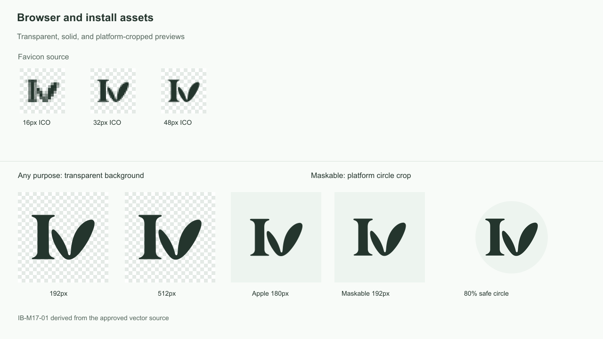

# Public Blog Logo Assets and Online-First PWA

## Context and Scope

- Context: the public blog has an approved vector brand mark and needs consistent browser and install icons with browser-native installation metadata.
- In scope: the public Astro site, its brand source files, generated icon assets, manifest, theme color, and public static-response caching in the Bun gateway and EdgeOne Makers artifact.
- Out of scope: `/admin/`, Service Workers, offline pages or reading, article pre-caching, push notifications, background sync, and custom install prompts.

## Terms and Interfaces

- `brand master`: the approved `IB-M17-01` reference image and the exact black-on-transparent `ivan-blog-mark.svg` source.
- `versioned asset`: a public asset whose URL contains a digest derived from the brand source and icon-generation contract.
- `online-first`: the site requires a network connection for navigation and content; regular browser caching may improve repeat visits but does not promise offline access.
- Interface: the build-generated `/site.webmanifest`, stable `/favicon.svg` and `/favicon.ico`, and digest-qualified files under `/pwa/`.

## Requirements

### REQ-PWA-001

- The system MUST keep the approved brand master in version control and preserve the SVG path data, black foreground, and transparent background byte-for-byte.
- Inputs: the approved `IB-M17-01` source image and final SVG.
- Outputs: source files under `site/assets/brand/source/` and an unchanged public SVG mark.

### REQ-PWA-002

- The system MUST deterministically derive transparent SVG and ICO favicons, transparent `any` PNG icons at 192 and 512 pixels, opaque `maskable` PNG icons at 192 and 512 pixels, and an opaque 180-pixel Apple touch icon.
- `any` icons MUST use the `#24352d` mark on transparency with the mark width at 72% of the canvas. `maskable` and Apple icons MUST use a `#24352d` mark at 60% width on a solid `#edf4ef` background. The generator MUST NOT bake in rounded corners or shadows.
- Each generated install asset URL MUST include a digest of the SVG source and generation contract so changed artwork or geometry receives a new URL.
- Inputs: the version-controlled SVG source and fixed icon-generation parameters.
- Outputs: reproducible files under `/public/pwa/<digest>/` and stable compatibility favicons.

### REQ-PWA-003

- The public site MUST publish a build-time Web App Manifest with stable `id`, `start_url`, and `scope` set to the public-site root including the configured Astro base path; `name` and `short_name` MUST be `Ivan's Blog`, and `display` MUST be `standalone`.
- The manifest MUST reference the generated `any` and `maskable` icons with correct dimensions and purposes, and use `#edf4ef` for its background and default theme colors.
- Inputs: the current public-site base path and generated icon version.
- Outputs: a valid `/site.webmanifest` within the public base path.

### REQ-PWA-004

- The public document's `theme-color` MUST track the resolved light or dark theme, including after Astro client-side navigation and theme changes.
- Inputs: the existing `data-ui-theme` theme state and the active `--nature-bg` value.
- Outputs: a matching `<meta name="theme-color">` value.

### REQ-PWA-005

- Public HTML responses MUST use `Cache-Control: public, max-age=60, must-revalidate`.
- Digest-qualified build and install assets MUST use `Cache-Control: public, max-age=31536000, immutable`.
- Manifest, stable favicon, and other unversioned public static assets MUST revalidate using ETag and `Cache-Control: public, max-age=0, must-revalidate`.
- The Bun gateway and EdgeOne Makers static artifact MUST implement equivalent public cache boundaries.
- Inputs: the resolved public static-file path and EdgeOne artifact path.
- Outputs: consistent cache directives for public static responses.

### REQ-PWA-006

- The system MUST NOT add cache directives or change online response semantics for API, gateway, or `/admin/` requests as part of public PWA caching.
- Inputs: API, gateway, and admin requests.
- Outputs: their existing response/cache behavior.

### REQ-PWA-007

- The system MUST provide repeatable checks for source identity, icon dimensions/transparency/safe area, manifest root and base-path URLs, theme-color updates, and gateway/EdgeOne cache policy.
- Inputs: the brand source, generated output, built site, and cache-policy implementations.
- Outputs: an explicit pass or failure for each verification boundary.

## Verification

### VER-PWA-001

- Method: source and generated-asset verification.
- covers: `REQ-PWA-001`, `REQ-PWA-002`.
- Pass condition: the master hashes remain fixed; SVG source and public mark are byte-identical; PNG dimensions, alpha behavior, color, safe area, transparent ICO entries, and version URLs match the contract.

### VER-PWA-002

- Method: root and non-root Astro builds plus browser manifest inspection.
- covers: `REQ-PWA-003`.
- Pass condition: the manifest is valid, all icon URLs resolve, and `id`, `start_url`, and `scope` use the correct root for both builds.

### VER-PWA-003

- Method: browser theme toggle and Astro client-side navigation check.
- covers: `REQ-PWA-004`.
- Pass condition: the theme-color value follows light and dark `--nature-bg` values after initial load, theme change, and navigation.

### VER-PWA-004

- Method: gateway HTTP checks and EdgeOne artifact route-policy checks.
- covers: `REQ-PWA-005`, `REQ-PWA-006`.
- Pass condition: HTML, versioned assets, and stable assets receive the prescribed headers; a matching ETag yields 304; API and admin paths receive no new cache policy.

### VER-PWA-005

- Method: icon preview and browser installation metadata inspection.
- covers: `REQ-PWA-002`, `REQ-PWA-003`, `REQ-PWA-007`.
- Pass condition: 16, 32, 48, 180, 192, and 512 pixel previews remain legible, and the 192/512 maskable marks stay inside the platform safe circle with no baked shape or clipping.

## Related ADRs

None

## Visual Evidence

- 

## References

- `./IMPLEMENTATION.md`
- `./HISTORY.md`
