# Style Playbook集成

## Context and Scope

本主题定义博客原生展示 Style Playbook、上游稳定发布后自动更新静态站，以及 console 跟随已发布Playbook快照的长期契约。

范围包括上游公开目录中的 Topic、项目实践快照和 Policy Skill、它们的正文与关系、博客导航及搜索、版本化数据发布、console 缓存与失败处理。上游知识内容的管理与写入、私有内容和未进入公开目录的分组/读写 Skill 主文档由上游负责；文章与 Memo 的实时读取边界由既有主题负责。

统一搜索以搜索内容对象为读者的比较与选择单位。整页、章节或命令的多个搜索命中必须汇入同一个内容搜索结果，避免长文占据多个顶层位置并挤掉其他内容；该聚合语义共同适用于文章、Memo、Topic、项目实践快照和 Policy Skill。文章/Memo 的查询语法、检索算法与授权边界仍由既有搜索主题定义，本主题不引入全文转载去重、跨内容相似度合并或新的检索服务。

博客主导航与栏目标题均使用两字名称“执念”，项目集合与搜索类型显示为“项目实践”。

## Terms and Interfaces

领域术语见 [CONTEXT.md](../../../CONTEXT.md)。上游知识源为 `IvanLi-CN/style-playbook-skills`；博客成功部署决定 console 跟随的已发布Playbook快照。

| 路径 | 阅读内容 |
| --- | --- |
| `/playbook/` | Playbook入口、目录概览与内容版本 |
| `/playbook/topics/` | Topic 索引与分类 |
| `/playbook/topics/<slug>/` | Topic 正文、关联项目实践与 Policy Skill |
| `/playbook/projects/` | 公开项目实践索引 |
| `/playbook/projects/<slug>/` | 项目实践正文与关联 Topic |
| `/playbook/policies/` | 公开 Policy Skill 索引 |
| `/playbook/policies/<slug>/` | Policy Skill 指令、公开资源与安装指南 |
| `/search` | 文章、Memo 和Playbook的统一搜索入口 |

数据接口包括上游固定 Release 的公开数据包、博客部署指针、不可变版本数据和 console 本地缓存。指针建议位于 `/_content/playbook/manifest.json`，版本文件建议位于 `/_content/playbook/<release-tag>/<digest>/`；具体文件布局必须遵循下述身份与缓存契约。

公开包与部署 edition 的固定格式见 [公开包契约](./contracts/public-package.md)。跨仓触发的参与方、接口、输入、凭据、补漏与结果处理见 [Release 触发契约](./contracts/release-trigger.md)。

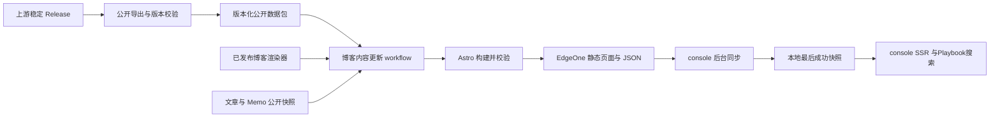

## Requirements

### REQ-PBI-001 — 原生阅读集合

博客必须继承 [Nature UI 响应式契约](../nature-front-ui/SPEC.md#44-responsive-control-and-code-density)，复用自身布局、导航、阅读样式、目录、移动布局和深色主题，完整展示公开目录中的 Topic、项目实践快照和 Policy Skill。每个对象必须能从索引进入正文，保留关联与 section anchor，并展示采用的内容版本。Playbook身份与文章、Memo、博客标签和现有项目案例必须独立；Policy Skill 阅读或复制命令不得自动执行安装。入口分类选择器（“全部 / 主题 / 项目实践 / 规则”）的悬浮、焦点和触控反馈不得移动交互元素自身的命中框；视觉状态只能改变颜色、背景或阴影等不影响命中边界的属性，需要抬升时位移必须作用于不参与命中的内部视觉层，并保持每个入口至少 44px 的可用高度。公开静态页禁用 JavaScript 时必须仍有完整正文和导航，console 首次响应必须提供 SSR 正文。

桌面详情页的 Hero 必须横跨正文与目录两栏。目录必须位于正文旁的侧栏，复用主题原生卡片，标题采用辅助导航层级，并在顶部导航下方随滚动固定；目录宽度不得挤占正文的正常阅读空间，锚点跳转后的章节标题不得被顶栏遮住。640–1023px 的目录放在正文前，使用与正文一致的主题卡片底色、边框、圆角和阴影，不得直接落在环境背景上。小于 640px 的移动端目录直接放在正文前，复用全宽、平面的阅读承载层，不使用独立卡片、圆角、边框或阴影，并保留无 JavaScript 导航能力。目录必须呈现正文真实标题层级，保留标题原文及已有编号，不自动添加章节编号。正文前目录的主章节条目采用 32px 纵向步距，子标题使用缩进、辅助色与 24px 步距，每个主章节组之间留 4px 间距。移动端目录标题配合目录图标，子标题通过细分支线连接到所属章节；当前项采用文字强调与细下划线，避免整行填色呈现为菜单按钮。悬浮菜单使用独立的 36px 触控间距。启用 JavaScript 时，正文前目录、桌面目录与悬浮目录同步强调当前阅读标题及其父章节；展开悬浮目录时定位并聚焦当前条目。子标题锚点必须在静态 HTML 和 SSR 中可用，且与目录一一对应。目录区完全滑出屏幕顶部后，右下角出现纵向的“目录 / 回到顶部”按钮组，距屏幕边框至少 16px，并考虑安全区域。按钮组从屏幕顶部中间沿弧线进入，组本体轻微收稳；悬浮目录使用紧凑菜单样式，从按钮组向左上展开，宽度随内容适配，最小 200px、最大不超出视口边距，长目录可内部滚动。再次显示正文前的目录区时收起按钮组。浮层支持锚点跳转、关闭按钮、外部点击和 Escape，减少动态效果时使用短淡入淡出。

### REQ-PBI-002 — 公开数据边界

Policy Skill 的公开文本文件必须能在页面内直接查看，预览区由可关闭、可重新展开的文件树与文件窗口组成。资源区标题右侧提供放大显示按钮，启用 JavaScript 后将同一工作区放入铺满当前视口的模态阅读层，使用主题底色、平面边界及移动安全区边距；文件、阅读/源码模式与有效滚动位置继续保留。放大期间背景不可操作且锁定页面滚动，支持按钮与 Escape 退出并返回原按钮焦点，恢复页面位置与原尺寸；移动文件树开启时，Escape 优先收起文件树。无 JavaScript 时不显示放大按钮，原生文件阅读仍可用。公开资源位于正文之后的独立分区，自占一行。桌面端使用主题卡片，横跨正文与目录两栏，与详情 Hero 同宽；移动端复用全宽、平面的阅读承载层，贴合视口两边，内容按共享阅读边距内缩，不使用外层卡片圆角、边框或阴影。文件树、工具栏与文件窗口共用资源分区底色，不额外叠加明暗背景，仅通过细分隔线与选中状态区分。文件树保留真实相对目录和文件名，切换文件后保持目录展开状态；关闭文件树后窗口使用可用全宽。启用 JavaScript 时，浏览器使用具有上下限的稳定视口高度，切换长短文件、阅读/源码模式和文件树显隐不得改变整体高度。文件树、Markdown 阅读区和源码分别内部滚动，工具栏与预览方式固定在文件窗口顶部；阅读与源码滚动区支持键盘操作。移动端文件树使用预览区内的非模态浮层，不参与上下布局，不挤压预览空间；浮层使用主题底色和适度阴影，宽高限制在工作区内，文件列表独立滚动。浏览器地址栏变化不得引起工作区持续伸缩。禁用 JavaScript 时保留原生折叠项的自然文档高度。代码、配置与 Markdown 源码采用博客现有明暗主题语法高亮，未知文本格式显示原文。Markdown 提供受控阅读与源码切换。阅读模式将文件开头完整的 YAML frontmatter 解析为独立键值元数据，仅将正文交给 Markdown renderer；兼容 JSON 形式的 YAML 元数据、BOM 和 CRLF。错误或不支持的元数据保留原文供查看，不执行自定义 YAML 标签；源码与下载始终保留完整文件。文件之间的相对链接只能映射到同一 Skill 已公开的文件；所有文件提供同版本匿名下载。移动端文件树默认收起，从窗口工具栏下方自然浮出；选择文件、点击浮层外部或按 Escape 后收起，关闭按钮与 Escape 将焦点返回工具栏，重新展开时聚焦当前文件。非模态浮层不锁定页面滚动或使用对话框焦点陷阱，减少动态效果偏好禁用动画；展开时仅滚动文件树以显示当前选择，保持页面阅读位置与预览高度。跨越 640px 工作区宽度时切换浮层与桌面侧栏；文件选择、目录折叠与预览方式等触控目标至少为 44px。静态 HTML 与 console SSR 必须包含文件内容，禁用 JavaScript 时仍能通过原生折叠项查看；页面内预览不得执行脚本、HTML 或 Mermaid。

页面、JSON 与搜索只能消费上游经过可见性和内容检查的公开导出，必须排除私有项目、内部字段、生成记录、管理数据及凭据。项目的 `visibility` 字段必须明确存在且为 `public` 或 `null`；缺失值和未知值一律拒绝。不得用原始仓库 Markdown 扫描或内部 API 绕过公开导出；公开契约缺失或检查失败时必须拒绝发布。正文必须按数据使用受控 Markdown renderer，不得执行包内脚本或 MDX。公开安装指南所引用的资源和依赖必须匿名可用；上游读取凭据只能留在 CI。

### REQ-PBI-003 — 固定来源与包身份

自动发布只能采用非 draft、非 prerelease 的稳定 Release，并固定仓库身份、Release ID/tag、tag 解析后的源 commit 和包 digest。首次引导与补漏可枚举稳定 Release，按 SemVer 选择最高的就绪版本；选中后，构建必须固定该 Release 的身份并校验 manifest、tag commit 和包 digest。不得下载浮动的 `latest` URL，也不得以当前分支导出冒充旧 tag。接收端必须重新核对触发参数、Release 元数据与资产；同一 Release 的既有资产 digest 不一致时必须拒绝静默替换。

### REQ-PBI-004 — 稳定发布自动更新

博客内容 workflow 每小时检查一次上游稳定 Release；发布资产齐全且通过校验后，自动选择最高的就绪稳定 SemVer 并构建、部署。`PLAYBOOK_INTEGRATION_ENABLED` 是应用集成与定时内容更新的唯一启用开关；未设置或为 false 时暂停自动更新，普通应用发布必须失败关闭以免丢失当前 Playbook，显式回滚要求同一开关为 false。首次应用发布在没有已部署指针时也使用相同的选择逻辑。博客使用已发布的稳定前端渲染器和明确身份的文章/Memo 公开快照。未经应用发布门禁的最新 `main` 不得自动作为渲染器。人工可默认执行 `mode=reconcile`，也可提交固定来源身份进行 `mode=release` 重试；两种入口复用相同的来源校验和部署流程。上游无需跨仓调用博客 Actions API。

### REQ-PBI-005 — 内容与应用发布分离

纯Playbook内容刷新必须独立于应用 SemVer、应用 GitHub Release 和 console 镜像构建。Playbook输入必须独立于依赖 console 的 posts/memos `public-snapshot.json`，Playbook构建不得反过来依赖 console 的Playbook缓存。普通前端代码发布必须保留当前采用的Playbook版本并检查兼容性；首次路由和缓存能力上线通过正常应用发布完成。

### REQ-PBI-006 — 并发与乱序

内容更新、显式回滚与应用代码发布必须共享生产部署互斥边界，在途部署不得因新触发被中断。应用发布必须从开始 EdgeOne 静态站点部署前一直持有互斥，直至依赖同一批 Playbook 指针的 console 镜像与后端发布步骤完成，避免内容更新在静态站点与 console 产物之间插入。重复事件必须幂等；迟到事件和代码发布不得把生产内容静默降级。自动更新只能采用更高的稳定版本；显式回滚只能指定低于当前部署版本的稳定 Release，并在构建完成、部署前再次确认目标仍早于当前指针。发布前必须重新核对候选与当前部署身份。

### REQ-PBI-007 — 同批发布与版本资产

Playbook页面、目录、详情、搜索数据和当前指针必须来自同一次成功部署，记录上游版本、包 digest、博客渲染器 commit 与文章/Memo 快照身份。版本文件必须使用不可变缓存，当前指针必须使用短缓存或重新验证。部署必须保留尚可被上一批指针引用的版本文件，并保留原始发布包供回滚；不得假定替换整站后旧目录仍可访问。

### REQ-PBI-008 — console 跟随已部署版本

console 必须后台同步博客的公开 JSON，在网络健康且 schema 兼容时约五分钟内跟随成功部署的数据。console 必须先读取指针，再下载该确切版本，并完成来源、schema、digest 与记录关系校验后整体替换缓存。并发刷新必须只保留一个任务；目录、详情和搜索不得分批生效。SSR 必须使用已验证的本地快照，不得逐页面请求访问 GitHub、上游服务或未部署的上游版本。

### REQ-PBI-009 — 最后成功版本与首次启动

上游或博客的下载、构建、校验和部署失败时，静态站必须继续提供之前成功发布的版本。console 必须持久化最后成功快照，网络故障、重启或新 schema 不兼容时继续使用最后兼容版本。没有持久缓存时可使用兼容的初始公开快照；有可用缓存时不得被初始快照覆盖。没有任何可用快照时，Playbook必须显示暂不可用，不得以空目录冒充成功，也不得阻止其他 console 功能启动。

### REQ-PBI-010 — 统一搜索与版本一致性

统一搜索必须明确区分 Topic、项目实践、Policy Skill、文章和 Memo，提供正确的目标 URL 与类型过滤。Playbook搜索必须使用确定性全文索引，向量化不得成为发布前置条件；不同来源的分数不得直接比较；展示使用单一连续结果列表，不按来源增加分区、标题或独立列表。保留输入结果顺序和类型标识。静态站使用本批构建的Playbook索引，console 使用已采用缓存中的同批索引；上游路由与 section anchor 必须映射至Playbook命名空间，文章/Memo 原有检索与授权规则必须保留。

内容身份聚合、章节子结果、排序计数与搜索命中高亮分别遵循 `REQ-PBI-012`、`REQ-PBI-013`、`REQ-PBI-014` 和 `REQ-PBI-015`。文章/Memo 的公开搜索 API 必须保留既有 JSON 数组响应及结果字段兼容性；内容聚合不得要求将响应改成 envelope 或暴露检索来源诊断字段。

### REQ-PBI-011 — 发布可追溯与回滚

部署记录必须保存 `(blogRendererCommit, playbookRelease, bundleDigest, contentSnapshotIdentity)`、实际发布结果及失败原因。重试、定时补漏和显式旧版回滚必须可核对到确切输入；回滚目标必须是低于当前部署版本的稳定 Release，并检查渲染器兼容性后整体恢复页面与公开数据。两个阅读站点必须能核对各自采用的内容版本，包括 console 暂留旧版的情况。

### REQ-PBI-012 — 按内容身份聚合

- 同一个搜索内容对象必须只有一个内容搜索结果，归集其整页、章节及命令命中；页面级命中不得作为自己的章节子结果。聚合身份由来源、内容类型及规范内容身份共同确定。Playbook使用规范详情路由标识所属对象，规范路由中的章节 fragment 不产生新的内容身份；文章/Memo 使用各自类型中的内容身份。
- 搜索文档 ID、标题文字及正文相似程度不得作为跨对象合并依据。同名或同 slug 的不同类型、来源对象必须保持独立；关联的 Topic、项目实践快照和 Policy Skill 各有自己的内容搜索结果，关系链接不构成父子命中。
- 每个主结果必须使用所属内容的权威标题，而不是以某个章节标题替代整篇标题，或通过拆分标题中的分隔符猜测父标题。仅有章节命中、整页未命中时也必须产生所属内容的主结果。无标题 Memo 继续遵循既有标题语义，保留摘要与可访问名称而不补造可见标题。
- 主摘要必须取自该对象的有效匹配片段，保留关键词高亮与上下文。除下述单章节情形外，主入口定位最相关命中的有效章节锚点；最佳命中为整页或没有有效章节锚点时进入规范内容页面。同一对象只有一个可定位章节命中时，主结果直接使用该章节的片段与锚点，不额外显示重复的章节子结果。
- 聚合只能使用搜索页面已绑定的公开内容版本，不得为补齐父标题或章节位置混入另一个 Playbook edition。既有可见性校验与锚点校验必须保留；无法定位的命中不得制造章节链接。

### REQ-PBI-013 — 章节子结果与渐进展开

- 同一内容有至少两个不同的可定位章节命中时，必须在其主结果内部呈现章节子结果。每个子结果显示章节原始标题、该章节的匹配片段及有效跳转入口；主标题只出现一次，不得在子结果中反复拼接整篇标题。
- 子结果必须按规范章节位置去重。同一章节的多个索引文档或重复片段只形成一个子结果，选用其中最相关的命中；不同章节即使标题相同也必须按各自有效锚点保持区分。仅有整页命中或无可定位章节时，只显示主结果。
- 默认必须直接显示最多三个最相关章节，按该内容内的相关性降序排列；相关性相同时按正文顺序稳定排列。超过三个时显示“展开更多匹配（N）”，其中 N 为尚未显示的去重章节数。展开在所属主结果内显示其余章节，支持“收起更多匹配”恢复前三个；至多三个章节时不得出现展开控件。
- 子结果必须采用比主结果弱的层级，通过缩进、文字层级与间距表达所属关系，不得渲染成分散的顶层卡片或重复的卡片套卡片。大屏幕（至少 1024px）采用左侧搜索操作、右侧结果的双栏布局；输入框、分类筛选与建议搜索词集中在左栏，结果使用右栏宽度。较窄屏幕采用上下排列。章节以两列附属链接展示，移动端为单列。桌面端和移动端采用相同的三个章节阈值，移动端继续使用共享连续阅读承载层与文字边距。
- 主入口、各章节入口和展开控件必须分别可操作，禁止嵌套链接或将整个父卡片链接包住子链接与按钮。键盘可以分别访问可见入口，折叠内容不得进入 Tab 顺序；展开控件必须提供展开状态及受控区域关系，触控目标继承至少 44px 的共享契约。新查询重置展开状态，类型筛选保留当前查询中已有内容的展开状态；收起不改变内容排序、计数或目标 URL。

### REQ-PBI-014 — 内容排序、上限与计数

- 展示不得按来源分组或重新排列输入结果；在每个来源内，以同一搜索内容对象的最高有效命中相关性决定主结果位置，不得把章节分数累加或仅因章节更多提升内容排名。相关性相同时必须沿用该来源既有的稳定排序，聚合不得改变文章/Memo 的同分排序契约；子结果顺序单独在所属内容内计算，不参与顶层混排。
- 搜索结果上限必须限制聚合后的内容数。必须先完成同源内容聚合与排名，再应用该来源的显示上限，禁止先截取固定数量的原始命中再聚合，导致同一篇内容占满候选并丢失本应进入结果范围的其他内容。现有来源各自的上限继续独立，不引入跨来源共享分数或总截断。
- “找到 N 条内容”、全部与类型筛选的数字必须按已返回的唯一内容搜索结果计算，不得把章节子结果或原始命中计入。数字代表返回范围内的内容数，不得冒充全部索引命中的精确总量；展开、收起和同一章节重复命中都不得改变它们。只有一篇内容命中多个章节时，内容数与该类型计数仍为 1。
- 新检索、类型筛选与缓存恢复必须遵循相同的聚合语义，旧的平铺缓存不得重新引入重复结果。聚合适用于正常检索、文章/Memo 语义检索与全文回退的展示结果，不改变各检索路径已有的查询解释与公开权限。

### REQ-PBI-015 — 高亮不改变文字排版

- 所有搜索内容类型的主结果和章节子结果必须遵循相同的搜索命中高亮规则，适用于普通文本与代码片段。高亮只能强调原有匹配文字，不得在文字两侧插入空格、不可见空白或其他占位字符；已有空格、标点、换行及代码缩进必须保持原样，复制所得文本必须与未高亮的同一片段一致。
- 高亮必须保持普通内联文本的排版属性，不得增加 padding、margin、占位边框或改变显示方式。字体、字号、字重、行高、字间距、词间距和断行规则必须继承所在文本上下文；不得通过额外加粗、缩放或不可断行的包装来强调关键词。允许使用文字颜色、背景颜色或不占布局空间的装饰，高亮范围必须贴合匹配文字，不呈现成独立徽章。
- 在字体已加载、容器宽度和内容相同的条件下，高亮前后必须保持每个字符的位置、原有行高、换行位置、总行数及片段容器尺寸一致；高亮不得把相邻文字推开、使整行变高、提前折行或增加横向溢出。明暗主题下高亮保持可辨和可读，状态变化不得引入排版位移。

## Verification

### VER-PBI-001

- Method: 对完整公开目录检查原生索引、正文、关系和 anchor；检查移动/深色页面、禁用 JavaScript 的静态 HTML 及首次 console SSR；在分类选择器底边固定指针的浏览器场景中检查四个入口不发生 `pointerleave`/重复进入，也不发生命中框位移。
- covers: `REQ-PBI-001`
- Pass condition: 所有可见对象可读且身份独立，版本可见，阅读或复制安装命令没有执行副作用；四个分类入口的命中框在悬浮反馈期间保持稳定。

### VER-PBI-002

- Method: 使用含私有项目、缺失或未知可见性、内部字段和执行内容的导出样例检查公开输出与拒绝路径；检查匿名安装资源和凭据边界；以长短文本、长路径及阅读/源码切换核对 1280、390、320 宽度的预览高度、内部滚动、文件树显隐与无 JavaScript 原生折叠阅读；检查移动端阅读区域贴合视口、无外层卡片框架、文本边距和 44px 触控目标，以及文件树默认收起、浮层不改变预览几何尺寸、选择/外部点击/Escape 收起和焦点返回。
- covers: `REQ-PBI-002`
- Pass condition: 非公开数据不进入 HTML、JSON 或搜索，公开检查失败拒绝发布，包内代码不执行且访客无需源仓库凭据。

### VER-PBI-003

- Method: 检查稳定、draft、prerelease、错误来源、tag/commit 不符、文件损坏和同版本不同 digest 的包与事件。
- covers: `REQ-PBI-003`
- Pass condition: 仅确切且完整的稳定版本可被采用，下载固定输入，所有不符输入均被拒绝。

### VER-PBI-004

- Method: 检查上游成功数据发布、漏通知后的补漏及手动重试，核对渲染器和两类内容输入。
- covers: `REQ-PBI-004`
- Pass condition: 合法发布触发同一更新入口，输出来自固定数据和已发布渲染器；产物未就绪时不更新生产。

### VER-PBI-005

- Method: 对比内容刷新与正常代码发布的副作用和依赖图。
- covers: `REQ-PBI-005`
- Pass condition: 内容刷新不发布应用版本或镜像，Playbook输入无循环依赖；代码发布保留已采用内容并校验兼容性。

### VER-PBI-006

- Method: 注入重复、乱序和并发代码/内容发布事件，核对发布前状态及显式回滚。
- covers: `REQ-PBI-006`
- Pass condition: 完整应用发布、内容更新和回滚使用同一不可中断的生产锁；该锁覆盖 EdgeOne 部署至 console 产物发布全程，任务排队不丢失；重复输入无额外更新，迟到任务不降级；显式回滚只接受早于当前部署的稳定版本，且指针在构建后变化时必须重新验证。

### VER-PBI-007

- Method: 对照单批页面、JSON、索引与指针，检查缓存头及整站更新后的旧指针下载。
- covers: `REQ-PBI-007`
- Pass condition: 所有内容身份一致，旧指针仍可取到引用文件，不可变文件与当前指针使用各自缓存策略。

### VER-PBI-008

- Method: 模拟新指针、分批下载、校验失败和并发刷新，检查更新延迟与页面请求的外部调用。
- covers: `REQ-PBI-008`
- Pass condition: 健康兼容情况下约五分钟内整体切换；失败或未完成下载不切换，SSR 无请求级上游依赖。

### VER-PBI-009

- Method: 模拟上游/博客各阶段失败、console 重启、断网、不兼容 schema、有旧缓存和无任何快照的首次启动。
- covers: `REQ-PBI-009`
- Pass condition: 已发布静态站与最后兼容缓存持续可用；初始快照不覆盖缓存；无快照时仅Playbook暂不可用。

### VER-PBI-010

- Method: 检查每种Playbook对象与 anchor 的搜索结果、类型过滤、跨来源统一列表与输入顺序、刷新期间的索引身份和文章/Memo 授权样例。
- covers: `REQ-PBI-010`
- Pass condition: 两站Playbook检索对应各自采用版本，URL 正确且不碰撞项目案例，已有授权边界保留，无向量服务仍可检索。

### VER-PBI-011

- Method: 核对成功/失败记录、重试、补漏和兼容/不兼容回滚，比较页面标示版本与实际数据身份。
- covers: `REQ-PBI-011`
- Pass condition: 每次结果可追溯到确切输入，回滚整体且兼容，console 保留旧版时版本标示仍真实。

### VER-PBI-012

- Method: 使用同一 Topic 的整页、多个章节及命令文档，只有章节命中的对象，同名不同内容、跨类型同 slug、关联 Topic/Policy、无标题 Memo 与不同 edition 的受控样例，核对聚合身份、主标题、片段和入口。
- covers: `REQ-PBI-012`
- Pass condition: 每个规范内容身份恰有一个主结果，章节与命令不独占顶层位置；不同对象不误合并，无标题 Memo 不生成可见标题。主入口定位最佳有效匹配，单章节使用其片段与锚点；父标题与子位置来自同一已采用版本，无效位置不形成伪造链接。

### VER-PBI-013

- Method: 对 0、1、2、3 和 5 个不同章节命中，以及重复章节文档、同名不同锚点的样例检查层级与展开/收起；在 1280、393 和 320px、明暗主题下核对独立链接、键盘、触控、查询更新与类型筛选，检查大屏双栏和操作区建议词点击搜索。
- covers: `REQ-PBI-013`
- Pass condition: 0 或 1 个章节不生成冗余子列表，2 或 3 个章节直接显示，5 个章节默认显示前三个且控件标示其余 2 个；展开后均可跳转，收起恢复前三个。每个位置最多一个子结果，主标题不重复，折叠区域不可聚焦，展开状态可读；查询更新重置展开，类型筛选保留当前内容的展开状态。大屏操作区和结果左右分列，输入、分类与建议词在左栏且均可独立操作，点击建议词执行新查询。移动布局继承共享边距与 44px 触控目标且无横向溢出。

### VER-PBI-014

- Method: 比较一个内容有 60 个原始命中、另一个有更强单命中的样例，以及请求两个唯一内容的显示上限；检查统一列表、来源内顺序、类型与全部计数、展开状态、缓存恢复、语义检索和全文回退展示。
- covers: `REQ-PBI-014`
- Pass condition: 更强单命中内容排在较弱多章节内容之前；上限为 2 且存在两个合格对象时返回两个唯一内容，不被前 50 个同页命中挤掉。各来源独立排序，不直接比较分数，展示不因来源重排或生成分区标题；计数与可展示内容一致，章节数量及展开状态不影响内容数；缓存与检索路径不重新产生平铺重复。

### VER-PBI-015

- Method: 使用“最新版本，并更新 package.json 中的版本”、紧邻标点的匹配、同一行多次匹配、中英文混排、接近换行边界的长文本及带空格/缩进的代码片段，在 1280、393 和 320px、明暗主题下比较同一片段高亮开启与关闭的文本、复制内容及浏览器排版。等待字体加载后，逐字符测量位置，并核对行高、断行、行数、容器尺寸与高亮样式。
- covers: `REQ-PBI-015`
- Pass condition: 文本与复制内容逐字一致，匹配文字左右不出现额外空白；高亮无占位内外边距或边框，字体与字重继承原文。断行位置、行数和代码缩进完全一致，逐字符位置、行高和容器尺寸仅允许不超过 1 CSS px 的测量误差；没有额外溢出或布局位移，高亮在主摘要与章节片段、明暗主题中均清晰可读。

## Related ADRs

- [ADR 0010](../../adr/0010-self-contained-console-runtime.md)
- [ADR 0011](../../adr/0011-published-playbook-read-model.md)

## References

- [实现状态](./IMPLEMENTATION.md)
- [研究基线与主题历史](./HISTORY.md)
- [Release 触发契约](./contracts/release-trigger.md)
- [应用发布契约](../manual-version-release/SPEC.md)
- [既有搜索契约](../search-full-text-fallback/SPEC.md)

## Visual Evidence

页面级证据使用 Web Demo 构建物的正式 `/playbook/` 与 `/search` 路由，导航与栏目标题为“执念”，项目分类为“项目实践”。Web Demo 在构建时注入固定公开 Playbook 包和公开快照；它不依赖登录、真实来源访问或 Storybook 页面 Story。每个 Web Demo 正式路由都带有共享 Inspector，可切换场景、身份、网络、数据模式，执行刷新/模拟保存/重置，并复制包含 `d_*` 状态的当前路由 URL；模拟写入只保存在内存中。Storybook 只保留资源浏览器和搜索组件状态的交互覆盖。下方既有图片是迁移前的历史视觉记录，重新捕获当前证据时必须以 Web Demo 为源，并在证据记录中标明正式路由和构建产物。

| 场景 | 浅色 | 深色 |
| --- | --- | --- |
| 移动端阅读，390 × 844 | 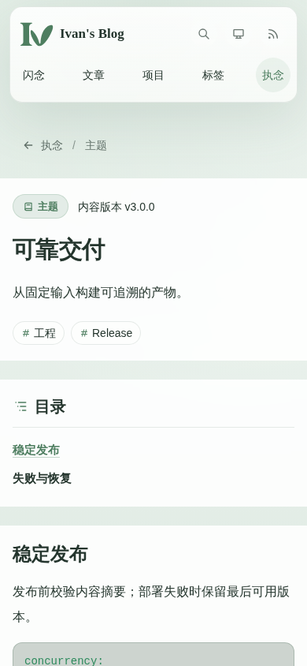 | 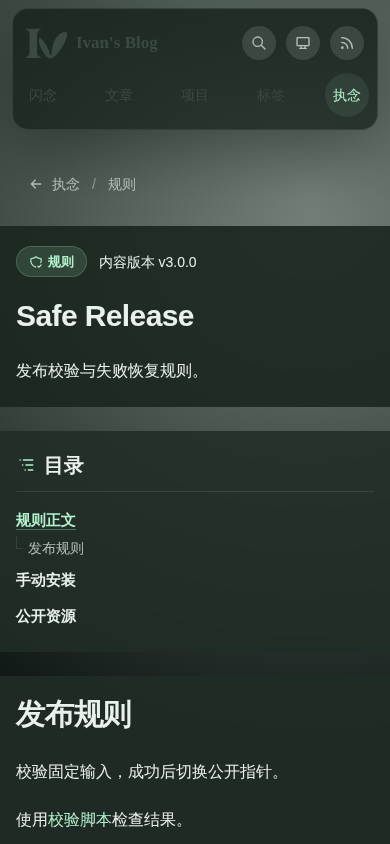 |
| 桌面端阅读，1280 × 900 | 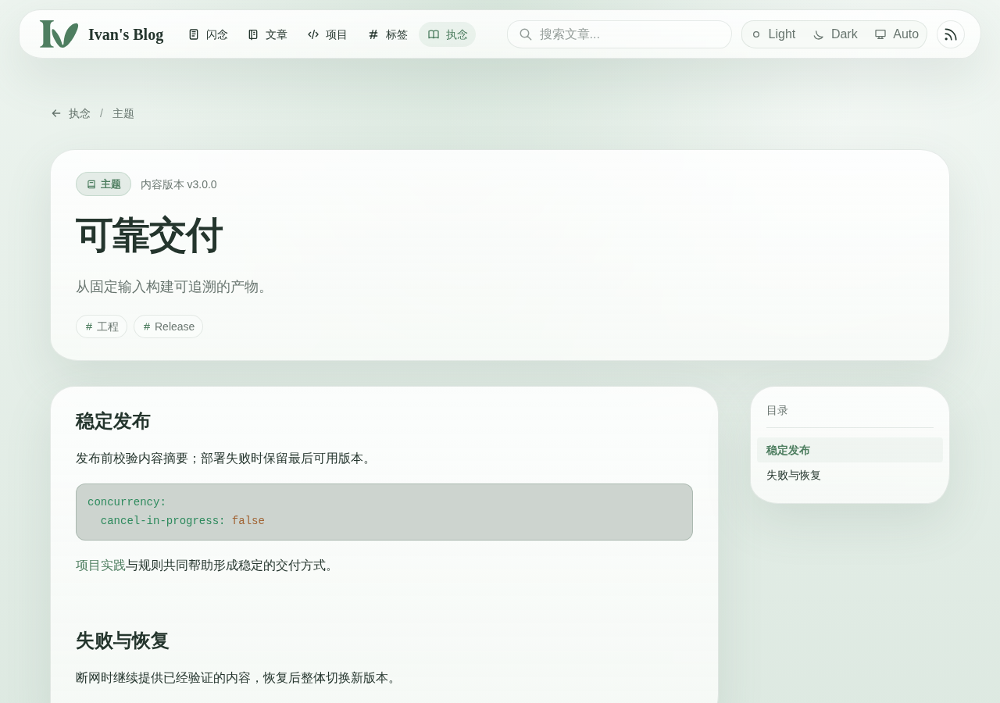 | 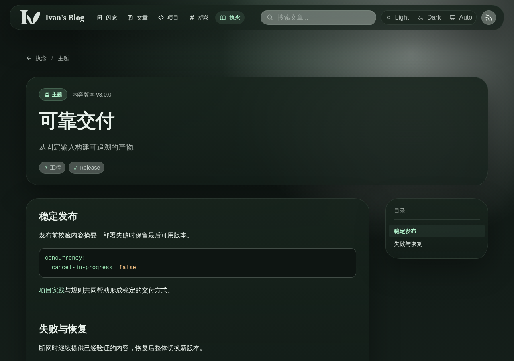 |
| 搜索，390 × 844 / 1280 × 900 |  | 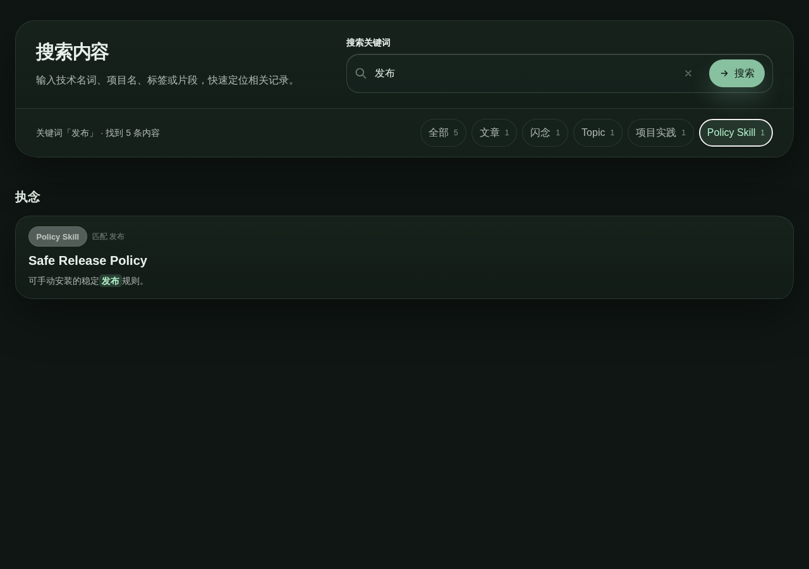 |
| 平板端目录与正文，768 × 900 | 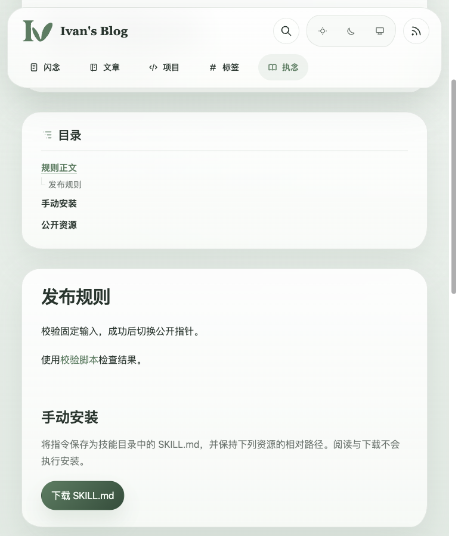 | 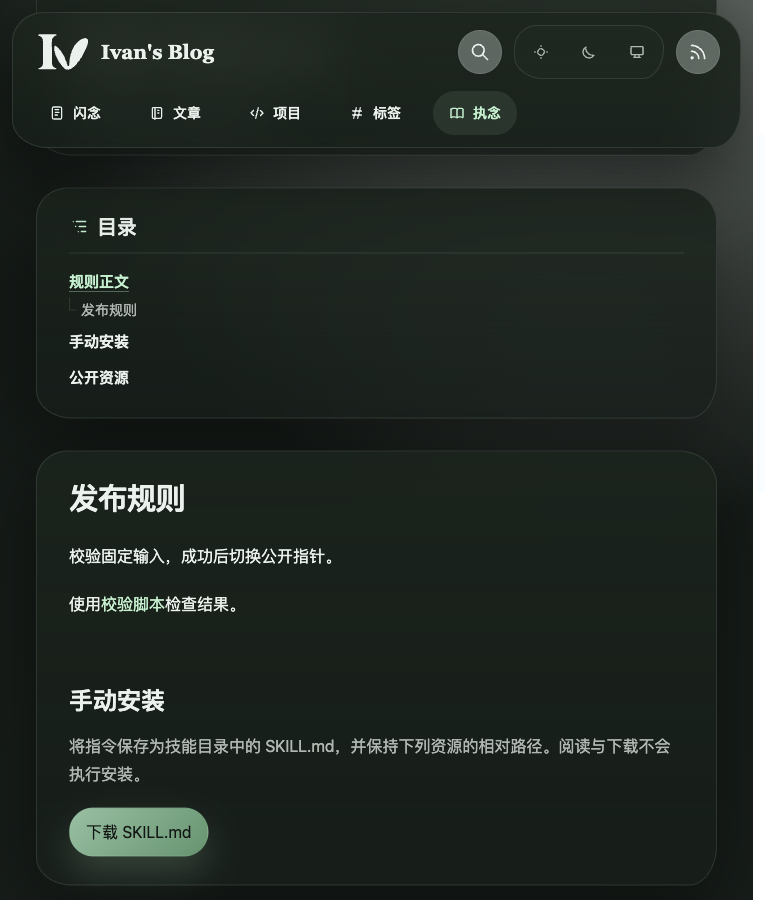 |

索引采用“全部 / 主题 / 项目实践 / 规则”分类选择器。桌面端以独立卡片展示，移动端使用连续阅读列表；类型图标位于标题左侧，内容不使用时间线。该索引展示已由 owner 确认。

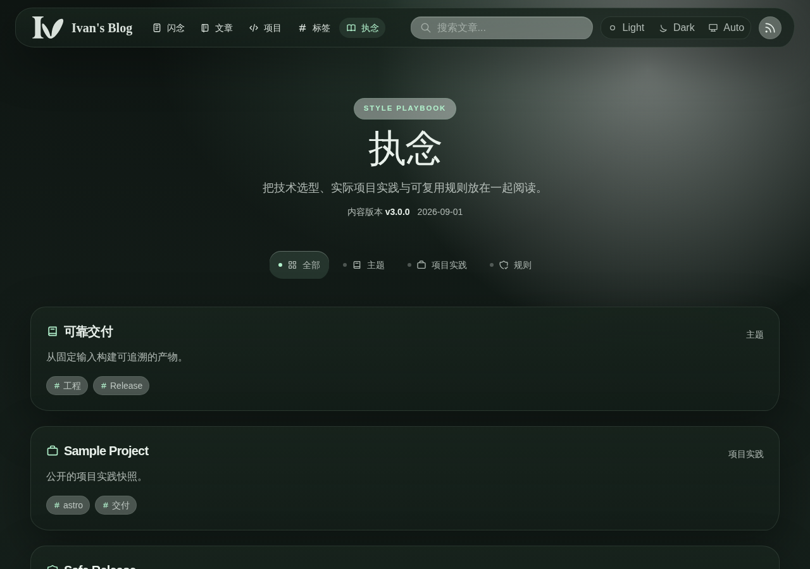

768 × 900 平板目录与正文使用同一主题面板背景、边框、圆角、阴影及可用宽度；浅色和深色场景均由 owner 确认。

公开资源浏览器位于正文后的独立全宽区域。桌面端在同一表面内并列显示文件树与预览；移动端文件树作为预览上的浮层按需打开。资源卡片支持铺满视口查看。

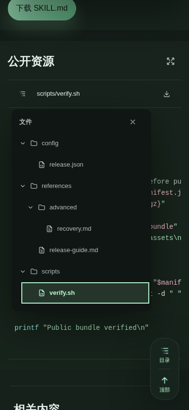

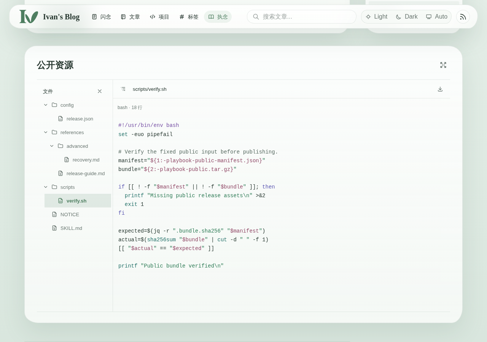
