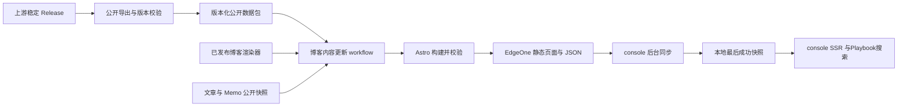

# Style Playbook集成

## Context and Scope

本主题定义博客原生展示 Style Playbook、上游稳定发布后自动更新静态站，以及 console 跟随已发布Playbook快照的长期契约。

范围包括上游公开目录中的 Topic、项目实践快照和 Policy Skill、它们的正文与关系、博客导航及搜索、版本化数据发布、console 缓存与失败处理。上游知识内容的管理与写入、私有内容和未进入公开目录的分组/读写 Skill 主文档由上游负责；文章与 Memo 的实时读取边界由既有主题负责。

博客主导航与栏目标题均使用两字名称“执念”，项目集合与搜索类型显示为“项目实践”。

## Terms and Interfaces

领域术语见 [CONTEXT.md](../../../CONTEXT.md)。上游知识源为 `IvanLi-CN/style-playbook-skills`；博客成功部署决定 console 跟随的已发布Playbook快照。

| 路径 | 阅读内容 |
| --- | --- |
| `/playbook/` | Playbook入口、目录概览与内容版本 |
| `/playbook/topics/` | Topic 索引与分类 |
| `/playbook/topics/<slug>/` | Topic 正文、关联项目实践与 Policy Skill |
| `/playbook/projects/` | 公开项目实践索引 |
| `/playbook/projects/<slug>/` | 项目实践正文与关联 Topic |
| `/playbook/policies/` | 公开 Policy Skill 索引 |
| `/playbook/policies/<slug>/` | Policy Skill 指令、公开资源与安装指南 |
| `/search` | 文章、Memo 和Playbook的统一搜索入口 |

数据接口包括上游固定 Release 的公开数据包、博客部署指针、不可变版本数据和 console 本地缓存。指针建议位于 `/_content/playbook/manifest.json`，版本文件建议位于 `/_content/playbook/<release-tag>/<digest>/`；具体文件布局必须遵循下述身份与缓存契约。

公开包与部署 edition 的固定格式见 [公开包契约](./contracts/public-package.md)。跨仓触发的参与方、接口、输入、凭据、补漏与结果处理见 [Release 触发契约](./contracts/release-trigger.md)。

## Requirements

### REQ-PBI-001 — 原生阅读集合

博客必须复用自身布局、导航、阅读样式、目录、移动布局和深色主题，完整展示公开目录中的 Topic、项目实践快照和 Policy Skill。每个对象必须能从索引进入正文，保留关联与 section anchor，并展示采用的内容版本。Playbook身份与文章、Memo、博客标签和现有项目案例必须独立；Policy Skill 阅读或复制命令不得自动执行安装。公开静态页禁用 JavaScript 时必须仍有完整正文和导航，console 首次响应必须提供 SSR 正文。

### REQ-PBI-002 — 公开数据边界

页面、JSON 与搜索只能消费上游经过可见性和内容检查的公开导出，必须排除私有项目、内部字段、生成记录、管理数据及凭据。不得用原始仓库 Markdown 扫描或内部 API 绕过公开导出；公开契约缺失或检查失败时必须拒绝发布。正文必须按数据使用受控 Markdown renderer，不得执行包内脚本或 MDX。公开安装指南所引用的资源和依赖必须匿名可用；上游读取凭据只能留在 CI。

### REQ-PBI-003 — 固定来源与包身份

自动发布只能采用非 draft、非 prerelease 的稳定 Release，并固定仓库身份、Release ID/tag、tag 解析后的源 commit 和包 digest。数据 manifest 必须包含 schema 版本、来源身份、发布时间及各文件 SHA-256 和大小。下载时不得重新解析 `latest`，不得以当前分支导出冒充旧 tag。接收端必须重新核对通知参数、Release 元数据与资产；同一 Release 的既有资产 digest 不一致时必须拒绝静默替换。

### REQ-PBI-004 — 稳定发布自动更新

上游稳定 Release 的数据包及就绪 manifest 成功发布后，必须在该发布流程尾部显式调用博客内容 workflow 的 `workflow_dispatch`。博客使用已发布的稳定前端渲染器、固定Playbook包和明确身份的文章/Memo 公开快照执行静态构建、校验与部署。未经应用发布门禁的最新 `main` 不得自动作为渲染器。触发必须符合 [Release 触发契约](./contracts/release-trigger.md)，并提供定时补漏与手动重试，复用相同的输入校验和部署入口；通知成功与实际部署成功必须分别记录。

### REQ-PBI-005 — 内容与应用发布分离

纯Playbook内容刷新必须独立于应用 SemVer、应用 GitHub Release 和 console 镜像构建。Playbook输入必须独立于依赖 console 的 posts/memos `public-snapshot.json`，Playbook构建不得反过来依赖 console 的Playbook缓存。普通前端代码发布必须保留当前采用的Playbook版本并检查兼容性；首次路由和缓存能力上线通过正常应用发布完成。

### REQ-PBI-006 — 并发与乱序

内容更新与应用代码发布必须共享生产部署互斥边界，在途部署不得因新触发被中断。重复事件必须幂等；迟到事件和代码发布不得把生产内容静默降级。自动更新只能采用更高的稳定版本；旧版回滚必须是显式操作。发布前必须重新核对候选与当前部署身份。

### REQ-PBI-007 — 同批发布与版本资产

Playbook页面、目录、详情、搜索数据和当前指针必须来自同一次成功部署，记录上游版本、包 digest、博客渲染器 commit 与文章/Memo 快照身份。版本文件必须使用不可变缓存，当前指针必须使用短缓存或重新验证。部署必须保留尚可被上一批指针引用的版本文件，并保留原始发布包供回滚；不得假定替换整站后旧目录仍可访问。

### REQ-PBI-008 — console 跟随已部署版本

console 必须后台同步博客的公开 JSON，在网络健康且 schema 兼容时约五分钟内跟随成功部署的数据。console 必须先读取指针，再下载该确切版本，并完成来源、schema、digest 与记录关系校验后整体替换缓存。并发刷新必须只保留一个任务；目录、详情和搜索不得分批生效。SSR 必须使用已验证的本地快照，不得逐页面请求访问 GitHub、上游服务或未部署的上游版本。

### REQ-PBI-009 — 最后成功版本与首次启动

上游或博客的下载、构建、校验和部署失败时，静态站必须继续提供之前成功发布的版本。console 必须持久化最后成功快照，网络故障、重启或新 schema 不兼容时继续使用最后兼容版本。没有持久缓存时可使用兼容的初始公开快照；有可用缓存时不得被初始快照覆盖。没有任何可用快照时，Playbook必须显示暂不可用，不得以空目录冒充成功，也不得阻止其他 console 功能启动。

### REQ-PBI-010 — 统一搜索与版本一致性

统一搜索必须明确区分 Topic、项目实践、Policy Skill、文章和 Memo，提供正确的目标 URL 与类型过滤。Playbook搜索必须使用确定性全文索引，向量化不得成为发布前置条件；不同来源的分数不得直接混排，结果应按来源分组。静态站使用本批构建的Playbook索引，console 使用已采用缓存中的同批索引；上游路由与 section anchor 必须映射至Playbook命名空间，文章/Memo 原有检索与授权规则必须保留。

### REQ-PBI-011 — 发布可追溯与回滚

部署记录必须保存 `(blogRendererCommit, playbookRelease, bundleDigest, contentSnapshotIdentity)`、实际发布结果及失败原因。重试、定时补漏和显式旧版回滚必须可核对到确切输入；回滚必须检查渲染器兼容性，并整体恢复页面与公开数据。两个阅读站点必须能核对各自采用的内容版本，包括 console 暂留旧版的情况。

## Verification

### VER-PBI-001

- Method: 对完整公开目录检查原生索引、正文、关系和 anchor；检查移动/深色页面、禁用 JavaScript 的静态 HTML 及首次 console SSR。
- covers: `REQ-PBI-001`
- Pass condition: 所有可见对象可读且身份独立，版本可见，阅读或复制安装命令没有执行副作用。

### VER-PBI-002

- Method: 使用含私有项目、内部字段、未知可见性和执行内容的导出样例检查公开输出与拒绝路径；检查匿名安装资源和凭据边界。
- covers: `REQ-PBI-002`
- Pass condition: 非公开数据不进入 HTML、JSON 或搜索，公开检查失败拒绝发布，包内代码不执行且访客无需源仓库凭据。

### VER-PBI-003

- Method: 检查稳定、draft、prerelease、错误来源、tag/commit 不符、文件损坏和同版本不同 digest 的包与事件。
- covers: `REQ-PBI-003`
- Pass condition: 仅确切且完整的稳定版本可被采用，下载固定输入，所有不符输入均被拒绝。

### VER-PBI-004

- Method: 检查上游成功数据发布、漏通知后的补漏及手动重试，核对渲染器和两类内容输入。
- covers: `REQ-PBI-004`
- Pass condition: 合法发布触发同一更新入口，输出来自固定数据和已发布渲染器；产物未就绪时不更新生产。

### VER-PBI-005

- Method: 对比内容刷新与正常代码发布的副作用和依赖图。
- covers: `REQ-PBI-005`
- Pass condition: 内容刷新不发布应用版本或镜像，Playbook输入无循环依赖；代码发布保留已采用内容并校验兼容性。

### VER-PBI-006

- Method: 注入重复、乱序和并发代码/内容发布事件，核对发布前状态及显式回滚。
- covers: `REQ-PBI-006`
- Pass condition: 部署串行、在途任务不中断，重复输入无额外更新，迟到任务不降级；降级仅发生于显式回滚。

### VER-PBI-007

- Method: 对照单批页面、JSON、索引与指针，检查缓存头及整站更新后的旧指针下载。
- covers: `REQ-PBI-007`
- Pass condition: 所有内容身份一致，旧指针仍可取到引用文件，不可变文件与当前指针使用各自缓存策略。

### VER-PBI-008

- Method: 模拟新指针、分批下载、校验失败和并发刷新，检查更新延迟与页面请求的外部调用。
- covers: `REQ-PBI-008`
- Pass condition: 健康兼容情况下约五分钟内整体切换；失败或未完成下载不切换，SSR 无请求级上游依赖。

### VER-PBI-009

- Method: 模拟上游/博客各阶段失败、console 重启、断网、不兼容 schema、有旧缓存和无任何快照的首次启动。
- covers: `REQ-PBI-009`
- Pass condition: 已发布静态站与最后兼容缓存持续可用；初始快照不覆盖缓存；无快照时仅Playbook暂不可用。

### VER-PBI-010

- Method: 检查每种Playbook对象与 anchor 的搜索结果、类型过滤、来源分组、刷新期间的索引身份和文章/Memo 授权样例。
- covers: `REQ-PBI-010`
- Pass condition: 两站Playbook检索对应各自采用版本，URL 正确且不碰撞项目案例，已有授权边界保留，无向量服务仍可检索。

### VER-PBI-011

- Method: 核对成功/失败记录、重试、补漏和兼容/不兼容回滚，比较页面标示版本与实际数据身份。
- covers: `REQ-PBI-011`
- Pass condition: 每次结果可追溯到确切输入，回滚整体且兼容，console 保留旧版时版本标示仍真实。

## Related ADRs

- [ADR 0010](../../adr/0010-self-contained-console-runtime.md)
- [ADR 0011](../../adr/0011-published-playbook-read-model.md)

## References

- [实现状态](./IMPLEMENTATION.md)
- [研究基线与主题历史](./HISTORY.md)
- [Release 触发契约](./contracts/release-trigger.md)
- [应用发布契约](../pr-label-release/SPEC.md)
- [既有搜索契约](../search-full-text-fallback/SPEC.md)
