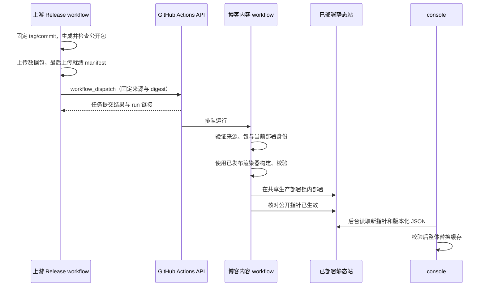

# Style Playbook Release 触发契约

本契约定义上游稳定发布完成后如何启动博客内容构建，覆盖 `REQ-PBI-003`、`REQ-PBI-004`、`REQ-PBI-006` 和 `REQ-PBI-011`。目标 workflow 已在博客实现；相关凭据和生产启用属于上线阶段，当前状态见 [IMPLEMENTATION.md](../IMPLEMENTATION.md)。

## Participants and Boundary

| 参与方 | 职责 |
| --- | --- |
| `IvanLi-CN/style-playbook-skills` Release workflow | 生成并发布固定版本公开数据，再通知博客 |
| `IvanLi-CN/blog-26` 的 `playbook-content-update.yml` | 接收通知或补漏检查，校验来源，构建并部署静态站 |
| `ivanli.cc` 已部署 manifest | 记录实际已生效的Playbook身份，供去重、版本判断和 console 同步 |
| `console.ivanli.cc` | 在博客部署后读取公开指针，独立执行缓存同步 |

博客不能通过监听自身 `release: published` 自动收到另一个仓库的 Release。主要触发为上游主动跨仓 `workflow_dispatch`；补漏为博客自身 `schedule`；人工重试使用同一个 `workflow_dispatch`。



## Upstream Publication Readiness

上游 Release 必须为稳定版本，且固定到已通过该仓库发布门禁的 tag/commit。公开数据资产采用两个固定名称：

- `playbook-public.tar.gz`：经过公开检查的目录、正文与搜索数据。
- `playbook-public-manifest.json`：schema 版本、来源仓库、Release ID/tag、解析后的 commit、文件清单及 SHA-256/大小，以及数据包的名称、SHA-256 和大小。

就绪 manifest 是单独的 Release asset，必须在数据包上传成功并核对 digest 后最后上传，避免数据包把自身 digest 包进自身的循环定义。缺少完整 manifest 的 Release 不具备构建资格。同一 Release 重跑必须核对既有资产，不得覆盖为不同内容。

通知 job 依赖稳定发布与公开资产 job 成功；canary、draft、无发布意图或公开检查失败均不通知。通知不等待博客构建完成；上游记录提交结果，博客负责记录实际部署结果。

## Dispatch Interface

目标 workflow 文件为 `.github/workflows/playbook-content-update.yml`，需要先进入博客默认分支。控制 workflow 的 `ref` 固定为 `main`；实际渲染器另行固定到已发布前端 commit，不能将控制 workflow 的 ref 当成渲染器版本。

请求接口：

```text
POST /repos/IvanLi-CN/blog-26/actions/workflows/playbook-content-update.yml/dispatches
```

请求使用 GitHub REST API 版本 `2026-03-10`，body 如下。尖括号内容为真实发布输入的占位符：

```json
{
  "ref": "main",
  "inputs": {
    "mode": "release",
    "source_repository": "IvanLi-CN/style-playbook-skills",
    "source_release_id": "<release-id>",
    "source_tag": "<stable-tag>",
    "source_sha": "<40-character-commit-sha>",
    "bundle_sha256": "<64-character-sha256>",
    "source_run_id": "<upstream-actions-run-id>"
  }
}
```

| Input | 约束 |
| --- | --- |
| `mode` | `release` 为固定版本通知/重试；`reconcile` 为查询并固定最新就绪稳定版；默认 `release` |
| `source_repository` | `release` 模式必填，必须精确匹配唯一允许的上游仓库 |
| `source_release_id` | `release` 模式必填，Release 数字 ID，以字符串传递 |
| `source_tag` | `release` 模式必填，必须与该 Release 的稳定 tag 匹配 |
| `source_sha` | `release` 模式必填，40 位十六进制 commit，必须与 tag 解析结果一致 |
| `bundle_sha256` | `release` 模式必填，必须与就绪 manifest 和下载包一致 |
| `source_run_id` | 来源运行关联信息；人工重试可省略，不作为来源授权依据 |

GitHub input 定义中，来源字段允许为空以支持 `reconcile`；接收 job 必须按模式执行上述必填与一致性检查。`reconcile` 不接受调用者注入候选来源，在内部读取固定上游的 Release 元数据并生成同一组固定输入。普通触发接口没有回滚模式，回滚通过单独的显式操作处理。

GitHub API 接受请求仅代表 workflow 已提交排队。当前 API 版本返回 run ID/URL，通知 job 将它们写入 summary，便于核对下游运行；不能把 HTTP 成功标为静态站已经更新。

## Credentials

| 使用位置 | 所需授权 |
| --- | --- |
| 上游通知 job | 对 `blog-26` 的 `Actions: write`，用于调用目标 workflow |
| 博客下载/补漏 job | 对私有上游仓库的只读访问，用于读取 Release 元数据和资产 |
| 博客部署 job | 复用博客自己的 EdgeOne 部署凭据 |

推荐 GitHub App 安装 token，或限定目标仓库的 fine-grained token。上游自带 `GITHUB_TOKEN` 仅能访问来源仓库，不能直接承担跨仓通知。通知凭据与来源读取凭据是两个权限角色；console 与访客只读博客公开 JSON。

这里选择 `workflow_dispatch`，可以只授予目标 `Actions: write`；`repository_dispatch` 需要目标 `Contents: write`。上游既有流程通过默认 token 创建 Release，不能依赖该动作再触发独立 `release: published` 工作流，因此直接在原 Release workflow 尾部发送通知。

## Receiver Processing

1. 解析事件和模式。`schedule` 等价于 `reconcile`；`release` 从输入固定候选。读取当前部署身份及自动更新是否暂停。
2. 查询固定上游，确认 Release 非 draft/prerelease、tag/commit 对应且就绪资产完整；下载固定包并校验 schema、来源、digest 和公开契约。通知参数只作为待核对声明，不作为可信内容。
3. 对比已部署指针。相同 Release/digest 已生效时跳过；同一 Release 不同 digest 拒绝；较旧稳定版本跳过。`reconcile` 选择最高 SemVer 的就绪稳定版，不直接信任 API `latest` 作为版本顺序。
4. 固定当前已发布的博客渲染器与文章/Memo 输入，构建并执行静态校验。
5. 获取与正常前端部署相同的生产 job 并发组，再重新读取部署身份。若内容已被采用或已变旧则跳过；若当前渲染器已改变，则不得部署旧渲染器产物，需要重新构建后再核对。
6. 部署完整页面及版本化数据，核对公开指针已生效，记录实际采用的输入身份与下游 run URL。console 从公开指针发现变化，无须上游单独通知。

生产 job 并发组建议为 `blog26-edgeone-production`，`queue: max`、`cancel-in-progress: false`，由内容和正常前端部署共同使用。不能沿用现有按 SHA 分组的外层 release concurrency 作为跨发布互斥锁；两种流程之间需要同一个部署 job 边界。即使有排队，也必须执行版本与渲染器复核，不能依赖 dispatch 时间保证顺序。

## Reconciliation and Failure Outcomes

博客 workflow 自身每小时第 17 分钟执行一次补漏检查；正常通知路径不等待这个定时检查。补漏仅在有更新且完整的稳定资产时构建，并使用与通知相同的接收逻辑。这个间隔与 console 部署后约五分钟的缓存同步间隔是两件事。

定时运行由 GitHub 排队，可能延迟或漏跑，因此是补漏手段而非严格一小时恢复保证；公开仓库长期无活动导致 schedule 被停用时需要恢复。手动 `mode=reconcile` 可以执行同一检查。显式内容回滚期间允许暂停自动更新，恢复前核对当前版本与上游候选，防止补漏立即撤销回滚。

| 结果 | 处理 |
| --- | --- |
| 上游数据生成、公开检查或上传失败 | 不通知；不完整资产不构建 |
| 跨仓通知失败 | 保留已成功发布的上游资产；记录失败，可单独重试通知，博客补漏可恢复 |
| 通知已接受，博客构建或部署失败 | 博客 run 记录失败，保留生产旧版本；后续补漏或人工重试同版本 |
| 重复或迟到通知 | 记录跳过，不重复部署或降级 |
| 下游部署期间渲染器发生变化 | 丢弃过时构建产物，使用新已发布渲染器重新构建 |
| 部署成功、console 下载失败 | 静态站提供新版本，console 继续最后兼容缓存并后续重试 |

## References

- [SPEC.md](../SPEC.md)
- [GitHub workflow dispatch REST API](https://docs.github.com/en/rest/actions/workflows#create-a-workflow-dispatch-event)
- [GITHUB_TOKEN 的仓库范围与事件触发](https://docs.github.com/en/actions/concepts/security/github_token)
- [workflow_dispatch 与 schedule 事件](https://docs.github.com/en/actions/reference/workflows-and-actions/events-that-trigger-workflows)
- [GitHub concurrency 队列](https://docs.github.com/en/actions/how-tos/write-workflows/choose-when-workflows-run/control-workflow-concurrency)
