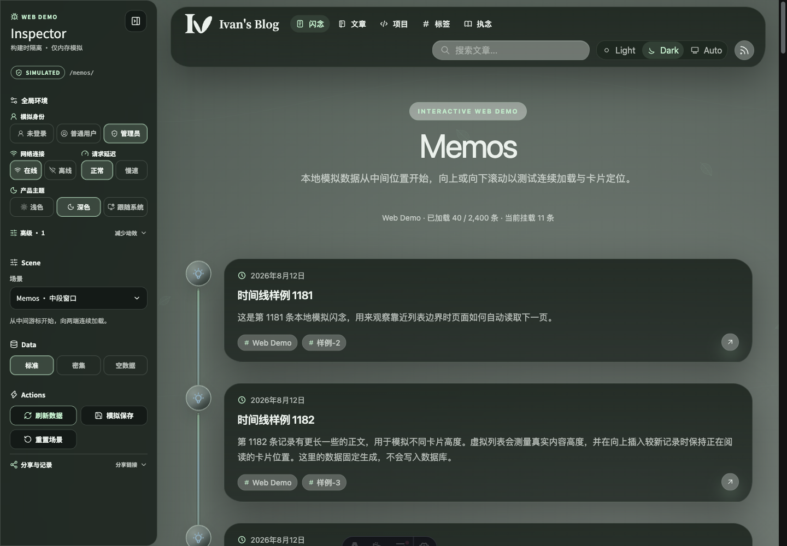
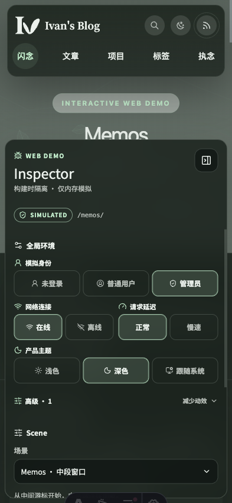

# Web Demo 全局 Inspector 控制实现状态

## Current Status

- Implementation: partial
- Lifecycle: active
- 五项全局环境控制、共享请求策略、SSR Web Demo 运行时和已有客户端读取器已接入；面板采用紧凑分组，Scene、Data、Actions 常驻，分享状态与最近记录默认折叠。公共页面导航仍通过 Astro ClientRouter 交换服务端 HTML，完整页面 CSR 尚未实现，按确认的拆分边界另行交付。

## Implementation Coverage

| 合同 | 当前相关代码 | 覆盖情况 |
|---|---|---|
| REQ-WDG-001 至 REQ-WDG-003 | `src/lib/web-demo-runtime.ts`、`src/components/WebDemoInspector.tsx`、`src/components/WebDemoInspector.css` | 已拆分 `WebDemoEnvironment` 与场景/数据状态；常驻四项控制、高级两项控制、URL/会话优先级、旧 `d_network` 兼容和环境变更分类已实现。全局设置使用紧凑两列布局，Scene、Data、Actions 常驻，分享状态与最近变更收进可访问的折叠组。 |
| REQ-WDG-004 | `apps/admin/src/demo/mock-admin-api.ts` | 已实现未登录、普通用户和管理员三种会话语义；后台非管理员请求返回正式权限拒绝，Inspector 始终可操作。 |
| REQ-WDG-005 至 REQ-WDG-006 | `src/lib/web-demo-runtime.ts`、`src/lib/web-demo-fetch.ts`、`src/lib/admin-api-client.ts`、`apps/admin/src/demo/mock-admin-api.ts`、`site/components/MemoTimeline.tsx`、`site/pages/memos/index.astro` | 已统一在线/离线、正常/1500ms/0–30000ms 自定义延迟、AbortSignal 取消与过时写保护；直接打开、刷新和同源 `ClientRouter` 文档导航继续走正式 SSR/ClientRouter；离线只由 `webDemoFetch`、Memos 请求适配和已有客户端读取器产生页面自身错误，SSR-only 页面不显示人工错误；Memos 的 URL 场景状态同时决定 SSR 初始窗口与 CSR 后续读取；公共客户端 API、Memos 与后台 mock 共用请求策略；离线仅使新的刷新、分页或场景读取失败；Demo 公共 API 未接入模拟的 endpoint 不再回退真实后端。 |
| REQ-WDG-007 | `src/lib/theme.ts`、`apps/admin/src/components/theme-provider.tsx`、`src/components/common/ThemeToggle.tsx`、`site/layouts/BaseLayout.astro` | 已复用产品主题模型，同页双向同步，支持 URL/会话恢复和系统偏好变化。 |
| REQ-WDG-008 | `src/components/common/AmbientScene.tsx`、`src/styles/globals.css`、`apps/admin/src/styles.css` | 已接入系统减少动效与 Inspector 强制减少动效，覆盖环境背景、公共动效和后台交互过渡。 |
| REQ-WDG-009 | `src/lib/web-demo-runtime.ts`、`src/components/WebDemoInspector.tsx`、`site/components/MemoTimeline.tsx` | 已覆盖刷新、前进后退、正式路由导航、会话字段回填和展示偏好隔离；环境变化不重置业务数据。 |
| REQ-WDG-010 | `astro.config.mjs`、`scripts/build-web-demo.ts`、`apps/admin/vite.config.ts`、共享 Inspector | Demo 仍只由构建时入口接入；公共 Demo 使用 Node standalone SSR，Admin Demo 保持 Vite CSR；Storybook 边界测试通过，未新增页面 Story 或独立 Demo 路径，既有停靠几何保持不变。 |

## Verification

- `bun run check` 通过；仓库已有 3 个非本主题 Biome warning，无错误。
- 全局 runtime、Inspector、Web Demo 请求适配器和 Memos 离线首屏回归的定向测试通过；后台 Demo mock、Memo 请求策略和 Storybook 边界测试继续作为相关验证集。
- 本地热更新验证使用 `web-demo-site-dev` `http://127.0.0.1:38110/` 和 `web-demo-admin-dev` `http://127.0.0.1:25094/admin/`：覆盖公共文章详情的身份/评论/反应请求、文章/项目/标签/Playbook 的 SSR 路由内容保留、离线时同源 `ClientRouter` 正常切换且 SSR-only 页面不出现共享错误、Memos 与搜索等独立 CSR 请求由各自页面承接失败、后台请求失败路径、主题双向同步、减少动效、跨正式路由恢复及权限拒绝；当前紧凑布局确认移动端场景选择器完整可见且无横向溢出。
- 已用受控 fixture 直接执行 `WEB_DEMO_BUILD=true bunx astro build`：构建输出为 `output: "server"`，产物包含 `server/entry.mjs` 与 `client/`；临时启动 standalone 入口后，`GET /posts/` 返回实时 SSR HTML，并包含正式页面内容、ClientRouter 和共享 Inspector。
- Agent VM 的非 root 完整单元套件通过：836 项测试、3688 项断言。`bun run web-demo:build` 在与 CI 相同的 Node 22.23.2、Bun 1.4.2 环境完成公共 standalone SSR 与后台 CSR 构建；同步时显式传入 renderer commit，避免将无 `.git` 的 VM 源目录误当成独立 Git checkout。
- Agent VM 同时生成 live 公共与后台产物，确认 live 不包含 Inspector UI 或后台 mock chunk、公共 HTML 不含 Demo 启用属性且内联初始化绑定 `false`；Demo 产物包含 Inspector 和 standalone SSR 入口。编译后的 live 初始化脚本在附带 Demo URL 参数与会话环境时仍保留正式主题，不启用 Demo 动效或构建标记。
- GitHub 的实现候选 `09b66ad5df7a6483139d632131869903bf5491a9` 已通过 Build、Docker 构建以及 guest、admin、user、mcp 四组 Playwright E2E。后续文档与语义证据提交仍由各自提交的 required checks 确认；这些检查不替代未完成的公共页面 CSR 验收。
- 产品验收仍以 `SPEC.md` 中的 VER-WDG-001 至 VER-WDG-009 为准。

## Remaining Gaps

- 公共产品路由目前仍获取目标 SSR HTML，离线导航因此可以显示目标内容；这不是完整 CSR，也不是全局网络控制已经覆盖公共路由数据加载的证明。按主人确认，公共路由 CSR 改造通过独立 PR 交付，共用正式产品渲染与数据层，不恢复 Demo 专属错误面板。
- Inspector 的装饰性分隔线已移除，主人已确认当前布局；发布证据与功能验收应区分，不能以视觉通过代替路由请求语义通过。
- live/Demo 的制品边界验证独立于公共 CSR 导航验收；产品页面 SSR 的初始内容与后续业务 API 请求必须区分，不能用首屏 SSR 内容推断离线 API 成功。

## Publication Evidence

受控 Web Demo 的面板截图：桌面 1440×1000，移动端 393×852。主分组与头部不再绘制装饰性分隔线，仅次要工作流保留边界；这组图片只证明面板呈现，不代表公共页面 CSR 已完成。

## References

- [Requirements](./SPEC.md)
- [Topic history](./HISTORY.md)
