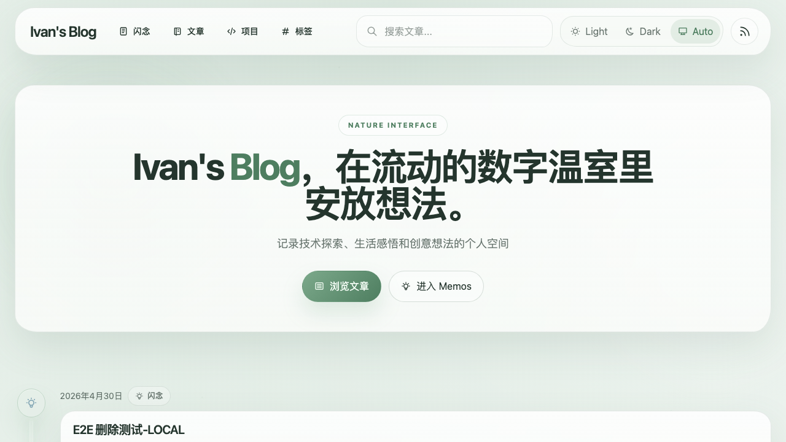
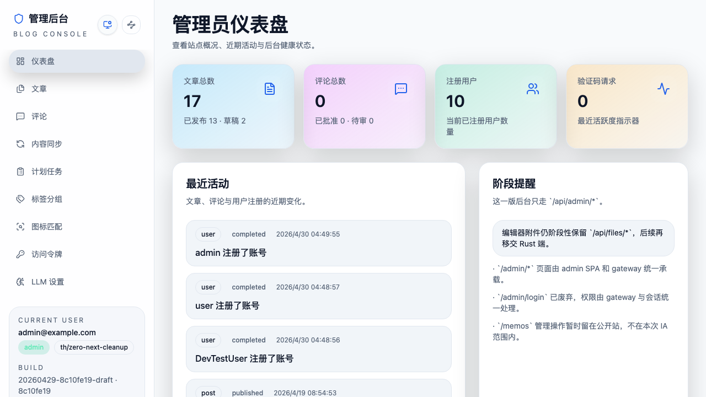

# SPEC: Zero Next cleanup

- Spec ID: `znext`
- Status: `in-progress`
- Owner: `main-agent`

## 1. Background

The public site is owned by Astro, `/admin/*` is owned by the Vite/React admin SPA, and the gateway already owns the stable production API surfaces. `cbwu4` completed the production-runtime reduction phase by proving the remaining browser-visible contracts and documenting the final cleanup boundary.

This spec owns the follow-up repository cleanup: active code, dependencies, scripts, Docker runtime, tests, and current project documentation must no longer require or describe an internal Next runtime.

## 2. Goals

1. Remove active Next runtime ownership from development, test, build, Docker, and gateway startup paths.
2. Move remaining dev/test compatibility endpoints and required `/api/trpc/*` compatibility to gateway-owned Bun handlers.
3. Delete the old `src/app/**`, `src/pages/**`, Next config, proxy, instrumentation, and integrated-server entrypoints.
4. Keep public site, admin SPA, file APIs, public/admin APIs, health, and MCP behavior stable.
5. Update current project truth to describe Astro + Admin SPA + Bun gateway without rewriting historical migration records.

## 3. Non-goals

- No historical rewrite of archived specs, old plans, article fixtures, or seed content where `Next.js` appears as a historical or content topic.
- No URL, authentication, persistence, MCP protocol, or public/admin contract changes.
- No PR merge or post-merge cleanup.

## 4. Runtime Contract

The Bun gateway owns:

- `/`
- public content routes rendered by Astro
- `/admin/*`
- `/api/public/*`
- `/api/admin/*`
- `/api/files/*`
- `/api/dev/*` in non-production environments
- `/api/test/*` in test or non-production environments, according to each handler
- `/api/trpc/*` compatibility
- `/api/tags/organize` compatibility
- `/api/health`
- `/mcp`

Internal-only demo/tooling pages from the old app tree are retired unless reintroduced through a framework-neutral surface.

## 5. Acceptance Criteria

1. `package.json` has no direct `next`, `@next/*`, or `nextjs-toploader` dependencies and no scripts that invoke `next dev`, `next build`, or Next lint/runtime helpers.
2. Active source/config paths no longer include `src/app`, `src/pages`, `next.config.ts`, `src/proxy.ts`, `INTERNAL_NEXT_PORT`, `/_next` proxying, or `next/*` imports.
3. `bun run dev` and `bun run test-server:start` start only WebDAV, Astro, admin SPA, and the Bun gateway.
4. Public/admin/API behavior remains stable for the gateway-owned surfaces listed in this spec.
5. `bun run check`, `bun run test`, `bun run build`, targeted E2E/API smoke, codex review convergence, and PR CI are clean before fast-track closeout.

## 6. Validation

- Static zero-Next scan over package, Docker, scripts, active source, app code, site, tests, README, and AGENTS.
- Dependency proof from `package.json`, `bun.lock`, and `bun pm why next`.
- Runtime proof from unit/integration tests, build, and targeted Playwright/API smoke.
- Visual proof for public/admin unchanged surfaces.

## 7. Spec Links

- Predecessor: `cbwu4-next-runtime-reduction`

## Visual Evidence

The public and admin surfaces were rendered through the Bun gateway after the Next runtime cleanup.

